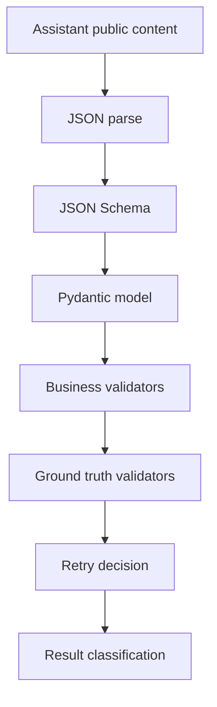

# LM Studio LabKit — техническое задание и архитектура проекта 🧭

**Статус:** проектная спецификация для вынесения LM Studio managed core и benchmark harness в отдельный open-source проект  
**Контекст:** host application / LLM Queue / LM Studio Lab L3.5–L3.11  
**Основная цель:** перестать вручную дописывать одноразовые gates и собрать расширяемую утилиту, которая умеет делать текстовые, мультимодальные, structured/unstructured, cache/stateful и overnight-бенчмарки через конфиги.

---

## 1. Executive summary 🧩

Проект **LM Studio LabKit** должен состоять из двух независимых, но совместимых частей:

| Часть | Назначение | Можно использовать отдельно |
|---|---|---:|
| **Core package** | управляемый клиент LM Studio: lifecycle, load/unload, chat, structured JSON, vision, retry, artifacts, privacy | ✅ |
| **Benchmark package** | матричный тестовый стенд: datasets, schemas, validators, planner, live runner, reports | ✅ |

Главная идея: **модели, схемы, датасеты и матрицы не должны быть зашиты в код**. Всё должно задаваться через YAML/JSON-конфиги. Тогда можно добавить новую модель или новый эксперимент без переписывания runner-а.

Проект должен поддерживать:

- локальный LM Studio backend;
- `/v1/chat/completions` для OpenAI-compatible structured output;
- `/api/v1/chat` для native chat / stateful research;
- managed load/unload lifecycle;
- text requests;
- image / multimodal requests;
- structured JSON через JSON Schema;
- business validation через Pydantic/custom validators;
- retry на parse/schema/business failures;
- privacy-safe artifacts;
- ночные матричные прогоны с resume;
- отчёты в Markdown/CSV/JSONL.

---

## 2. Почему нужен отдельный проект 🚀

Текущая L3-серия уже доказала, что:

1. **одноразовые gates полезны**, но быстро начинают дублировать инфраструктуру;
2. **валидный JSON не равен правильному JSON**;
3. для host application-подобных задач нужны не только `json_parse_pass` и `schema_pass`, но и business-инварианты: ID fidelity, отсутствие duplicate/missing/reorder, длина текста, язык, отсутствие placeholders;
4. **retry нужен всегда**, потому что даже сильная модель может один раз вернуть структурно красивую гадость;
5. выбор модели нельзя делать по одному smoke-тесту — нужна карта отказов по сложности структуры, языку, объёму, context tier, schema strictness и retry mode.

В host application уже есть production-идея `BlocksPostProcessor`: block-идентичная постобработка, strict JSON Schema, amnesia check, retry и per-block DB storage. Новый проект должен обобщить этот опыт в reusable lab/core-инструмент.

---

## 3. Product goals 🎯

### 3.1. Для разработчика

Разработчик должен иметь возможность:

```bash
lmkit models list
lmkit run --config configs/matrix.overnight.yaml
lmkit report results/run_20260707_overnight
```

И получить:

- таблицу по моделям;
- таблицу по типам задач;
- таблицу failures;
- retry summary;
- resource summary;
- decision-oriented `report.md`.

### 3.2. Для преподавателя / студента

Студент должен иметь возможность:

1. описать модель в `models.yaml`;
2. добавить датасет в `datasets/`;
3. добавить JSON Schema / Pydantic validator;
4. запустить benchmark;
5. посмотреть, где модель ломается.

### 3.3. Для будущей интеграции host application

host application в будущем должен использовать **Core package**, а не test harness напрямую:

```python
from lmstudio_labkit import ManagedLMStudioCore

core = ManagedLMStudioCore.from_config(config)
result = await core.run_structured(request)
```

Benchmark package остаётся внешним исследовательским инструментом.

---

## 4. Non-goals 🚫

На первом этапе проект **не должен**:

- интегрироваться в host application runtime;
- трогать host application UI;
- трогать QueueManager;
- делать production-default рекомендации;
- хранить raw prompt / raw response по умолчанию;
- быть только под Gemma или только под host application;
- требовать конкретный список моделей в коде;
- запускать `/v1/responses` long-context как основной путь.

`/v1/responses` можно оставить как отдельный experimental route для small-context cache-accounting research, но не как default long-context path.

---

## 5. Архитектура проекта 🏗️

```mermaid
flowchart TD
    subgraph App[External users]
        CLI[CLI]
        PY[Python API]
        host application[Future host application integration]
    end

    subgraph Core[Core package]
        CFG[Config loader]
        REG[Model registry]
        LIFE[Lifecycle manager]
        CHAT[Chat / completions client]
        VISION[Vision request support]
        RETRY[Retry policy]
        ART[Artifact writer]
        PRIV[Privacy scanner]
    end

    subgraph Bench[Benchmark package]
        DATA[Dataset registry]
        SCHEMA[Schema builders]
        VAL[Validators]
        PLAN[Matrix planner]
        RUN[Matrix runner]
        REPORT[Report builder]
    end

    subgraph LM[LM Studio]
        NATIVE[/api/v1/*]
        OPENAI[/v1/chat/completions]
    end

    CLI --> Bench
    CLI --> Core
    PY --> Core
    host application -. later .-> Core

    Bench --> Core
    Core --> NATIVE
    Core --> OPENAI

    Bench --> DATA
    Bench --> SCHEMA
    Bench --> VAL
    Bench --> PLAN
    Bench --> RUN
    Bench --> REPORT
```

---

## 6. Рекомендуемая структура репозитория 📁

```text
lmstudio-labkit/
├── pyproject.toml
├── README.md
├── LICENSE
├── CHANGELOG.md
├── .gitignore
├── .env.example
│
├── src/
│   └── lmstudio_labkit/
│       ├── __init__.py
│       ├── py.typed
│       │
│       ├── core/
│       │   ├── __init__.py
│       │   ├── config.py
│       │   ├── model_registry.py
│       │   ├── hardware_profile.py
│       │   ├── lifecycle.py
│       │   ├── clients/
│       │   │   ├── __init__.py
│       │   │   ├── lmstudio_native.py
│       │   │   ├── openai_compatible.py
│       │   │   └── errors.py
│       │   ├── requests/
│       │   │   ├── __init__.py
│       │   │   ├── text.py
│       │   │   ├── structured.py
│       │   │   ├── vision.py
│       │   │   └── chat_stateful.py
│       │   ├── responses/
│       │   │   ├── __init__.py
│       │   │   ├── usage.py
│       │   │   ├── structured_result.py
│       │   │   └── validation_result.py
│       │   ├── retry/
│       │   │   ├── __init__.py
│       │   │   ├── policy.py
│       │   │   └── violation_summary.py
│       │   ├── artifacts/
│       │   │   ├── __init__.py
│       │   │   ├── writer.py
│       │   │   ├── privacy_scan.py
│       │   │   └── schemas.py
│       │   └── utils/
│       │       ├── hashing.py
│       │       ├── token_estimator.py
│       │       └── image_preprocessor.py
│       │
│       ├── bench/
│       │   ├── __init__.py
│       │   ├── config.py
│       │   ├── matrix.py
│       │   ├── planner.py
│       │   ├── runner.py
│       │   ├── datasets/
│       │   │   ├── __init__.py
│       │   │   ├── loader.py
│       │   │   ├── text_manifest.py
│       │   │   └── image_manifest.py
│       │   ├── schemas/
│       │   │   ├── __init__.py
│       │   │   ├── text_simple.py
│       │   │   ├── text_blocks.py
│       │   │   ├── text_complex.py
│       │   │   ├── image_simple.py
│       │   │   ├── image_medium.py
│       │   │   └── image_complex.py
│       │   ├── validators/
│       │   │   ├── __init__.py
│       │   │   ├── json_schema.py
│       │   │   ├── business.py
│       │   │   ├── language.py
│       │   │   ├── image_ground_truth.py
│       │   │   └── failure_taxonomy.py
│       │   └── reports/
│       │       ├── __init__.py
│       │       ├── csv_writer.py
│       │       ├── markdown_report.py
│       │       └── decision_record.py
│       │
│       └── cli/
│           ├── __init__.py
│           ├── app.py
│           ├── commands_models.py
│           ├── commands_plan.py
│           ├── commands_run.py
│           └── commands_report.py
│
├── configs/
│   ├── models.example.yaml
│   ├── hardware.example.yaml
│   ├── matrix.smoke.yaml
│   ├── matrix.screening.yaml
│   ├── matrix.overnight.yaml
│   └── routes.example.yaml
│
├── datasets/
│   ├── text/
│   │   ├── ru_simple.jsonl
│   │   ├── ru_blocks_medium.jsonl
│   │   ├── ru_complex_nested.jsonl
│   │   ├── ru_en_mixed_tech.jsonl
│   │   ├── en_simple.jsonl
│   │   └── edge_cases.jsonl
│   └── image/
│       ├── manifest.json
│       ├── ui_screenshots/
│       ├── code_screenshots/
│       ├── document_tables/
│       ├── charts_graphs/
│       ├── people_scenes/
│       └── mixed_text_image/
│
├── examples/
│   ├── run_text_matrix.py
│   ├── run_image_matrix.py
│   └── minimal_structured_request.py
│
├── tests/
│   ├── unit/
│   ├── integration/
│   └── fixtures/
│
└── docs/
    ├── ARCHITECTURE.md
    ├── CONFIG_REFERENCE.md
    ├── DATASET_FORMAT.md
    ├── VALIDATION_GUIDE.md
    ├── MATRIX_GUIDE.md
    ├── LM_STUDIO_SETUP.md
    ├── PRIVACY_POLICY_FOR_ARTIFACTS.md
    ├── EXTENDING_MODELS.md
    └── WVM_INTEGRATION_NOTES.md
```

---

## 7. Core package responsibilities ⚙️

### 7.1. Model registry

Модели задаются через конфиг, не через код.

```yaml
models:
  - model_key: gemma4_e2b_q4km
    model_id: google/gemma-4-e2b
    family: gemma4
    quant: q4km
    modality: [text]
    structured_output: supported
    routes:
      preferred_structured: strict_json_chat_completions
      allowed:
        - strict_json_chat_completions
        - native_chat
      blocked:
        - responses_long_context
    context_tiers: [8192, 16384, 32768]
    load:
      flash_attention: true
      offload_kv_cache_to_gpu: true
      parallel: 1
    safety:
      production_default: false
      final_user_facing_recommendation: false
```

### 7.2. Hardware profile

```yaml
hardware:
  machine_id: local_5060ti_16gb
  os: windows
  gpu:
    name: RTX 5060 Ti
    vram_mb: 16384
  ram_mb: 49152
  lmstudio:
    url: http://127.0.0.1:1234
    version: optional
```

### 7.3. Lifecycle manager

Обязательные свойства:

| Requirement | Почему |
|---|---|
| exact owned load | не трогать чужие модели |
| exact unload | не оставлять zombie instances |
| no wildcard unload | безопасный multi-model lab |
| cleanup to zero | воспроизводимость |
| load response as hard source | model-list metadata optional |

L3.8b уже показал, что native load response может быть точнее model-list telemetry: native response дал exact applied context/parallel, а model-list не отдал context arrays. Поэтому model-list context metadata должна оставаться optional telemetry, не hard gate.

---

## 8. Request modes 📨

| Mode | Endpoint | Use case |
|---|---|---|
| `native_chat` | `/api/v1/chat` | LM Studio native, stateful research, latency checks |
| `strict_json_chat_completions` | `/v1/chat/completions` | основной structured JSON path |
| `text_chat_completions` | `/v1/chat/completions` | обычный OpenAI-compatible text |
| `vision_chat_completions` | `/v1/chat/completions` | image + text request |
| `responses_small_cache_accounting` | `/v1/responses` | small-context cache research only |

Для long-context production planning `/v1/responses` не использовать как default path.

---

## 9. Benchmark axes 📊

Утилита должна поддерживать полную матрицу:

| Axis | Values |
|---|---|
| model | из `models.yaml` |
| modality | `text`, `image`, `image_text` |
| input_language | `ru`, `en`, `mixed` |
| output_language | `ru`, `en` |
| structure_complexity | `simple`, `medium`, `complex` |
| volume_tier | `single`, `many`, `stress` |
| context_length | `8192`, `16384`, `32768`, model-specific |
| schema_variant | `baseline_loose`, `hardened_const`, `custom` |
| retry_policy | `off`, `business_retry_1`, `schema_retry_1`, `full_retry_1` |
| lifecycle_mode | `cold_per_job`, `session_per_cell` |
| cache_mode | `off`, `warmup`, `stateful_root`, `compact_memory` |
| repeat_count | `1`, `3`, `10`, `100` |
| image_type | `ui_screenshot`, `code_screenshot`, `document_table`, `chart_graph`, `people_scene`, `mixed_text_image` |

---

## 10. Языки 🌍

Русский язык должен быть главным профилем, потому что целевая аудитория и реальные данные host application в основном русскоязычные.

| Profile | Input | Output | Priority |
|---|---|---|---:|
| `ru_ru` | русский | русский | P0 |
| `ru_en_mixed` | русский + английские термины | русский, термины сохранить | P0 |
| `en_en` | английский | английский | P1 |
| `en_ru` | английский | русский | P2 |

---

## 11. Structure complexity 🧱

### 11.1. Simple

```json
{
  "title": "string",
  "summary": "string",
  "language": "ru",
  "tags": ["string"],
  "confidence": 0.0
}
```

Проверки:

- required fields;
- types;
- language enum;
- min/max length;
- tags count;
- no placeholders.

### 11.2. Medium / Blocks

```json
{
  "blocks": [
    {"id": 0, "text": "..."},
    {"id": 1, "text": "..."}
  ]
}
```

Production-like schema should use per-position const IDs:

```json
{
  "id": {"const": 0},
  "text": {"type": "string", "minLength": 1}
}
```

Проверки:

- all IDs preserved;
- no missing IDs;
- no extra IDs;
- no duplicate IDs;
- order preserved;
- text non-empty for non-empty input;
- sane length ratio;
- no markdown fences;
- no placeholders.

### 11.3. Complex

```json
{
  "document": {
    "title": "string",
    "sections": [
      {
        "section_id": 0,
        "heading": "string",
        "blocks": [
          {
            "block_id": 0,
            "clean_text": "string",
            "entities": [
              {"type": "person|product|library|date|number", "value": "string"}
            ],
            "flags": {
              "unclear": false,
              "needs_review": false
            }
          }
        ]
      }
    ]
  }
}
```

Проверки:

- exact section IDs;
- exact block IDs;
- entity enum;
- max entities per block;
- no unsupported fields;
- language compliance;
- value grounding where ground truth exists.

---

## 12. Image benchmark matrix 🖼️

Vision benchmark должен быть частью общего harness, но отдельной модальностью.

### 12.1. Image types

| Type | Что проверяет |
|---|---|
| `ui_screenshot` | UI labels, controls, visible text |
| `code_screenshot` | OCR + code/text structure |
| `document_table` | rows, columns, cell extraction |
| `chart_graph` | labels, values, legend, axis |
| `people_scene` | constrained scene/object extraction |
| `mixed_text_image` | combined UI/text/graphics |

### 12.2. Image fixture format

Каждая картинка должна иметь ground truth:

```text
image_001.png
image_001.expected.json
```

`expected.json`:

```json
{
  "image_id": "ui_settings_ru_001",
  "image_type": "ui_screenshot",
  "input_language": "ru",
  "expected_visible_text": ["Настройки", "Модель", "Сохранить"],
  "expected_objects": [
    {"type": "button", "label": "Сохранить"},
    {"type": "input", "label": "API ключ"}
  ],
  "validation": {
    "text_match": "normalized_contains",
    "object_match": "type_and_label",
    "min_visible_text_recall": 0.8
  }
}
```

### 12.3. Image schemas

#### Simple image

```json
{
  "image_type": "ui_screenshot",
  "short_description": "string",
  "visible_text": ["string"],
  "language": "ru"
}
```

#### Medium image

```json
{
  "image_type": "ui_screenshot",
  "objects": [
    {"type": "button|input|menu|text|icon|person|chart|table", "label": "string", "confidence": 0.0}
  ],
  "visible_text": ["string"],
  "summary": "string"
}
```

#### Complex image

```json
{
  "image_type": "document_table",
  "layout": {
    "title": "string",
    "sections": [
      {
        "section_id": 0,
        "heading": "string",
        "items": [
          {"item_id": 0, "label": "string", "value": "string", "unit": "string", "confidence": 0.0}
        ]
      }
    ]
  },
  "warnings": [
    {"type": "low_confidence|unreadable_text|ambiguous_layout", "message": "string"}
  ]
}
```

### 12.4. Image preprocessing

Для LM Studio image path:

| Step | Default |
|---|---|
| max side | 1024 px |
| fallback max side | 512 px |
| format | JPEG q=85 or PNG if text-heavy |
| store raw image path | no |
| artifact path | hash/relative id only |

Предыдущий vision benchmark показал, что resize до 1024/512 существенно влияет на fail rate и token pressure, поэтому image preprocessor должен быть first-class component.

---

## 13. Validation stack 🧰



### 13.1. JSON parse validator

Failure classes:

- `invalid_json`;
- `empty_content`;
- `reasoning_only`;
- `markdown_wrapped`;
- `trailing_text`.

### 13.2. JSON Schema validator

Use:

- `type`;
- `required`;
- `additionalProperties: false`;
- `minItems` / `maxItems`;
- `minLength` / `maxLength`;
- `enum`;
- `const`;
- `prefixItems` when supported.

### 13.3. Pydantic / business validators

Checks:

| Check | Applies to |
|---|---|
| exact IDs | blocks / nested |
| no missing/extra IDs | blocks / nested |
| order preserved | blocks / nested |
| no duplicates | blocks / nested |
| output/input length ratio | text |
| no placeholders | all |
| no markdown fences | all |
| language compliance | text/image |
| OCR recall | image |
| numeric tolerance | chart/table |
| finish_reason != length | all |

---

## 14. Retry policy 🔁

Retry должен быть формальным, а не “попробуем ещё разок”.

| Failure | Retry | Retry prompt |
|---|---:|---|
| invalid JSON | ✅ | “Return valid JSON only.” |
| schema fail | ✅ | schema violation summary |
| business fail | ✅ | missing/duplicate/reorder summary |
| finish_reason=length | ✅ | reduce chunk or increase max tokens |
| empty output | ✅ | “Response was empty.” |
| reasoning leak | optional | route/model specific |
| auth/credits/model unavailable | ❌ | fail-fast |
| same hash deterministic failure | ❌ | stop, classify deterministic |

Recommended default for production-like structured tasks:

```yaml
retry_policy:
  parse_retry_limit: 1
  schema_retry_limit: 1
  business_failure_retry_limit: 1
  stop_on_same_response_hash: true
```

---

## 15. Matrix config examples ⚙️

### 15.1. Smoke

```yaml
matrix_id: smoke_text_ru_hardened
live: true
max_requests: 12

models:
  include: [gemma4_e2b_q4km]

axes:
  modality: [text]
  input_language: [ru]
  output_language: [ru]
  structure_complexity: [simple, medium, complex]
  volume_tier: [single]
  context_length: [8192]
  schema_variant: [hardened_const]
  retry_policy: [off]
  repeats: 1
```

### 15.2. Screening

```yaml
matrix_id: screening_text_ru_en_models
live: true
max_requests: 400

models:
  include:
    - gemma4_e2b_q4km
    - gemma4_e4b_q4km
    - gemma4_12b_qat
    - qwen35_9b

axes:
  modality: [text]
  input_language: [ru, ru_en_mixed, en]
  output_language: [ru, en]
  structure_complexity: [simple, medium, complex]
  volume_tier: [single, many]
  context_length: [8192]
  schema_variant: [baseline_loose, hardened_const]
  retry_policy: [off]
  repeats: 3

execution:
  lifecycle_mode: session_per_cell
  parallel_models: 1
  request_concurrency: 1
  cleanup_after_cell: true
```

### 15.3. Overnight

```yaml
matrix_id: overnight_structured_robustness
live: true
max_requests: 1200
allow_large_matrix: true

models:
  include_from_file: configs/models.overnight.yaml

axes:
  modality: [text, image]
  input_language: [ru, ru_en_mixed, en]
  output_language: [ru, en]
  structure_complexity: [simple, medium, complex]
  volume_tier: [single, many]
  context_length: [8192, 16384]
  schema_variant: [hardened_const]
  retry_policy: [business_retry_1]
  repeats: 5

vision:
  image_types:
    - ui_screenshot
    - code_screenshot
    - document_table
    - chart_graph
    - people_scene
  resize:
    max_side: 1024
    fallback_max_side: 512

execution:
  resume: true
  checkpoint_every: 1
  stop_on_privacy_violation: true
  stop_on_cleanup_failure: true
```

---

## 16. CLI design ⌨️

```bash
lmkit models validate --config configs/models.yaml
lmkit plan --config configs/matrix.screening.yaml
lmkit run --config configs/matrix.screening.yaml
lmkit resume --run results/run_20260707_overnight
lmkit report --run results/run_20260707_overnight
lmkit privacy-scan --run results/run_20260707_overnight
```

Planner output example:

```text
Matrix: screening_text_ru_en_models
Models: 4
Modalities: text
Languages: ru, ru_en_mixed, en
Complexities: simple, medium, complex
Volumes: single, many
Schema variants: baseline_loose, hardened_const
Repeats: 3
Total cells: 288
Total requests: 288
Estimated runtime: unknown / collect after first 10 requests
Live calls: true
Large matrix: false
```

---

## 17. Artifacts and privacy 🔒

Default policy:

| Store | Allowed |
|---|---:|
| raw prompt | ❌ |
| raw response | ❌ |
| raw local URL | ❌ |
| raw state id | ❌ |
| raw image path | ❌ |
| hashes | ✅ |
| lengths | ✅ |
| counts | ✅ |
| validation failures | ✅ |
| expected IDs | ✅ if synthetic |
| response hash | ✅ |
| model id/key | ✅ public markers |

Run directory:

```text
results/run_<timestamp>_<matrix_id>/
├── matrix_config.yaml
├── planner_summary.json
├── cell_results.jsonl
├── request_metrics.jsonl
├── structured_errors.jsonl
├── cell_summary.csv
├── model_summary.csv
├── failure_summary.csv
├── retry_summary.csv
├── resource_summary.csv
├── privacy_scan.json
├── report.md
└── decision_record.md
```

---

## 18. Report columns 📈

### 18.1. `cell_summary.csv`

```text
matrix_id
run_id
model_key
model_id
modality
input_language
output_language
image_type
structure_complexity
volume_tier
context_length
schema_variant
retry_policy
repeat_count
request_count
success_count
hard_failure_count
json_parse_pass_rate
schema_pass_rate
business_pass_rate
value_accuracy
ids_exact_pass_rate
missing_id_count
extra_id_count
duplicate_id_count
reorder_count
empty_text_count
placeholder_count
finish_length_count
reasoning_leak_count
retry_attempt_count
retry_recovered_count
retry_failed_count
median_latency_ms
p95_latency_ms
total_wall_time_ms
tokens_per_second_avg
prompt_tokens_avg
completion_tokens_avg
ram_peak_mb
vram_peak_mb
cleanup_pass_rate
privacy_status
cell_status
```

### 18.2. `model_summary.csv`

```text
model_key
model_id
total_cells
total_requests
overall_business_pass_rate
overall_schema_pass_rate
overall_value_accuracy
ru_business_pass_rate
en_business_pass_rate
mixed_business_pass_rate
text_business_pass_rate
image_business_pass_rate
simple_pass_rate
medium_pass_rate
complex_pass_rate
many_parts_pass_rate
retry_dependency_rate
finish_length_rate
median_latency_ms
p95_latency_ms
vram_peak_mb
ram_peak_mb
recommended_role
```

### 18.3. `failure_summary.csv`

```text
model_key
modality
language
complexity
volume
schema_variant
failure_type
count
first_seen_cell
repeatability
recovered_by_retry
notes
```

---

## 19. Failure taxonomy 🧯

| Failure type | Meaning |
|---|---|
| `invalid_json` | response is not parseable JSON |
| `empty_content` | public content empty |
| `reasoning_only` | content hidden in reasoning-side field |
| `schema_violation` | JSON Schema failed |
| `business_missing_id` | ID missing |
| `business_duplicate_id` | duplicate ID |
| `business_extra_id` | unexpected ID |
| `business_reorder` | order changed |
| `empty_required_text` | required text empty |
| `placeholder_text` | N/A / same as above / placeholder |
| `language_mismatch` | wrong language |
| `finish_length` | output truncated |
| `value_mismatch` | ground truth value mismatch |
| `image_ocr_miss` | expected visible text missed |
| `image_object_miss` | expected object missed |
| `runtime_error` | endpoint/model/server error |
| `cleanup_failure` | model cleanup failed |
| `privacy_violation` | artifact privacy failure |

---

## 20. Execution strategy 🏃

### Phase A — Offline harness

No live calls.

Deliverables:

- config parsing;
- dataset loaders;
- schema builders;
- validators;
- matrix planner;
- report skeleton;
- tests.

### Phase B — Tiny live smoke

One model, one language, text only:

```text
1 model × ru × text × simple/medium/complex × single × hardened × repeat 1
```

### Phase C — Wide screening

```text
3–5 models × 2–3 languages × text × 3 complexities × 2 volumes × 2 schema variants × repeat 3
```

### Phase D — Vision screening

```text
vision models × 2 output languages × 5 image types × 3 complexities × repeat 2
```

### Phase E — Overnight

Only selected configs:

```text
top candidates × hardened schema × retry=1 × mixed text/image × 50–100 jobs
```

---

## 21. Acceptance criteria ✅

### 21.1. Core package

- typed config models;
- native LM Studio lifecycle client;
- OpenAI-compatible chat completions client;
- structured request/response types;
- retry policy;
- artifact writer;
- privacy scanner;
- unit tests.

### 21.2. Benchmark package

- matrix expansion from config;
- dataset loaders for text/image;
- schema builders;
- JSON Schema validation;
- Pydantic/business validation;
- planner summary;
- CSV/Markdown reports;
- no raw prompt/response artifacts by default;
- resume support for long runs.

### 21.3. First release

- `pip install -e .` works;
- `lmkit plan` works;
- `lmkit run` works for smoke;
- `lmkit report` creates Markdown and CSV;
- README explains setup;
- examples included;
- host application integration notes included.

---

## 22. Suggested dependencies 📦

```toml
[project]
dependencies = [
  "httpx>=0.27",
  "pydantic>=2",
  "jsonschema>=4",
  "typer>=0.12",
  "rich>=13",
  "PyYAML>=6",
  "pandas>=2",
]

[project.optional-dependencies]
vision = ["pillow>=10"]
gpu = ["nvidia-ml-py>=12", "psutil>=5"]
dev = ["pytest>=8", "ruff>=0.6", "mypy>=1"]
```

---

## 23. Documentation set 📚

| File | Purpose |
|---|---|
| `README.md` | быстрый старт |
| `docs/ARCHITECTURE.md` | архитектура core + bench |
| `docs/CONFIG_REFERENCE.md` | YAML schema |
| `docs/DATASET_FORMAT.md` | как добавлять datasets |
| `docs/VALIDATION_GUIDE.md` | JSON Schema + Pydantic validators |
| `docs/MATRIX_GUIDE.md` | как проектировать матрицы |
| `docs/LM_STUDIO_SETUP.md` | LM Studio setup, ports, load/unload |
| `docs/PRIVACY_POLICY_FOR_ARTIFACTS.md` | что можно хранить |
| `docs/EXTENDING_MODELS.md` | как добавить модель |
| `docs/WVM_INTEGRATION_NOTES.md` | как потом подключить к host application |

---

## 24. Agent task: extraction and first implementation 🤖

Текст для кодового агента:

```text
Создай отдельный open-source style проект LM Studio LabKit внутри новой папки или нового репозитория.

Цель проекта:
- reusable LM Studio managed core;
- configurable structured/text/image benchmark harness;
- no host application runtime dependency;
- future host application integration через Core API.

Сначала реализуй L3.11a offline harness + project skeleton.

Scope:
1. Создай pyproject.toml.
2. Создай src/lmstudio_labkit/core и src/lmstudio_labkit/bench.
3. Создай CLI на Typer:
   - lmkit models validate
   - lmkit plan
   - lmkit run --dry-run
   - lmkit report --dry-run
4. Создай конфиги:
   - configs/models.example.yaml
   - configs/hardware.example.yaml
   - configs/matrix.smoke.yaml
   - configs/matrix.screening.yaml
   - configs/matrix.overnight.yaml
5. Реализуй config parsing через Pydantic.
6. Реализуй matrix expansion/planner без live calls.
7. Реализуй text dataset loader и image manifest loader.
8. Реализуй schema builders:
   - simple text
   - medium blocks
   - complex nested
   - image simple/medium/complex skeletons
9. Реализуй validators:
   - JSON parse
   - JSON Schema
   - business ID checks
   - length ratio
   - placeholder detection
   - language compliance stub
   - image ground truth stub
10. Реализуй report skeleton:
   - planner_summary.json
   - cell_summary.csv columns
   - model_summary.csv columns
   - failure_summary.csv columns
   - report.md skeleton
11. Добавь tests:
   - config parsing
   - matrix expansion
   - schema generation
   - validators
   - report columns
   - privacy policy: raw prompt/response fields forbidden by default
12. Не делай live inference в этом коммите.
13. Не интегрируй host application.
14. Не хардкодь модели в коде.
15. Все модели только через config.

После завершения:
- запусти pytest;
- ruff check;
- ruff format --check;
- покажи planner output для matrix.screening.yaml;
- подготовь список, что готово для L3.11b live screening.
```

---

## 25. Главное решение 🧠

Проект надо строить как **измерительную машину**, а не как ещё один скрипт для Gemma.

Правильная формула:

```text
Core API + Configurable Benchmark Harness + Strict Validation + Privacy Artifacts + Reports
```

Тогда можно будет:

- ночью прогнать большую матрицу;
- утром разобрать CSV/Markdown;
- добавить новую модель без кода;
- добавить новую схему без переписывания runner-а;
- позже подключить core к host application;
- выложить проект отдельно для студентов и сообщества.

---

## 26. MVP definition of done 🏁

MVP считается готовым, если:

1. `lmkit plan --config configs/matrix.screening.yaml` показывает полную матрицу.
2. `lmkit run --dry-run` создаёт структуру artifacts без live calls.
3. `lmkit run --config configs/matrix.smoke.yaml` может выполнить live smoke для одной модели.
4. Текстовые structured validators ловят:
   - invalid JSON;
   - schema fail;
   - missing/duplicate/reorder IDs;
   - empty text;
   - placeholders;
   - finish length.
5. Image manifest и schemas готовы к live vision run.
6. `report.md`, `cell_summary.csv`, `model_summary.csv`, `failure_summary.csv` создаются автоматически.
7. Raw prompt/response не сохраняются по умолчанию.
8. Cleanup проверяется и попадает в отчёт.

---

## 27. Практический следующий шаг 🎯

Не запускать очередную одиночную модель.

Сейчас нужно:

1. зафиксировать L3.10;
2. создать отдельный проект / папку;
3. перенести reusable pieces из текущего LM Studio Lab;
4. реализовать L3.11a offline matrix harness;
5. затем запустить L3.11b live screening;
6. потом — overnight.

Именно это завершит недельный цикл ручных исследований и превратит его в инструмент.

