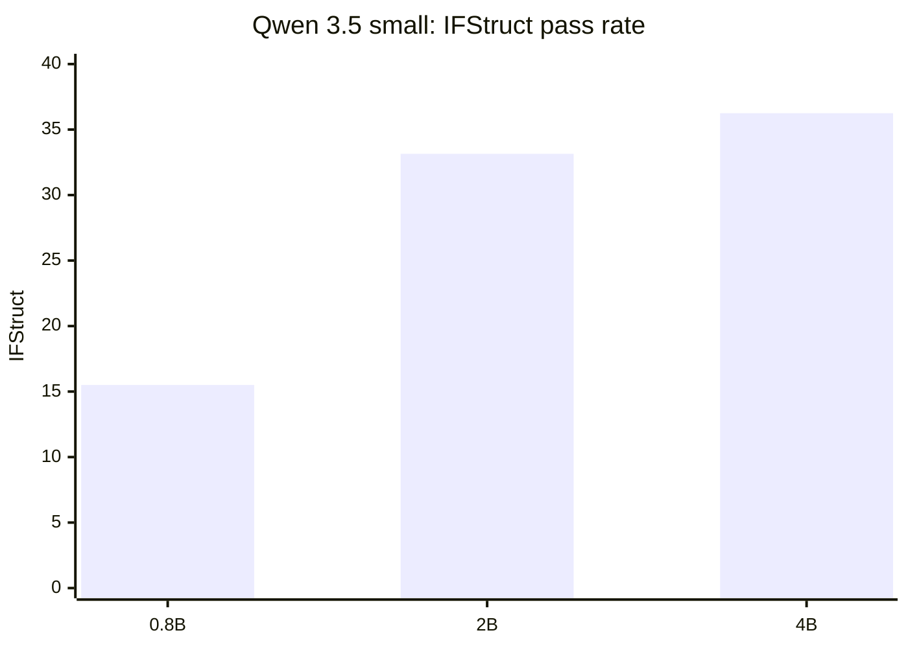
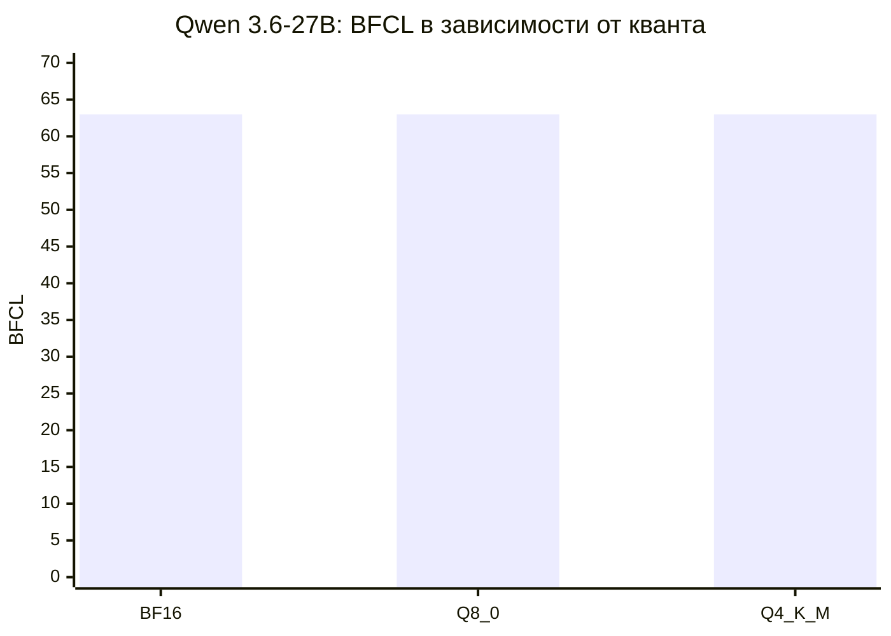
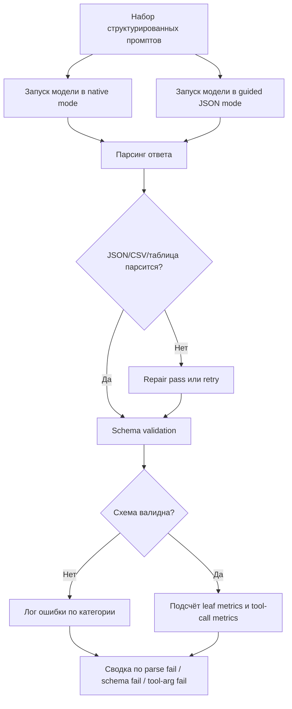
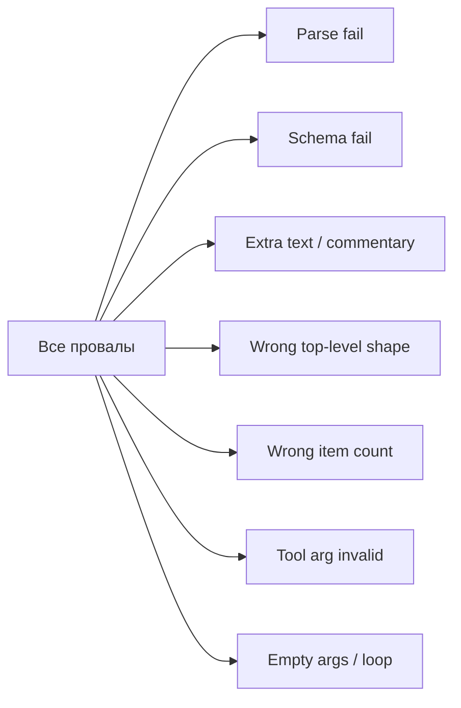

# Qwen 3.5 и Qwen 3.6 Q4 для структурированных ответов

## Executive summary 📌

Это исследование охватывает **только Q4-квантизованные варианты** моделей **Qwen 3.5** и **Qwen 3.6** в открыто доступных размерах **до 40B включительно**. На практике это означает: для **Qwen 3.5** в объём попадают **0.8B, 2B, 4B, 9B, 27B и 35B-A3B**; для **Qwen 3.6** — **27B и 35B-A3B**, потому что меньших открытых размеров у 3.6 в найденных официальных релизах нет. Официальные и полуофициальные каналы распространения Q4 включают **AWQ Int4 / GPTQ Int4** для части моделей, а для локального CPU/GPU-раннера уровня llama.cpp — **GGUF Q4_0 / Q4_1 / Q4_K_\*** или их динамические варианты в популярных сборках. citeturn20view0turn20view1turn21view4turn21view5turn21view6turn21view7turn22view0turn24view0turn24view1

Главный практический вывод очень приземлённый: **для строгого JSON, таблиц по схеме и function-calling Qwen 3.5/3.6 лучше оценивать и использовать в non-thinking режиме**. Официальная документация Alibaba Cloud по structured output прямо говорит, что **thinking mode сейчас не поддерживает structured output**, а в официальных карточках Qwen 3.5/3.6 показано, что для прямого ответа без рассуждений нужно явно задавать `enable_thinking: false`. Более того, сами документы Qwen предупреждают: даже при корректных шаблонах **tool calls могут иногда быть malformed**, поэтому в production нужно **парсить и валидировать аргументы самостоятельно**. citeturn40view0turn36view1turn36view2turn5view2

Если смотреть именно на **структурную дисциплину** — валидный JSON/YAML, следование схеме, отсутствие лишнего текста — то **малые Qwen 3.5 выглядят слабо** по открытому бенчмарку IFStruct: **0.8B = 15.50**, **2B = 33.15**, **4B = 36.25**. Это означает не “плохой интеллект вообще”, а именно **низкую надёжность в жёстких схемных задачах**, где ответ либо проходит валидатор, либо нет. Для **Qwen 3.6** и старших **Qwen 3.5 9B/27B/35B-A3B** аналогичных публичных IFStruct-результатов найти не удалось, но официальные карточки 27B и 35B-A3B обеих серий подчёркивают сильные tool-calling/agentic способности, а независимый кейс по **Qwen 3.6-27B** показал, что **BFCL function-calling accuracy у BF16, Q8_0 и Q4_K_M оказалась одинаковой — 63%**, при этом **Q4_K_M** был заметно быстрее и примерно вдвое экономнее по памяти. citeturn15view0turn7view0turn7view3turn26view2

Поэтому итог без маркетингового тумана такой: **для “просто JSON” нижняя практическая планка начинается скорее с 4B–9B**, а для **надёжного function-calling, вложенных схем и многошаговых agentic-пайплайнов** оптимальный класс — это **Qwen 3.5/3.6 27B** и выше. Если задача локальная и нужна Q4-сборка с хорошим балансом, то в текущих открытых данных наиболее убедительно выглядит **Qwen 3.6-27B Q4_K_M**; если нужен максимально стабильный локальный tool use, то у **Qwen 3.6** обязательно учитывать `preserve_thinking`, а в LM Studio и похожих окружениях — отдельно следить за шаблоном и парсером. citeturn26view2turn36view0turn36view3turn35view2turn35view0

## Что удалось подтвердить по моделям и квантам 🧩

Ниже — только те размеры, которые действительно удалось подтвердить в источниках. Колонка “Q4-реализации” важна: пользовательский вопрос звучит про **Q4-кванты вообще**, а не только про один формат. Поэтому в таблице разделены **официальные Int4-релизы** и **локальные GGUF Q4-сборки**, где это подтверждено. citeturn20view0turn20view1turn21view4turn21view5turn21view6turn21view7turn22view0turn23view1turn24view0turn24view1

| Семейство | Размер | Что подтверждено по Q4 | Комментарий для structured output | Источник |
|---|---:|---|---|---|
| Qwen 3.5 | 0.8B | GGUF: `Q4_0`, `Q4_1`, `Q4_K_M`, `Q4_K_S`, dyn-Q4; MLX 4-bit | Самый маленький доступный размер; для жёстких схем слабый | citeturn22view0turn15view0 |
| Qwen 3.5 | 2B | AWQ Int4; GGUF: `Q4_0`, `Q4_1`, `Q4_K_M`, `Q4_K_S`, dyn-Q4 | Уже лучше 0.8B, но ещё далеко от надёжного schema-following | citeturn21view7turn15view0 |
| Qwen 3.5 | 4B | GGUF: `Q4_0`, `Q4_1`, `Q4_K_M`, `Q4_K_S`, dyn-Q4; MLX 4-bit | Минимум, с которого structured output становится условно пригодным | citeturn21view6turn15view0 |
| Qwen 3.5 | 9B | AWQ Int4; GGUF: `Q4_0`, `Q4_1`, `Q4_K_M`, `Q4_K_S`, dyn-Q4; MLX 4-bit | Публичного IFStruct нет, но это первый “серьёзный” кандидат среди small-моделей | citeturn21view5turn37view0 |
| Qwen 3.5 | 27B | GPTQ Int4; AWQ Int4; GGUF: `Q4_0`, `Q4_1`, `Q4_K_M`, `Q4_K_S`, dyn-Q4 | Один из лучших компромиссов между качеством и локальной ценой | citeturn21view4turn37view2 |
| Qwen 3.5 | 35B-A3B | GPTQ Int4; AWQ Int4; локальные GGUF Q4 через сборки Unsloth | Потенциально сильнее 27B в agentic-сценариях, но чувствителен к шаблонам | citeturn20view0turn17view1turn35view1 |
| Qwen 3.6 | 27B | AWQ Int4; community GGUF `Q4_1`, `Q4_K_M`, `Q4_K_S`; Unsloth dyn-Q4 | Лучший подтверждённый публично sweet spot для Q4 tool calling | citeturn23view1turn24view0turn24view1turn26view2 |
| Qwen 3.6 | 35B-A3B | AWQ Int4; GGUF: `UD-Q4_K_M`, `UD-Q4_K_S`, `UD-Q4_K_XL`, `MXFP4_MOE` | Сильный кандидат для локальных агентных задач, но требует корректной конфигурации thinking | citeturn23view1turn23view2turn36view0 |

Важно отметить одну неприятную, но полезную деталь: **QAT как официальный релизный канал для Qwen 3.5/3.6 в найденных источниках не подтверждён**. Есть сторонние демо и общие статьи о QAT, но не найдено официальной линейки “Qwen 3.5/3.6 QAT” по аналогии с тем, как это иногда подают для других семейств. Поэтому в этом отчёте **QAT для Qwen считается “не подтверждено как официальный массовый релиз”**. citeturn29search10turn29search12

Есть и ещё одна тонкость, из-за которой у многих локальный tool-calling превращается в комедию положений. Официальные карточки Qwen 3.5/3.6 говорят, что модели **по умолчанию думают** и выводят `<think>...</think>`, но у локальных GGUF-сборок и wrapper’ов поведение может отличаться. Например, документация Unsloth для Qwen3.5 small-моделей пишет, что в их локальной конфигурации **0.8B/2B/4B/9B reasoning выключен по умолчанию**, а включается через `--chat-template-kwargs '{"enable_thinking":true}'`. Это не противоречие в духе “кто-то врёт”, а разница между **официальной модельной логикой** и **поведением конкретной сборки/шаблона**. citeturn37view0turn37view2turn17view1

## Качество структурированных ответов по доступным данным 📊

### Что реально измерено публично

Самые полезные открытые числа по **строгой структуре** сейчас даёт **IFStruct**. Этот бенчмарк проверяет не “разумность” ответа, а конкретно то, что нужно в проде: **парсится ли JSON/YAML, соблюдены ли code fences, нет ли лишнего текста, совпадает ли top-level shape, правильное ли число элементов, все ли leaf-поля соответствуют схеме, не добавлены ли лишние ключи**. Проход бинарный: либо пример полностью соответствует всем ограничениям, либо нет. citeturn9view2turn9view3

В опубликованной таблице IFStruct для Qwen 3.5 присутствуют только **0.8B, 2B и 4B**, и картина там довольно жёсткая: **15.50 / 33.15 / 36.25** соответственно. При этом соседние метрики из той же таблицы — **StructEval** и **Structured Output Benchmark (text subset)** — заметно выше, что хорошо показывает типичный разрыв: модель может “в среднем выглядеть структурной”, но на **строгом all-or-nothing schema validation** всё ещё регулярно ломаться. Именно поэтому маленькие Q4-модели часто создают ложное ощущение “ну вроде JSON же пишет”, пока не включается настоящий валидатор. citeturn15view0

| Модель | IFStruct | StructEval | SOB Text | Интерпретация |
|---|---:|---:|---:|---|
| Qwen3.5-0.8B | 15.50 | 49.45 | 70.03 | Слаб для строгого схемного JSON |
| Qwen3.5-2B | 33.15 | 69.18 | 80.82 | Условно годится для простых структур |
| Qwen3.5-4B | 36.25 | 72.75 | 81.03 | Минимально практичный нижний порог |

Источник одной строкой, но очень содержательный: citeturn15view0



### Что можно сказать про 9B, 27B и 35B-A3B

Для **Qwen 3.5-9B**, **Qwen 3.5-27B** и **Qwen 3.5-35B-A3B** публичных IFStruct-оценок в найденных источниках нет, но экосистема вокруг этих моделей гораздо богаче в части **tool use**. Официальные карточки **27B** и **35B-A3B** прямо говорят, что модели **“excel in tool calling capabilities”**, и показывают готовые команды запуска для vLLM/SGLang с `--tool-call-parser qwen3_coder`. Это не равно строгому benchmark-числу по JSON, но это важный сигнал: семейство явно обучалось не только “болтать красиво”, но и выдавать машинно-обрабатываемые вызовы инструментов. citeturn7view0turn7view3turn37view2

Для **Qwen 3.6** официальная риторика ещё сильнее смещена в сторону real-world agents и tool use. В карточках **27B** и **35B-A3B** отдельно документирован параметр `preserve_thinking`, а описание прямо указывает, что он полезен для agent-сценариев, потому что поддерживает согласованность решений и снижает повторное “переосмысление” на последующих шагах. Это особенно важно для **многошагового function-calling**, где модель не просто один раз должна выдать `{"arg": ...}`, а несколько раз подряд держать protocol discipline. citeturn36view0turn36view3

### Что известно именно про Q4 и function-calling

Самый полезный найденный публичный кейс именно по **Q4** — это независимое сравнение **Qwen 3.6-27B** в трёх вариантах: **BF16, Q8_0 и Q4_K_M**. В нём на **BFCL** у всех трёх вариантов получился один и тот же результат — **63%**, тогда как по кодогенерации BF16 заметно лучше. Это очень хорошо ложится на практику: **Q4 чаще сильнее деградирует на тонкой генерации текста и кода, чем на достаточно “формализованном” tool-calling**, особенно если рядом есть хороший шаблон, parser и жёсткий post-processing. При этом у автора Q4_K_M получился примерно **2.3× быстрее BF16** и почти вдвое легче по RAM. citeturn26view2



Это не означает, что “любой Q4 у любого Qwen работает как BF16”. Увы, мир не настолько справедлив. Но это означает, что **при правильной обвязке** Q4 не обязательно убивает function-calling как класс задачи. В частности, когда schema/arguments достаточно просты и runner умеет корректно трактовать модельный формат tool calls, потери от Q4 могут быть существенно ниже, чем ожидают многие, особенно после болезненного опыта с маленькими моделями. citeturn26view2turn38view0

### Где всё ломается на практике

Самые частые проблемы оказываются не в “глупой модели”, а на стыке **thinking blocks, шаблона чата и парсера инструментов**. У **Qwen 3.5** и **Qwen 3.6** это подтверждается сразу несколькими источниками: официальная документация Qwen пишет, что malformed tool calls возможны и в production надо разбирать аргументы самостоятельно; issue в LM Studio показывает, что с reasoning включённым `<think>` может смешиваться с JSON, ломая downstream parsing; отдельный issue показывает, что parser вообще может сканировать содержимое `<think>` как будто это реальный tool-call; а issue по Qwen3.6 фиксирует типичную поломку multi-turn loops с пустыми `{}` arguments без `preserve_thinking=true`. citeturn5view2turn35view1turn35view3turn35view2

Это и даёт самый важный прикладной вывод отчёта: если задача — **строго структурированный ответ**, то **thinking mode нужно считать источником дополнительного риска**, а не “бесплатной умности”. В hosted JSON mode это вообще запрещено официально; в локальном function-calling это часто ведёт либо к смешиванию reasoning и JSON, либо к ошибкам шаблона/парсера, либо к пустым аргументам на длинной дистанции. citeturn40view0turn35view1turn35view2turn35view3

## Методика корректного эксперимента 🧪

### Что именно стоит мерить

Для этой темы недостаточно метрики “модель ответила вроде похоже”. Нужны метрики в трёх слоях. Первый слой — **синтаксис**: парсится ли JSON/CSV/YAML/таблица вообще. Второй — **схема**: все ли поля на месте, правильные ли типы, нет ли лишних ключей, соблюдены ли enum/range/count. Третий — **содержимое**: корректны ли leaf values и насколько стабильно модель их воспроизводит между перезапусками. Именно такой разбор хорошо согласуется с IFStruct, StructEval, SOB и BFCL: IFStruct жёстко проверяет структурную корректность, SOB показывает, что schema compliance сама по себе ещё не гарантирует value accuracy, а BFCL оценивает способность корректно вызывать функции в реалистичных сценариях. citeturn9view2turn15view0turn33view2turn9view1

Рекомендуемый набор метрик для собственного прогона:

| Группа | Метрика | Как считать |
|---|---|---|
| Синтаксис | Parse success rate | Доля ответов, которые парсятся без repair |
| Схема | Schema violation rate | Доля ответов с пропущенными/лишними полями, неверными типами, count/range ошибками |
| Поля | Field Precision / Recall / F1 | По leaf-полям схемы |
| Значения | Exact leaf match | Для строк/чисел/enum |
| Строки | Normalized edit distance | Для “почти правильных” строковых полей |
| Таблицы | Column fidelity / row count accuracy | Совпадение колонок и числа строк |
| Function calling | Tool name accuracy / argument validity | Имя функции, парсинг args, schema-valid args |
| Стабильность | Repeat variance | 5–10 прогонов с фиксированным seed/температурой |

SOB особенно полезен как напоминание, что **schema compliance и value accuracy — не одно и то же**: модели могут почти идеально проходить по форме, но заметно хуже по leaf-value match. citeturn33view0turn33view1

### Как запускать, чтобы не обмануть самого себя

Если реальные прогоны делать отдельно, а не читать красивые чужие цифры, я бы рекомендовал две ветки пайплайна. Первая — **native mode**: модель отвечает сама, без constrained decoding, только через prompt/template. Вторая — **guided mode**: для self-hosted vLLM использовать `guided_json`/`guided_regex`/`guided_grammar`, а для API-режима Alibaba — `response_format={"type":"json_object"}` в **non-thinking** режиме. vLLM официально поддерживает guided decoding через **outlines**, **lm-format-enforcer** и **xgrammar**, а JSON mode у Alibaba/Qwen требует и `response_format`, и присутствия слова “JSON” в system/user prompt. citeturn38view0turn40view0

Параметры генерации для Qwen 3.5/3.6 лучше брать не “от чуйки”, а из официальных карточек. Для **non-thinking mode** у Qwen 3.5 и Qwen 3.6 документация рекомендует примерно **`temperature=0.7`, `top_p=0.8`, `top_k=20`, `min_p=0.0`, `presence_penalty=1.5`, `repetition_penalty=1.0`**. Для строгих структурированных ответов это хороший старт: не слишком детерминированно, но и без творческого джаза, после которого JSON уходит в путешествие. Для Qwen 3.6 multi-turn agentic use при thinking-режиме нужно добавлять `preserve_thinking=True`, но если цель — именно machine-readable output, мой baseline всё равно был бы **non-thinking + validator + retry**. citeturn37view3turn36view0turn36view3

### Рекомендуемый pipeline в одном mermaid-блоке



### Что делать с IFStruct

**IFStruct здесь применим напрямую**: это один из самых точных публичных сигналов именно про **instruction-following на structured output tasks**. Он проверяет валидность JSON/YAML, top-level shape, комментарии вне структуры, число элементов и строгое соответствие схеме. Но есть важное ограничение: в найденных открытых публикациях IFStruct-результаты для Qwen даны только для **Qwen3.5-0.8B / 2B / 4B**. Для **9B / 27B / 35B-A3B** и для **Qwen 3.6** либо результаты ещё не опубликованы, либо по крайней мере не были найдены в открытых источниках на дату этого отчёта. citeturn9view2turn15view0

## Набор тестов для structured output 🔬

Ниже — **минимальный рабочий набор из 20 тестов**, который покрывает JSON, вложенные структуры, таблицы, CSV→JSON, schema-following, function-calling и устойчивость к “ненужной болтовне”. Он составлен так, чтобы быть совместимым по духу с IFStruct, SOB, StructEval и BFCL, но оставаться удобным для локального воспроизведения. citeturn9view2turn31search0turn33view2turn9view1

### Тестовые примеры с эталонными ответами

| ID | Сценарий | Промпт | Эталонный ответ |
|---|---|---|---|
| T01 | Простой JSON | «Из текста извлеки `name`, `age`, `email`. Верни **только JSON**.» | `{"name":"Alex Brown","age":34,"email":"alex@example.com"}` |
| T02 | JSON + optional field | «Если `hobby` не указан, поле не добавляй.» | `{"name":"Alex","age":34}` |
| T03 | Enum | «Поле `priority` только `low|medium|high`. Верни 1 объект.» | `{"priority":"high"}` |
| T04 | Array count | «Сгенерируй **ровно 3** задачи с полями `title`, `done:boolean`.» | `{"tasks":[{"title":"...","done":false},{"title":"...","done":false},{"title":"...","done":true}]}` |
| T05 | Вложенный JSON | «Заказ: клиент, адрес, список из 2 товаров. Без лишних полей.» | `{"customer":{"name":"..."}, "address":{"city":"..."}, "items":[{"sku":"...","qty":1},{"sku":"...","qty":2}]}` |
| T06 | Deep nesting | «Проект → спринты → задачи → комментарии. Верни JSON с вложенностью 4 уровня.» | `{"project":{"sprints":[{"tasks":[{"comments":[{"author":"...","text":"..."}]}]}]}}` |
| T07 | Escaping | «Поле `quote` должно содержать строку с кавычками и переводом строки.» | `{"quote":"Он сказал: \"Привет\"\nИ ушёл"}` |
| T08 | Regex-like field discipline | «`postal_code` строкой в формате `070000`. Верни только JSON.» | `{"postal_code":"070000"}` |
| T09 | Mixed numeric types | «`price:number`, `qty:integer`, `discount:number`.» | `{"price":12.5,"qty":2,"discount":0.1}` |
| T10 | No commentary | «Никаких пояснений, Markdown и code fences.» | Чистый JSON без текста вокруг |
| T11 | Fenced JSON | «Верни **в ```json fence** и только его.» | ```json `{"status":"ok"}` ``` |
| T12 | Таблица Markdown | «Покажи таблицу из 3 строк с колонками `SKU`, `Qty`, `Price`.» | Markdown table с точными тремя строками данных |
| T13 | Таблица CSV | «Сгенерируй CSV с заголовком `city,population` и 2 строками.» | `city,population\nAlmaty,2280000\nOskemen,300000` |
| T14 | CSV→JSON | «Преобразуй CSV в массив JSON-объектов.» | `[{"city":"Almaty","population":2280000},{"city":"Oskemen","population":300000}]` |
| T15 | JSON Schema prompt | «Вот JSON Schema … заполни его валидным объектом.» | Объект, проходящий `jsonschema.validate` |
| T16 | Wrapper key | «Оберни массив в объект с ключом `employees`.» | `{"employees":[...]}`
| T17 | Function-calling single | «Если нужен поиск погоды — вызови `get_weather(location:string)`.» | `tool_call: {"name":"get_weather","arguments":{"location":"Almaty"}}` |
| T18 | Function-calling parallel | «Сравни погоду в Алматы и Астане, можно несколько вызовов.» | два tool call с валидными args |
| T19 | Function-calling with nested args | «Вызови `create_invoice(customer, items[])`. Учти 2 позиции.» | `{"name":"create_invoice","arguments":{"customer":{"name":"..."},"items":[{"sku":"A1","qty":1},{"sku":"B2","qty":2}]}}` |
| T20 | Repair / canonicalization | «Исправь невалидный JSON, сохранив смысл и схему.» | Валидный JSON без потери полей |

Чтобы не оставлять таблицу слишком абстрактной, ниже — три полностью развёрнутых образца, которыми удобно начинать smoke test.

#### Полный пример простого JSON 🧾

**Промпт**

```text
Извлеки имя, возраст и email из текста.
Верни только JSON.
Текст: "Hi, my name is Alex Brown, I'm 34 years old and my email is alexbrown@example.com"
```

**Эталон**

```json
{
  "name": "Alex Brown",
  "age": 34,
  "email": "alexbrown@example.com"
}
```

Такой паттерн буквально совпадает с рекомендуемым сценарием JSON mode у Alibaba/Qwen: запрос содержит слово “JSON”, а ответ должен приходить без лишнего текста вокруг структуры. citeturn40view0

#### Полный пример вложенного JSON 🪆

**Промпт**

```text
Сгенерируй валидный JSON для заказа.
Схема:
- customer.name: string
- customer.vip: boolean
- items: массив из 2 объектов
- items[].sku: string
- items[].qty: integer >= 1
- total: number
Никаких лишних полей. Только JSON.
```

**Эталон**

```json
{
  "customer": {
    "name": "Amina Tursyn",
    "vip": true
  },
  "items": [
    {"sku": "KB-101", "qty": 1},
    {"sku": "MS-220", "qty": 2}
  ],
  "total": 129.90
}
```

#### Полный пример function-calling 🔧

**Промпт**

```text
У тебя есть функция:
get_weather(location: string, unit: "celsius" | "fahrenheit")
Найди погоду в Almaty.
Если нужна функция — не отвечай текстом, а верни корректный tool call.
```

**Эталон**

```json
{
  "tool_calls": [
    {
      "type": "function",
      "function": {
        "name": "get_weather",
        "arguments": "{\"location\":\"Almaty\",\"unit\":\"celsius\"}"
      }
    }
  ]
}
```

Официальные примеры Qwen в function-calling-документации как раз показывают, что аргументы функции приходят как **JSON-строка**, а не как уже распарсенный объект; это важная мелочь, из-за которой ломается часть самописных адаптеров. citeturn5view2

### Какую диаграмму ошибок строить после прогонов

Публичного открытого **распределения ошибок именно для Qwen 3.5/3.6 Q4 по единой методике** я не нашёл. Поэтому ниже — не “измеренный факт”, а **шаблон визуализации**, который стоит построить после собственных прогонов.



Эта таксономия хорошо согласуется с IFStruct-validator, JSON-schema-подходом и реальными инцидентами у Qwen/LM Studio/Pi. citeturn9view2turn35view1turn35view2turn35view3

## Практический запуск и доступные сборки 🚀

### Что использовать для экспериментов

Если задача — **официальные Int4-релизы**, то для Qwen 3.5 это прежде всего **GPTQ Int4** и **AWQ Int4** на больших моделях и **AWQ Int4** на малых. Если задача — **локальный Q4 через llama.cpp**, то самое покрытое направление — **GGUF-сборки Unsloth**, а для Qwen 3.6-27B ещё и **bartowski**, где явно перечислены `Q4_1`, `Q4_K_M`, `Q4_K_S`. Для self-hosted structured JSON удобно использовать **vLLM**: он даёт и OpenAI-compatible API, и guided decoding через JSON schema. citeturn20view0turn20view1turn24view0turn24view1turn38view0

| Вариант | Когда брать | Пример |
|---|---|---|
| Qwen official AWQ Int4 | Нужен стандартный Int4 на vLLM/SGLang/Transformers | `QuantTrio/Qwen3.6-27B-AWQ`, `QuantTrio/Qwen3.5-35B-A3B-AWQ` citeturn23view1turn20view0 |
| Qwen official GPTQ Int4 | Нужен официальный Int4 у Qwen 3.5 | `Qwen/Qwen3.5-27B-GPTQ-Int4`, `Qwen/Qwen3.5-35B-A3B-GPTQ-Int4` citeturn21view4turn22view3 |
| Unsloth GGUF dyn-Q4 | Локальный llama.cpp / Ollama / LM Studio | `unsloth/Qwen3.6-27B-GGUF:UD-Q4_K_XL` citeturn24view1 |
| Bartowski GGUF classic Q4 | Нужны классические `Q4_1`, `Q4_K_M`, `Q4_K_S` | `bartowski/Qwen_Qwen3.6-27B-GGUF:Q4_K_M` citeturn24view0 |

### Команды запуска

#### vLLM для официального Qwen 3.5 с tool calling

```bash
vllm serve Qwen/Qwen3.5-27B \
  --port 8000 \
  --tensor-parallel-size 8 \
  --max-model-len 262144 \
  --reasoning-parser qwen3 \
  --enable-auto-tool-choice \
  --tool-call-parser qwen3_coder
```

Это официальный шаблон из карточки Qwen 3.5-27B. Для strict-JSON поверх этого имеет смысл использовать ещё и `guided_json` на уровне запроса. citeturn37view2turn38view0

#### vLLM для Qwen 3.6 с official AWQ Int4

```bash
vllm serve QuantTrio/Qwen3.6-27B-AWQ \
  --port 8000 \
  --tensor-parallel-size 4 \
  --max-model-len 262144 \
  --reasoning-parser qwen3
```

Официально через Xinference подтверждён именно AWQ Int4 для Qwen 3.6-27B; community GGUF уже отдельная история. citeturn23view1

#### llama.cpp для локального Q4 sweet spot

```bash
llama-server -hf bartowski/Qwen_Qwen3.6-27B-GGUF:Q4_K_M
```

У bartowski для 27B явно указаны `Q4_1`, `Q4_K_M` и `Q4_K_S`, причём `Q4_K_M` помечен как recommended default. citeturn24view0

#### llama.cpp для Unsloth GGUF на Qwen 3.6

```bash
llama serve -hf unsloth/Qwen3.6-27B-GGUF:UD-Q4_K_XL
```

Или, если нужен 35B-A3B:

```bash
llama-server -hf unsloth/Qwen3.6-35B-A3B-GGUF:UD-Q4_K_XL \
  --chat-template-kwargs '{"enable_thinking":false}'
```

Unsloth документирует эту сборку как совместимую с llama.cpp, Ollama, LM Studio и рядом агентных рантаймов. Для строгих структурированных ответов лучше стартовать сразу с `enable_thinking=false`. citeturn24view1turn23view2turn36view1

#### Запрос к vLLM с guided JSON

```python
from openai import OpenAI

client = OpenAI(base_url="http://localhost:8000/v1", api_key=os.environ.get("LOCAL_MODEL_API_KEY", ""))

schema = {
    "type": "object",
    "properties": {
        "name": {"type": "string"},
        "age": {"type": "integer"}
    },
    "required": ["name", "age"],
    "additionalProperties": False
}

resp = client.chat.completions.create(
    model="Qwen/Qwen3.5-27B",
    messages=[
        {"role": "system", "content": "Return JSON only."},
        {"role": "user", "content": "John is 28 years old. Extract name and age as JSON."}
    ],
    extra_body={
        "guided_json": schema,
        "chat_template_kwargs": {"enable_thinking": False}
    }
)
print(resp.choices[0].message.content)
```

vLLM официально поддерживает `guided_json`, `guided_regex` и `guided_grammar`; в большинстве реальных кейсов именно `guided_json + non-thinking` даёт лучший баланс между качеством и предсказуемостью. citeturn38view0

#### JSON mode у Alibaba Cloud Model Studio

```python
from openai import OpenAI

client = OpenAI(
    api_key=os.environ["MODEL_STUDIO_API_KEY"],
    base_url="https://your-endpoint/compatible-mode/v1",
)

resp = client.chat.completions.create(
    model="qwen3.6-27b",
    messages=[
        {"role": "system", "content": "Return the result in JSON format."},
        {"role": "user", "content": "My name is Alex Brown and I am 34 years old"}
    ],
    response_format={"type": "json_object"}
)
print(resp.choices[0].message.content)
```

Тут есть три официально задокументированных правила: нужно включить `response_format={"type":"json_object"}`, упомянуть слово **JSON** в сообщениях и **не включать thinking mode**, потому что thinking и structured output сейчас несовместимы. Alibaba также советует **не ставить `max_tokens`**, чтобы не получить обрезанный JSON. citeturn40view0

## Выводы и рекомендации 🧭

Если отбросить всё лишнее, то картина по Q4 для structured output выглядит так.

**Qwen 3.5-0.8B и 2B** — это модели, которые можно заставить писать JSON, но на задачах уровня **IFStruct / nested schema / exact shape / no-extra-text** они слишком часто “мимо кассы”. Для прототипа или дешёвого рерайтера JSON — ещё ладно. Для production-пайплайна, где downstream не прощает лишней запятой, — нет. citeturn15view0

**Qwen 3.5-4B** — это нижняя граница, где structured output начинает быть практичным. Но именно “начинает”, а не “уже надёжен”. Если ответы простые, схема короткая, а вы сверху ставите `guided_json` или API JSON mode, он может быть полезен. Если же нужны вложенные структуры, таблицы, function-calling с несколькими аргументами и высокая повторяемость, я бы смотрел выше. citeturn15view0turn38view0

**Qwen 3.5-9B** — в этом отчёте остаётся “тёмной лошадкой с хорошими шансами”. Публичного IFStruct для него не нашлось, но по размеру, общей instruction-following базе и доступности Q4-сборок он выглядит как первый реально серьёзный кандидат для локальных structured-output задач. Если железо позволяет, это намного более разумная ставка, чем 4B, особенно если хочется и JSON, и таблицы, и лёгкий tool use в одном флаконе. citeturn21view5turn37view0

**Qwen 3.5-27B и 35B-A3B** — это уже “рабочий класс” для машинно-обрабатываемых ответов. По официальной документации обе модели явно поддерживаются в tool-use сценариях, а по факту главные провалы у них чаще не в reasoning capacity, а в связке **thinking/tags/template/parser**. Если эту связку починить и запускать strict JSON в non-thinking mode, это уже очень конкурентные кандидаты для self-hosted pipelines. citeturn37view2turn36view2turn35view1turn35view3

**Qwen 3.6-27B** — самый убедительный выбор в этом исследовании. Причина простая: по нему есть хотя бы один открытый кейс, где **Q4_K_M не проиграл BF16 по BFCL**, зато выиграл по скорости и памяти. Плюс Qwen 3.6 в целом строился как более “стабильная и полезная в реальном мире” итерация по сравнению с базой 3.5, а для multi-turn reasoning/tool use у него официально есть `preserve_thinking`. Если нужен один ответ на вопрос “что брать локально под Q4 для structured responses и function-calling?” — мой выбор из найденных данных был бы **Qwen 3.6-27B Q4_K_M**. citeturn26view2turn20view1turn36view3

**Qwen 3.6-35B-A3B** тоже очень силён, но у него больше operational nuance. В “чистом” качестве он может быть отличным вариантом, однако реальная надёжность сильнее зависит от того, как именно runner обрабатывает thinking blocks, template и парсер. Если инфраструктура под контролем — хороший выбор. Если стек разнородный и там LM Studio, Open WebUI, кастомный OpenAI shim и ещё пара удивительных решений — 27B dense выглядит менее капризным. citeturn36view0turn35view2turn35view0

Практические рекомендации я бы сформулировал так:

- Для **строгого JSON по схеме**: брать **Qwen 3.6-27B Q4_K_M** или **Qwen 3.5-27B/35B-A3B**, запускать в **non-thinking**, сверху ставить **schema validation** и желательно **guided_json/JSON mode**. citeturn26view2turn38view0turn40view0
- Для **простых JSON-ответов на слабом железе**: минимально разумный старт — **Qwen 3.5-4B**, лучше — **9B**. Но 0.8B и 2B годятся скорее для дешёвых задач, где валидатор и retry уже встроены. citeturn15view0turn21view5
- Для **function-calling и агентных циклов**: у **Qwen 3.6** обязательно учитывать `preserve_thinking`, а при локальном стеке не доверять шаблону “из коробки” без smoke test на 20–50 последовательных tool calls. citeturn36view0turn35view2
- Для **LM Studio и похожих рантаймов**: считать `<think>`-блоки потенциальным источником поломок. Если цель — надёжная структура, выключать thinking; если нужны agent loops — проверять parser/template отдельно. citeturn35view1turn35view3turn35view0
- Для **production**: всегда делать `parse -> validate -> retry/repair`. И да, это та самая скучная часть, которая экономит больше времени, чем ещё одна “умная” модель. JSON без валидатора — это не pipeline, это авантюра с красивым логотипом. citeturn40view0turn5view2

Ограничение исследования нужно назвать прямо. В открытых источниках на **2026-07-07** не нашлось **полного apples-to-apples бенчмарка именно Q4-версий Qwen 3.5 и Qwen 3.6 по всем размерам от минимума до 40B** на едином наборе структурированных задач. Поэтому самые надёжные выводы здесь опираются на четыре класса источников: **официальные карточки и документацию Qwen/Alibaba**, **IFStruct для малых Qwen3.5**, **один независимый BFCL-кейс для Qwen3.6-27B Q4_K_M**, и **issue-репорты / практические обсуждения инфраструктурных поломок**. Там, где чисел нет, выводы в отчёте даны как **осторожная инженерная экстраполяция**, а не как доказанный leaderboard-факт. citeturn15view0turn26view2turn40view0turn35view1turn35view2turn35view3