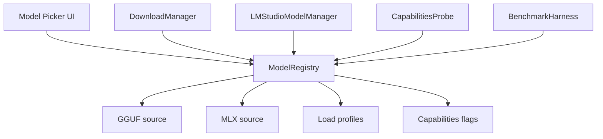

# Model Registry для host application: идентификаторы, GGUF/MLX источники и capabilities моделей 📦

## Назначение документа 🎯

Model Registry — это единый источник правды о моделях, которые host application умеет скачивать, загружать и использовать через LM Studio. Такой реестр нужен, потому что у одной модели обычно существует несколько имён: человекочитаемое имя в UI, идентификатор каталога LM Studio, репозиторий Hugging Face для GGUF, отдельный MLX-репозиторий для macOS, квантизация, vision-проектор и набор возможностей.

Без реестра подсистема загрузки начинает жить на строковых догадках. В UI отображается одно имя, API получает второе, файл скачивается из третьего места, а через полгода никто не понимает, почему `Gemma 4 26B` внезапно стала `google/gemma-4-26B-A4B-it-qat-q4_0-gguf:Q4_0`. Model Registry устраняет этот класс ошибок: каждая модель описывается один раз, а остальные компоненты только читают её декларативное описание.

> [!NOTE]
> Реестр не должен быть списком «популярных моделей». Он должен быть контрактом между UI, загрузчиком, lifecycle manager, benchmark harness и structured-output клиентом.

## Основные типы идентификаторов 🧩

| Поле | Пример | Назначение |
|------|--------|------------|
| `wvm_key` | `gemma4_26b_a4b_qat` | Внутренний стабильный ключ host application, не меняется при переименовании UI |
| `display_name` | `Gemma 4 26B-A4B QAT` | Человекочитаемое имя для интерфейса |
| `lmstudio_catalog_id` | `google/gemma-4-26b-a4b` | ID из каталога LM Studio, удобен для поиска и совместимости |
| `hf_repo_gguf` | `google/gemma-4-26B-A4B-it-qat-q4_0-gguf` | Репозиторий Hugging Face для GGUF |
| `gguf_quantization` | `Q4_0` или `Q4_K_M` | Выбранная квантизация для скачивания |
| `hf_repo_mlx` | `mlx-community/gemma-4-26b-a4b-it-4bit` | Репозиторий MLX для Apple Silicon |
| `official_level` | `upstream`, `lmstudio-community`, `mlx-community` | Уровень доверия к источнику |
| `capabilities` | `text`, `vision`, `reasoning`, `json_output` | Возможности модели |

## Уровни официальности 🏷️

| Уровень | Описание | Пример | Политика host application |
|---------|----------|--------|--------------|
| `upstream` | Репозиторий в официальной организации вендора | `google/...`, `Qwen/...`, `mistralai/...` | Предпочтительный источник |
| `lmstudio-community` | Кванты, подготовленные командой/сообществом LM Studio | `lmstudio-community/Qwen3.6-35B-A3B-GGUF` | Допустимо, если upstream GGUF отсутствует |
| `mlx-community` | MLX-конверсия сообщества | `mlx-community/gemma-4-12B-it-4bit` | Практический стандарт для macOS, но помечается отдельно |
| `unofficial` | Сторонняя сборка без явного доверенного маршрута | произвольные HF repos | Только experimental |

> [!WARNING]
> Уровень `official_level` не должен превращаться в украшение. Он влияет на UI-предупреждения, автозагрузку по умолчанию, benchmark-приоритет и поддержку пользователем.

## Рекомендуемая структура записи 🧱

```json
{
  "key": "gemma4_26b_a4b_qat",
  "display_name": "Gemma 4 26B-A4B QAT",
  "family": "gemma",
  "vendor": "Google",
  "lmstudio_catalog_id": "google/gemma-4-26b-a4b",
  "recommended_for": ["structured_json", "vision", "long_context"],
  "capabilities": ["text", "vision", "reasoning", "tool_use", "json_output"],
  "gguf": {
    "repo": "google/gemma-4-26B-A4B-it-qat-q4_0-gguf",
    "quantization": "Q4_0",
    "official_level": "upstream",
    "vision_projector_required": true
  },
  "mlx": {
    "repo": "mlx-community/gemma-4-26b-a4b-it-4bit",
    "official_level": "mlx-community"
  },
  "load_profiles": {
    "rtx_5060ti_16gb": {
      "context_length": 32768,
      "parallel": 2,
      "flash_attention": true,
      "offload_kv_cache_to_gpu": true
    }
  }
}
```

## Базовая таблица моделей 🧠

| host application key | LM Studio catalog ID | GGUF Q4 | MLX | Комментарий |
|---------|----------------------|---------|-----|-------------|
| `qwen3_6_35b_a3b` | `qwen/qwen3.6-35b-a3b` | `lmstudio-community/Qwen3.6-35B-A3B-GGUF:Q4_K_M` | `mlx-community/Qwen3.6-35B-A3B-4bit` | Сильная модель, но structured output требует проверки reasoning |
| `qwen3_5_9b` | `qwen/qwen3.5-9b` | `lmstudio-community/Qwen3.5-9B-GGUF:Q4_K_M` | `mlx-community/Qwen3.5-9B-OptiQ-4bit` | Хороший тестовый кандидат, но возможны thinking/routing edge cases |
| `qwen3_vl_4b` | `qwen/qwen3-vl-4b` | `Qwen/Qwen3-VL-4B-Instruct-GGUF:Q4_K_M` | `mlx-community/Qwen3-VL-4B-Instruct-4bit` | Upstream GGUF, удобен для vision baseline |
| `qwen3_vl_8b` | `qwen/qwen3-vl-8b` | `Qwen/Qwen3-VL-8B-Instruct-GGUF:Q4_K_M` | `mlx-community/Qwen3-VL-8B-Instruct-4bit` | Более сильный vision baseline |
| `gemma3_4b_qat` | `google/gemma-3-4b` | `google/gemma-3-4b-it-qat-q4_0-gguf:Q4_0` | `mlx-community/gemma-3-4b-it-qat-4bit` | Лёгкая vision-модель |
| `gemma4_e2b_qat` | `google/gemma-4-e2b-qat` | `google/gemma-4-E2B-it-qat-q4_0-gguf:Q4_0` | `mlx-community/gemma-4-e2b-it-4bit` | Очень лёгкая модель для дешёвых JSON/vision задач |
| `gemma4_e4b_qat` | `google/gemma-4-e4b-qat` | `google/gemma-4-E4B-it-qat-q4_0-gguf:Q4_0` | `mlx-community/gemma-4-e4b-it-4bit` | Потенциальный быстрый кандидат для постобработки |
| `gemma4_12b_qat` | `google/gemma-4-12b` | `google/gemma-4-12B-it-qat-q4_0-gguf:Q4_0` | `mlx-community/gemma-4-12B-it-4bit` | Вероятный sweet spot для RTX 5060 Ti 16GB |
| `gemma4_26b_a4b_qat` | `google/gemma-4-26b-a4b` | `google/gemma-4-26B-A4B-it-qat-q4_0-gguf:Q4_0` | `mlx-community/gemma-4-26b-a4b-it-4bit` | Сильный кандидат для structured output, но требует VRAM-профиля |
| `gemma4_31b_qat` | `google/gemma-4-31b` | `google/gemma-4-31B-it-qat-q4_0-gguf:Q4_0` | `mlx-community/gemma-4-31b-it-4bit` | Большая модель, тестировать на loops/latency |
| `ministral3_3b` | `mistralai/ministral-3-3b` | `mistralai/Ministral-3-3B-Instruct-2512-GGUF:Q4_K_M` | — | Официальный Mistral GGUF, vision + JSON output |
| `ministral3_14b_reasoning` | `mistralai/ministral-3-14b-reasoning` | `mistralai/Ministral-3-14B-Reasoning-2512-GGUF:Q4_K_M` | — | Reasoning-модель, structured output требует отдельного режима |

## Mermaid-схема зависимостей 🗺️



## Политика выбора backend 🖥️

| Платформа | Предпочтение | Причина |
|-----------|--------------|---------|
| Windows + NVIDIA | GGUF через LM Studio llama.cpp | CUDA, понятные Q4-кванты, parallel requests |
| Linux + NVIDIA | GGUF через LM Studio llama.cpp | Аналогично Windows, но зависит от драйверов |
| macOS Apple Silicon | MLX, если модель стабильна | Нативная производительность и unified memory |
| macOS fallback | GGUF | Если MLX-версия отсутствует или нестабильна |

## Инварианты реестра ✅

1. `key` уникален и не зависит от внешних переименований.
2. `display_name` можно менять без миграции данных.
3. `lmstudio_catalog_id` не используется как единственный источник скачивания.
4. `gguf.repo + gguf.quantization` образуют точный источник загрузки.
5. `official_level` обязателен для каждого источника.
6. Для vision-моделей явно фиксируется необходимость projector/mmproj.
7. Для reasoning-моделей явно фиксируется стратегия отключения/валидации reasoning.
8. Для каждой модели есть минимум один load profile для целевого железа.

## Рекомендуемые проверки при старте приложения 🧪

```text
1. Загрузить registry.
2. Проверить уникальность key.
3. Проверить наличие хотя бы одного источника gguf/mlx.
4. Проверить, что quantization допустима для указанного repo.
5. Получить /api/v1/models и сопоставить catalog_id/capabilities.
6. Пометить модели как available / downloadable / unsupported.
```

## Итог 🧷

Model Registry превращает набор внешних моделей в управляемую подсистему. Для host application он должен быть не справочником, а контрактом: загрузчик читает источники, UI читает display metadata, benchmark harness читает capabilities, а lifecycle manager читает load profiles. Такой подход снижает риск строковых ошибок и позволяет добавлять новые модели без переписывания логики загрузки.

## Источники и точки проверки 🔗

- LM Studio REST API overview: https://lmstudio.ai/docs/developer/rest
- LM Studio model download API: https://lmstudio.ai/docs/developer/rest/download
- LM Studio download status API: https://lmstudio.ai/docs/developer/rest/download-status
- LM Studio model load API: https://lmstudio.ai/docs/developer/rest/load
- LM Studio model list API: https://lmstudio.ai/docs/developer/rest/list
- LM Studio native chat API: https://lmstudio.ai/docs/developer/rest/chat
- LM Studio stateful chats: https://lmstudio.ai/docs/developer/rest/stateful-chats
- LM Studio structured output: https://lmstudio.ai/docs/developer/openai-compat/structured-output
- LM Studio parallel requests: https://lmstudio.ai/docs/app/advanced/parallel-requests
- LM Studio 0.4.0 blog: https://lmstudio.ai/blog/0.4.0
- LM Studio API changelog: https://lmstudio.ai/docs/developer/api-changelog
- LM Studio Open Responses blog: https://lmstudio.ai/blog/openresponses
- LM Studio bug tracker, Responses re-prefill: https://github.com/lmstudio-ai/lmstudio-bug-tracker/issues/2074
- llama.cpp prefix cache discussion: https://github.com/ggml-org/llama.cpp/discussions/15530
