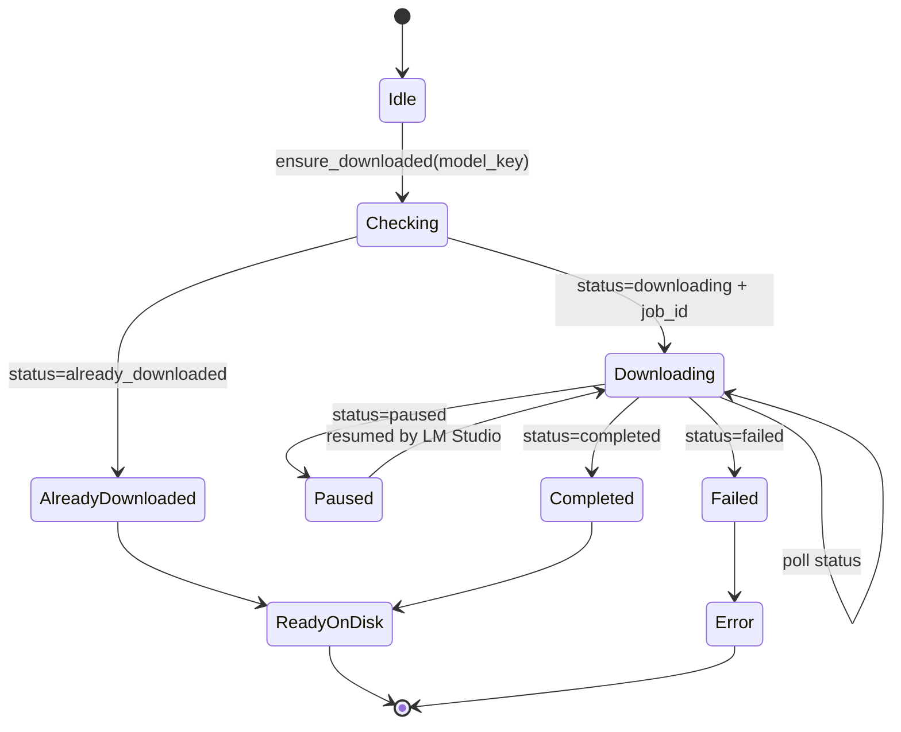
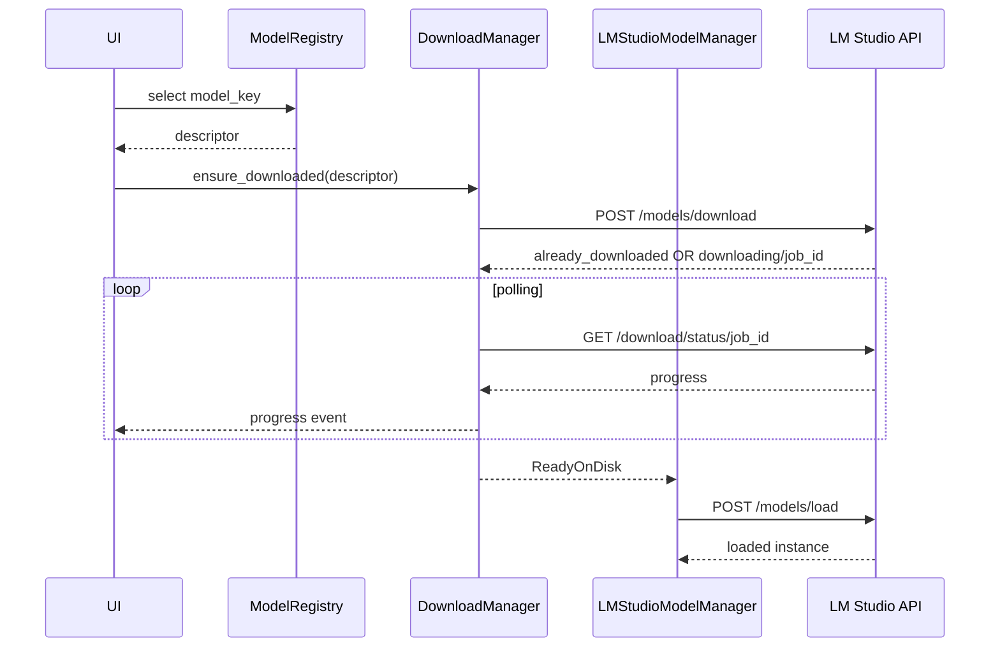

# Загрузчик моделей LM Studio в host application: download jobs, progress polling и UX-индикация 📥

## Назначение документа 🎯

Загрузчик моделей отвечает за превращение записи из Model Registry в локально доступную модель на диске LM Studio. Он не должен смешивать скачивание, загрузку в VRAM/RAM и саму генерацию. Его задача уже: принять модельный descriptor, вызвать API LM Studio download, обработать `already_downloaded`, показать прогресс и вернуть управляемый результат.

> [!NOTE]
> Скачанная модель не равна загруженной модели. Скачивание работает с диском и сетью, загрузка — с RAM/VRAM и load config.

## Основные endpoint-ы 🧩

| Endpoint | Назначение |
|----------|------------|
| `POST /api/v1/models/download` | Запускает скачивание модели или возвращает `already_downloaded` |
| `GET /api/v1/models/download/status/:job_id` | Возвращает прогресс download job |
| `GET /api/v1/models` | Позволяет проверить доступные/скачанные/загруженные модели |

LM Studio возвращает объект download job. При активном скачивании в нём присутствуют `job_id`, `status`, `downloaded_bytes`, `total_size_bytes`, `bytes_per_second`, `estimated_completion`. Если модель уже скачана, job id отсутствует, а статус равен `already_downloaded`.

## State machine загрузчика 🔄



## Алгоритм `ensure_downloaded()` 🛠️

```python
async def ensure_downloaded(model: ModelDescriptor) -> DownloadResult:
    request = build_download_request(model)
    response = await lmstudio.post('/api/v1/models/download', json=request)

    if response.status == 'already_downloaded':
        return DownloadResult.ready(model_key=model.key)

    if response.status != 'downloading' or not response.job_id:
        return DownloadResult.error('unexpected_download_state')

    while True:
        status = await lmstudio.get(f'/api/v1/models/download/status/{response.job_id}')
        emit_progress(status)

        if status.status == 'completed':
            return DownloadResult.ready(model_key=model.key)
        if status.status == 'failed':
            return DownloadResult.error('download_failed', details=status)
        if status.status == 'paused':
            emit_paused(status)

        await asyncio.sleep(0.5)
```

## Формирование download request 📦

| Тип источника | Payload |
|---------------|---------|
| LM Studio catalog | `{ "model": "google/gemma-4-12b" }` |
| Hugging Face GGUF | `{ "model": "https://huggingface.co/google/gemma-4-12B-it-qat-q4_0-gguf", "quantization": "Q4_0" }` |
| Qwen VL GGUF | `{ "model": "https://huggingface.co/Qwen/Qwen3-VL-8B-Instruct-GGUF", "quantization": "Q4_K_M" }` |
| Mistral GGUF | `{ "model": "https://huggingface.co/mistralai/Ministral-3-14B-Reasoning-2512-GGUF", "quantization": "Q4_K_M" }` |

> [!TIP]
> Для production-загрузчика лучше предпочитать HF URL + quantization, потому что это делает скачивание предсказуемым. Catalog ID удобен для discovery, но иногда скрывает конкретный quant/source.

## UX-состояния 📊

| Состояние | Текст UI | Действие |
|----------|----------|----------|
| `checking` | Проверка модели… | Короткий spinner |
| `already_downloaded` | Модель уже скачана | Переход к load |
| `downloading` | Скачивание: 42% · 18 MB/s | Progress bar + скорость |
| `paused` | Скачивание на паузе | Warning + wait/retry |
| `completed` | Скачивание завершено | Переход к load |
| `failed` | Не удалось скачать модель | Error + retry button |

## Расчёт прогресса 🧮

```python
progress = downloaded_bytes / total_size_bytes if total_size_bytes else None
mb_done = downloaded_bytes / 1024 / 1024
mb_total = total_size_bytes / 1024 / 1024
mbps = bytes_per_second / 1024 / 1024
```

UI-строка:

```text
📥 Скачивание Gemma 4 12B QAT: 43.7% · 5120 / 11720 MB · 24.6 MB/s · осталось ~4 мин
```

## Ошибки и классификация 🧯

| Класс ошибки | Пример | Что делать |
|--------------|--------|------------|
| `network_error` | нет соединения | retry с backoff |
| `not_found` | repo/quant отсутствует | показать ошибку registry/source |
| `auth_required` | gated HF model | попросить пользователя авторизовать LM Studio/HF |
| `disk_full` | недостаточно места | остановить, показать free-space guidance |
| `paused` | download job paused | ждать или предложить открыть LM Studio |
| `failed` | job failed | сохранить статус, дать retry |
| `unexpected_schema` | изменился API response | лог + fallback |

## Privacy-safe logging 🕵️

```python
logger.info(
    "model.download.progress model_key=%s status=%s percent=%.1f speed_mbps=%.2f",
    model.key,
    status.status,
    progress * 100,
    mbps,
)
```

Запрещено логировать:

- локальный путь модели;
- полный URL с токеном;
- домашнюю директорию пользователя;
- имена файлов датасета;
- пользовательский текст.

## Взаимодействие с lifecycle manager 🔗



## Инварианты загрузчика ✅

1. Повторный вызов `ensure_downloaded()` безопасен.
2. `already_downloaded` не считается ошибкой.
3. Progress events имеют стабильную структуру.
4. DownloadManager не вызывает `/models/load` самостоятельно.
5. Ошибки классифицируются до показа пользователю.
6. UI может восстановиться после перезапуска по последнему job/status.
7. Загрузчик не хранит пользовательский контент.

## Итог 🧷

Загрузчик моделей должен быть идемпотентным, наблюдаемым и независимым от lifecycle в памяти. Его success-критерий — не «модель работает», а «модель гарантированно доступна на диске или возвращена понятная ошибка». После этого управление передаётся `LMStudioModelManager`, который уже решает вопросы контекста, VRAM, parallel и unload policy.

## Источники и точки проверки 🔗

- LM Studio REST API overview: https://lmstudio.ai/docs/developer/rest
- LM Studio model download API: https://lmstudio.ai/docs/developer/rest/download
- LM Studio download status API: https://lmstudio.ai/docs/developer/rest/download-status
- LM Studio model load API: https://lmstudio.ai/docs/developer/rest/load
- LM Studio model list API: https://lmstudio.ai/docs/developer/rest/list
- LM Studio native chat API: https://lmstudio.ai/docs/developer/rest/chat
- LM Studio stateful chats: https://lmstudio.ai/docs/developer/rest/stateful-chats
- LM Studio structured output: https://lmstudio.ai/docs/developer/openai-compat/structured-output
- LM Studio parallel requests: https://lmstudio.ai/docs/app/advanced/parallel-requests
- LM Studio 0.4.0 blog: https://lmstudio.ai/blog/0.4.0
- LM Studio API changelog: https://lmstudio.ai/docs/developer/api-changelog
- LM Studio Open Responses blog: https://lmstudio.ai/blog/openresponses
- LM Studio bug tracker, Responses re-prefill: https://github.com/lmstudio-ai/lmstudio-bug-tracker/issues/2074
- llama.cpp prefix cache discussion: https://github.com/ggml-org/llama.cpp/discussions/15530
