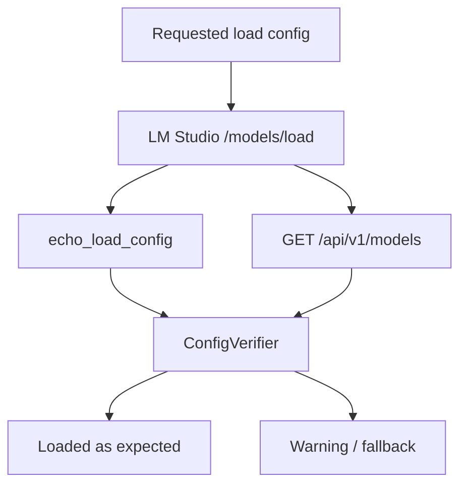
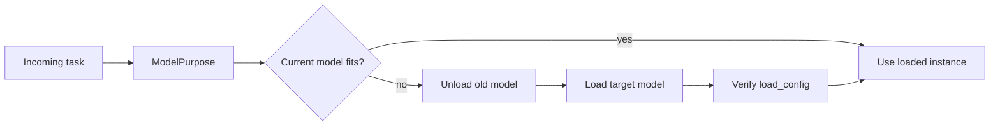

# Lifecycle моделей в LM Studio: load/unload, context, KV cache, Flash Attention и parallelism 🧠

## Назначение документа 🎯

Lifecycle manager управляет тем, какие модели находятся в памяти LM Studio, с какими параметрами они загружены и когда они выгружаются. Он работает после загрузчика моделей: если модель скачана на диск, её ещё нужно загрузить в RAM/VRAM. На целевом железе с RTX 5060 Ti 16GB этот слой критичен: слишком большой контекст, агрессивный parallel или vision-нагрузка могут быстро привести к деградации скорости или ошибкам памяти.

> [!NOTE]
> В рамках host application загрузка модели должна быть явной операцией. JIT-load через первый chat-запрос удобен, но хуже контролируется и сложнее измеряется.

## Download vs Load ⚖️

| Операция | Endpoint | Ресурс | Результат |
|----------|----------|--------|-----------|
| Download | `POST /api/v1/models/download` | сеть + диск | модель доступна в LM Studio library |
| Load | `POST /api/v1/models/load` | RAM/VRAM | модель имеет loaded instance |
| Unload | `POST /api/v1/models/unload` | RAM/VRAM освобождается | instance удалён из памяти |
| List | `GET /api/v1/models` | состояние сервера | capabilities + loaded_instances |

## Основные параметры загрузки ⚙️

| Параметр | Назначение | Комментарий |
|----------|------------|-------------|
| `model` | ID модели | catalog ID или локальный ID LM Studio |
| `context_length` | размер контекстного окна | главный фактор KV-памяти |
| `eval_batch_size` | batch для prompt/eval | влияет на скорость prefill |
| `flash_attention` | включение Flash Attention | обычно полезно, но проверяется benchmark-ом |
| `num_experts` | число активных экспертов MoE | для A3B/A4B моделей |
| `offload_kv_cache_to_gpu` | KV cache в GPU | ускоряет, но расходует VRAM |
| `parallel` | concurrent predictions | по changelog/CLI доступно, обязательно проверять фактический config |
| `echo_load_config` | вернуть применённый config | обязательно для диагностики |

Пример payload:

```json
{
  "model": "google/gemma-4-12b",
  "context_length": 32768,
  "parallel": 2,
  "eval_batch_size": 512,
  "flash_attention": true,
  "offload_kv_cache_to_gpu": true,
  "echo_load_config": true
}
```

## Почему `echo_load_config` обязателен 🔍

LM Studio может применить не совсем тот набор параметров, который был отправлен: часть значений может быть нормализована, часть проигнорирована, часть взята из per-model defaults. Поэтому lifecycle manager не должен считать request body истиной. Истина — фактически применённый config из response или `GET /api/v1/models`.



## Context length и стоимость KV cache 📦

Контекст напрямую влияет на KV cache. При росте контекста увеличивается память, необходимая для хранения состояний внимания. В параллельном режиме эта нагрузка умножается на количество активных запросов, хотя Unified KV Cache может распределять ресурсы гибче.

| Context | Риск | Где тестировать |
|---------|------|-----------------|
| 8k | низкий | baseline для всех моделей |
| 16k | средний | Gemma 12B, Qwen VL 8B, Ministral 14B |
| 32k | высокий | основной целевой режим для lecture memory |
| 64k | очень высокий | только если модель и VRAM выдерживают |
| 128k+ | experimental | для Gemma/Qwen заявленных long-context, но не по умолчанию |

> [!WARNING]
> Большое заявленное окно модели не означает, что локальный Q4-запуск с parallel=4 на 16GB VRAM будет стабилен. Context должен тестироваться вместе с parallel, output length и vision-нагрузкой.

## Load profiles для RTX 5060 Ti 16GB 🎮

| Профиль | Context | Parallel | Назначение |
|---------|---------|----------|------------|
| `safe` | 8192 | 1 | Проверка модели, structured output baseline |
| `balanced` | 16384 | 2 | Параллельная постобработка коротких чанков |
| `long_context` | 32768 | 1–2 | Lecture memory / stateful context |
| `stress` | 32768–65536 | 2–4 | Только benchmark, не production default |
| `vision_safe` | 8192–16384 | 1 | Vision-запросы, скриншоты, OCR |

## Unload policy 🧹

| Политика | Описание | Когда использовать |
|----------|----------|--------------------|
| `manual` | выгрузка только по команде | debug/experiments |
| `idle_ttl` | выгрузка после N секунд простоя | production default |
| `lru_swap` | оставить последнюю нужную модель, выгружать при смене purpose | ModelOrchestrator |
| `always_unload` | выгружать после задачи | слабое железо, риск OOM |
| `never_unload` | держать в памяти | выделенный backend/server |

## Смена моделей и purpose 🧭

host application может использовать разные модели для разных задач:

| Purpose | Пример модели | Особенность |
|---------|---------------|-------------|
| `postprocess_text` | Gemma 4 12B QAT | structured output, низкая температура |
| `vision_ocr` | Qwen3-VL 8B | картинки, resize, low parallel |
| `summary` | Gemma 4 26B A4B | long context, stateful branches |
| `experimental_reasoning` | Ministral 14B Reasoning | reasoning on/off, осторожный JSON |



## KV cache quantization: статус и осторожность ⚠️

В SDK LM Studio доступны параметры K/V cache quantization, но REST load endpoint документирует более узкий набор. Community-issue указывает, что программное совмещение KV quantization и точного parallel пока может быть шероховатым: CLI умеет `--parallel`, SDK умеет K/V quantization, REST может отклонять расширенные поля как unrecognized. Поэтому для host application такие параметры должны быть experimental.

Политика:

1. Production load использует только подтверждённые REST/CLI параметры.
2. Advanced KV quantization включается только после отдельного benchmark.
3. Фактический config всегда сверяется через `echo_load_config` и `/api/v1/models`.
4. Если параметр не применился, host application не должен молча считать его применённым.

## Инварианты lifecycle manager ✅

1. Не загружать модель без проверки, что она скачана.
2. Не отправлять запросы до подтверждения loaded instance.
3. Проверять context/parallel/flash_attention после загрузки.
4. Не грузить вторую тяжёлую модель без VRAM-policy.
5. Отделять physical `parallel` от app-level concurrency.
6. Любое unload-событие должно сбрасывать связанные session/cache IDs.
7. Все load/unload операции должны иметь timeout и диагностику.

## Итог 🧷

Lifecycle manager — это слой, который превращает LM Studio из интерактивного приложения в предсказуемый backend. Он не просто вызывает `load`: он применяет профили, проверяет фактический config, управляет VRAM/RAM, соблюдает purpose-политику и создаёт основу для benchmark-матрицы. На 16GB VRAM агрессивные режимы должны быть экспериментальными до фактических замеров.

## Источники и точки проверки 🔗

- LM Studio REST API overview: https://lmstudio.ai/docs/developer/rest
- LM Studio model download API: https://lmstudio.ai/docs/developer/rest/download
- LM Studio download status API: https://lmstudio.ai/docs/developer/rest/download-status
- LM Studio model load API: https://lmstudio.ai/docs/developer/rest/load
- LM Studio model list API: https://lmstudio.ai/docs/developer/rest/list
- LM Studio native chat API: https://lmstudio.ai/docs/developer/rest/chat
- LM Studio stateful chats: https://lmstudio.ai/docs/developer/rest/stateful-chats
- LM Studio structured output: https://lmstudio.ai/docs/developer/openai-compat/structured-output
- LM Studio parallel requests: https://lmstudio.ai/docs/app/advanced/parallel-requests
- LM Studio 0.4.0 blog: https://lmstudio.ai/blog/0.4.0
- LM Studio API changelog: https://lmstudio.ai/docs/developer/api-changelog
- LM Studio Open Responses blog: https://lmstudio.ai/blog/openresponses
- LM Studio bug tracker, Responses re-prefill: https://github.com/lmstudio-ai/lmstudio-bug-tracker/issues/2074
- llama.cpp prefix cache discussion: https://github.com/ggml-org/llama.cpp/discussions/15530
