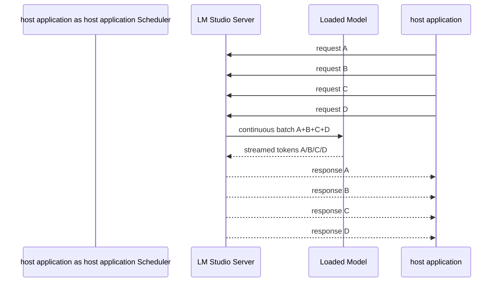

# Parallel Inference в LM Studio: параллельные запросы к одной модели ⚙️

## Назначение документа 🎯

Документ описывает сценарий, в котором одна модель уже загружена в память LM Studio, а host application отправляет к ней несколько запросов одновременно: два, три или четыре потока постобработки, summary, glossary, extraction или vision-задач. Это не multi-model сценарий и не multi-GPU tensor parallelism. Речь идёт именно о нескольких concurrent predictions к одному loaded instance.

> [!NOTE]
> Параллельные запросы повышают throughput, но не гарантируют линейного ускорения. Особенно если workload prefill-dominated: длинные промпты и короткие ответы.

## Термины 🧩

| Термин | Значение |
|--------|----------|
| `Max Concurrent Predictions` | максимальное число запросов, которые модель может обрабатывать одновременно |
| `parallel` | программный/CLI-параметр, соответствующий concurrent predictions |
| `continuous batching` | runtime объединяет декодирование нескольких запросов в batch |
| `Unified KV Cache` | гибкое распределение KV-памяти между параллельными запросами |
| `app-level concurrency` | сколько запросов host application реально отправляет одновременно |
| `queue wait` | время ожидания, если запросов больше, чем parallel slots |

## Модель обработки запросов 🔄



Если `parallel=2`, то запросы C и D не обязаны падать: они могут ждать в очереди.

## Physical parallel vs host application concurrency ⚖️

| Параметр | Где задаётся | Что означает |
|----------|--------------|--------------|
| `load.parallel` | LM Studio load/UI/CLI | сколько запросов может принять loaded instance |
| `max_app_concurrent_requests` | host application config | сколько запросов host application отправляет одновременно |
| `worker_pool_size` | host application scheduler | сколько задач одновременно готовит приложение |

host application не должен автоматически приравнивать `max_app_concurrent_requests` к `load.parallel`. Например, модель может быть загружена с `parallel=4`, но host application отправляет только 2 запроса, потому что одновременно работает Whisper, VAD или vision pipeline.

## Рекомендации по настройкам для RTX 5060 Ti 16GB 🎮

| Сценарий | Context | parallel load | host application concurrency | Комментарий |
|----------|---------|---------------|-----------------|-------------|
| JSON chunks baseline | 8k | 1 | 1 | измерение качества без влияния parallel |
| JSON chunks balanced | 16k | 2 | 2 | основной кандидат для постобработки |
| Long lecture memory | 32k | 1–2 | 1–2 | prefill-heavy, осторожно |
| Stress test | 32k | 4 | 4 | только benchmark |
| Vision OCR | 8k–16k | 1–2 | 1–2 | image tokens и mmproj увеличивают нагрузку |
| Heavy MoE | 16k–32k | 1–2 | 1 | Gemma 26B A4B/Qwen 35B A3B |

## Почему parallel не ускоряет всё подряд 🧠

LLM-запрос состоит из двух фаз:

1. **Prefill / prompt processing** — модель читает входные токены.
2. **Decode / generation** — модель генерирует новые токены.

Continuous batching особенно полезен на decode-фазе, где многие запросы генерируют по одному токену за шаг. Но если запросы имеют 25k токенов контекста и короткий ответ, большая часть времени уходит на prefill. Тогда parallel может увеличить нагрузку на память, но не дать пропорционального выигрыша.

> [!WARNING]
> Для длинных лекций ключевая метрика — не только `tokens/sec`, а `prompt_processing_seconds` и `time_to_first_token_seconds`.

## Unified KV Cache 📦

Unified KV Cache означает, что preallocated resources не режутся жёстко по слотам. Запросы разного размера могут использовать KV-память гибче. Это полезно, когда один запрос маленький, второй средний, третий большой.

Что Unified KV Cache даёт:

- меньше пустого зарезервированного места;
- лучше адаптация к разным длинам промптов;
- удобнее mixed workload.

Чего он не даёт:

- не превращает полную лекцию в вечный shared document cache;
- не гарантирует бесплатный prefill для branch-запросов;
- не отменяет стоимость KV-памяти при большом context × parallel.

## Риски параллельной постобработки ⚠️

| Риск | Симптом | Контрмера |
|------|---------|-----------|
| VRAM pressure | OOM, выгрузка модели, резкое замедление | снижать context/parallel, offload policy |
| Queue saturation | часть запросов долго ждёт | измерять queue_wait |
| Prefill bottleneck | TTFT почти не падает | compact memory, prefix cache experiments |
| JSON instability | больше ошибок structured output | снизить concurrency, retry/fallback |
| Vision overload | image-запросы тормозят text-запросы | отдельный purpose/очередь vision |
| Whisper конфликт | GPU занят транскрипцией | scheduler подавляет LLM concurrency |

## Scheduler policy 🧭

```mermaid
graph TD
    JOB[LLM task] --> CLASS{Task class}
    CLASS -->|structured_json| JSON[High correctness]
    CLASS -->|summary| SUM[High context]
    CLASS -->|vision| VIS[High memory]
    CLASS -->|simple_text| TXT[Low risk]
    JSON --> C1[concurrency=min(2, profile)]
    SUM --> C2[concurrency=1 or stateful branches]
    VIS --> C3[concurrency=1]
    TXT --> C4[concurrency=profile]
```

## Benchmark-инварианты 🧪

Каждая модель должна быть протестирована минимум в режимах:

| Context | Parallel | Concurrency | Цель |
|---------|----------|-------------|------|
| 8k | 1 | 1 | baseline |
| 8k | 2 | 2 | минимальный parallel |
| 16k | 2 | 2 | рабочий режим |
| 32k | 1 | 1 | long-context baseline |
| 32k | 2 | 2 | long-context parallel |
| 32k | 4 | 4 | stress |

Метрики:

- `queue_wait_seconds`;
- `prompt_processing_seconds`;
- `time_to_first_token_seconds`;
- `tokens_per_second`;
- `total_latency_seconds`;
- VRAM before/peak/after;
- JSON pass rate;
- timeout/OOM rate.

## Итог 🧷

Параллельные запросы к одной модели в LM Studio — рабочий и важный механизм для host application, но его нужно использовать как управляемую политику, а не как «поставить 4 и забыть». Для 16GB VRAM базовый production-кандидат — `parallel=2`, host application concurrency=2. Режим `parallel=4` должен быть benchmark/stress до тех пор, пока матрица тестов не подтвердит стабильность по скорости, памяти и JSON-качеству.

## Источники и точки проверки 🔗

- LM Studio REST API overview: https://lmstudio.ai/docs/developer/rest
- LM Studio model download API: https://lmstudio.ai/docs/developer/rest/download
- LM Studio download status API: https://lmstudio.ai/docs/developer/rest/download-status
- LM Studio model load API: https://lmstudio.ai/docs/developer/rest/load
- LM Studio model list API: https://lmstudio.ai/docs/developer/rest/list
- LM Studio native chat API: https://lmstudio.ai/docs/developer/rest/chat
- LM Studio stateful chats: https://lmstudio.ai/docs/developer/rest/stateful-chats
- LM Studio structured output: https://lmstudio.ai/docs/developer/openai-compat/structured-output
- LM Studio parallel requests: https://lmstudio.ai/docs/app/advanced/parallel-requests
- LM Studio 0.4.0 blog: https://lmstudio.ai/blog/0.4.0
- LM Studio API changelog: https://lmstudio.ai/docs/developer/api-changelog
- LM Studio Open Responses blog: https://lmstudio.ai/blog/openresponses
- LM Studio bug tracker, Responses re-prefill: https://github.com/lmstudio-ai/lmstudio-bug-tracker/issues/2074
- llama.cpp prefix cache discussion: https://github.com/ggml-org/llama.cpp/discussions/15530
