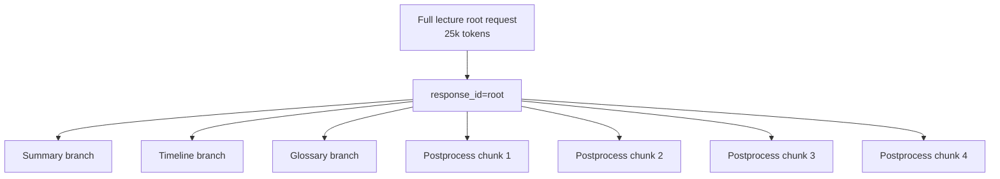
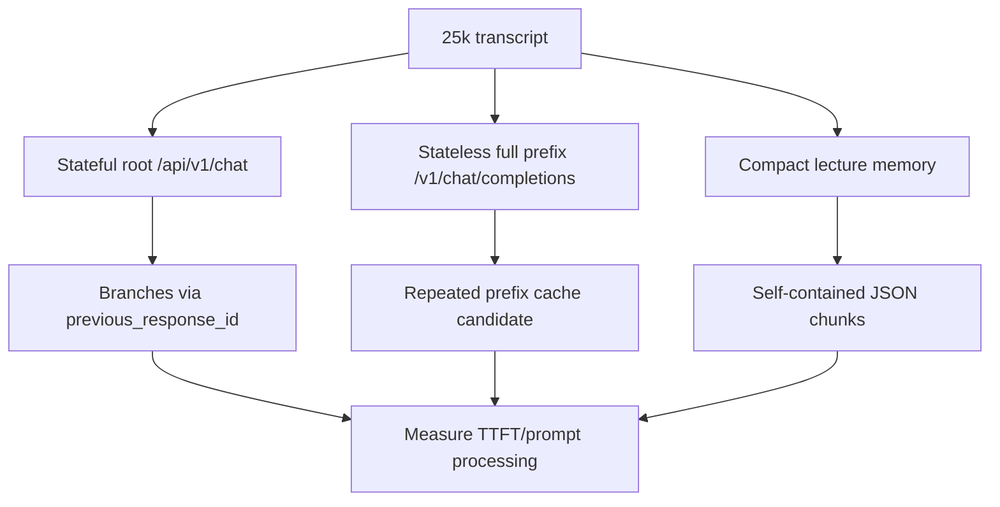

# Prompt Cache и общий контекст лекции: stateful sessions, prefix reuse и 25k-токенный сценарий 🧠📦

## Назначение документа 🎯

Документ описывает исследовательский сценарий host application: есть транскрипция трёхчасовой лекции примерно на 25 тысяч токенов. Система хочет один раз разместить этот большой контекст, а затем задать серию запросов: summary, таймкоды, glossary, постобработка частей 1–4. Цель — не пересчитывать prompt processing полного контекста при каждом запросе.

> [!NOTE]
> Это не вопрос «можно ли отправить длинный prompt». Это вопрос повторного использования большого префикса или server-side context между серией задач.

## Основной кейс 🧩

```text
Root context:
- полная транскрипция лекции, ~25k tokens
- сегменты и таймкоды
- возможные notes / glossary / speaker info

Branch tasks:
1. Summary всей лекции
2. Таймкоды ключевых тем
3. Glossary терминов
4. Постобработка части 1
5. Постобработка части 2
6. Постобработка части 3
7. Постобработка части 4
```

## Три возможных механизма 🔁

| Механизм | Endpoint | Идея | Статус для host application |
|----------|----------|------|----------------|
| Stateful chat | `/api/v1/chat` | создать `response_id`, затем ветвиться через `previous_response_id` | главный experimental candidate |
| Stateless full prefix | `/v1/chat/completions` | каждый раз отправлять один и тот же 25k prefix + маленький suffix | надёжнее для JSON Schema, но дороже по payload/prefill |
| OpenAI Responses | `/v1/responses` | stateful follow-up + cached token visibility | перспективно, но нужен осторожный тест из-за баг-репортов |

## Stateful root context 🌳



Пример root-запроса:

```json
{
  "model": "google/gemma-4-12b",
  "system_prompt": "Материал ниже является рабочим контекстом лекции. На последующих шагах ответы должны опираться на него.",
  "input": "<FULL_TRANSCRIPT_WITH_TIMECODES>",
  "store": true,
  "temperature": 0,
  "max_output_tokens": 64
}
```

Branch-запрос:

```json
{
  "model": "google/gemma-4-12b",
  "previous_response_id": "resp_lecture_root",
  "input": "Составь glossary ключевых терминов лекции.",
  "temperature": 0,
  "max_output_tokens": 2048
}
```

## Важное ограничение: API state ≠ доказанный физический KV reuse ⚠️

Stateful API официально позволяет не пересылать полную историю. Но для production-решения нужно измерить, насколько runtime физически переиспользует KV/prompt cache. С точки зрения host application состояние должно считаться полезной возможностью, но не гарантией ускорения до тех пор, пока benchmark не покажет падение TTFT/prompt_processing для branch-запросов.

> [!WARNING]
> Если branch-запрос после root context снова делает почти такой же prefill, глобальный контекст не даёт экономии. В таком случае режим остаётся функциональным, но не оптимизационным.

## Prefix-cache режим 🧱

В stateless режиме каждый запрос содержит одинаковый большой prefix:

```text
[STABLE_SYSTEM]
[STABLE_FULL_LECTURE_25K]
[QUERY: summary]
```

```text
[STABLE_SYSTEM]
[STABLE_FULL_LECTURE_25K]
[QUERY: glossary]
```

Если runtime умеет longest-common-prefix cache, он может переиспользовать вычисления для `[STABLE_SYSTEM]+[STABLE_FULL_LECTURE_25K]`. Но это работает только если prefix токен-в-токен одинаковый.

## Что ломает prefix cache 🧨

| Ошибка | Почему ломает cache |
|--------|---------------------|
| `Current time: ...` в начале prompt | меняется каждый запрос |
| `Request id: uuid` до общего контекста | меняет prefix |
| разный порядок metadata | меняет токены |
| разные пробелы/переводы строк | может изменить токенизацию |
| reason/thinking trace в истории | раздувает и меняет контекст |
| добавление query до лекции | query становится частью prefix |

Правило:

```text
Стабильная часть должна идти первой и быть byte/token-stable.
Динамическая часть должна идти после общего контекста.
```

## Full transcript vs compact memory ⚖️

| Подход | Плюсы | Минусы | Лучшие задачи |
|--------|-------|--------|---------------|
| Full transcript root | полный доступ к лекции | тяжёлый prefill, большой KV | summary, Q&A, timeline search |
| Compact lecture memory | дешевле, стабильнее | теряет детали | postprocess chunks, glossary hints |
| Local context only | надёжно, просто | нет глобального знания | strict JSON Blocks |

Compact memory может выглядеть так:

```markdown
## Lecture memory
- Тема: архитектура локальных LLM и обработка транскрипций.
- Термины: KV cache, TTFT, continuous batching, response_format.
- Имена и продукты: LM Studio, host application, Gemma, Qwen, Ministral.
- Стиль: техническая лекция, русский язык, без канцелярита.
- Правила: сохранять таймкоды, не менять ID блоков.
```

## Production и experimental разделение 🧭

| Режим | Контекст | Endpoint | Надёжность |
|-------|----------|----------|------------|
| `production_json_chunks` | chunk + compact memory | `/v1/chat/completions` | высокая |
| `experimental_stateful_root` | full transcript root + branches | `/api/v1/chat` | требует benchmark |
| `responses_cache_probe` | root + previous_response_id | `/v1/responses` | только исследование |
| `stateless_prefix_probe` | full prefix каждый раз | `/v1/chat/completions` | полезно как baseline |

## План измерения кэша 🧪

| Шаг | Что измеряется |
|-----|----------------|
| Root request 25k | baseline prefill, TTFT, total latency |
| Branch summary | prompt_processing относительно root |
| Branch glossary | cache reuse при другой задаче |
| Branch chunk 1–4 parallel | влияние parallel на TTFT и latency |
| Stateless full-prefix | сравнение с stateful |
| Compact memory | сравнение качества/скорости |

Критерий полезности:

```text
branch_prompt_processing <= 20–30% от root_prompt_processing
```

Если branch-запросы стоят почти как root, режим не считается cache-оптимизацией.

## Mermaid-сравнение режимов 🗺️



## Итог 🧷

Для host application сценарий «один большой контекст лекции → много коротких запросов» технически возможен, но должен считаться экспериментальным до измерений. Надёжный production-режим остаётся self-contained JSON chunks + compact context. Stateful root context может стать ускорителем и quality-mode, если benchmark покажет реальный reuse по TTFT/prompt-processing, а не только удобство API.

## Источники и точки проверки 🔗

- LM Studio REST API overview: https://lmstudio.ai/docs/developer/rest
- LM Studio model download API: https://lmstudio.ai/docs/developer/rest/download
- LM Studio download status API: https://lmstudio.ai/docs/developer/rest/download-status
- LM Studio model load API: https://lmstudio.ai/docs/developer/rest/load
- LM Studio model list API: https://lmstudio.ai/docs/developer/rest/list
- LM Studio native chat API: https://lmstudio.ai/docs/developer/rest/chat
- LM Studio stateful chats: https://lmstudio.ai/docs/developer/rest/stateful-chats
- LM Studio structured output: https://lmstudio.ai/docs/developer/openai-compat/structured-output
- LM Studio parallel requests: https://lmstudio.ai/docs/app/advanced/parallel-requests
- LM Studio 0.4.0 blog: https://lmstudio.ai/blog/0.4.0
- LM Studio API changelog: https://lmstudio.ai/docs/developer/api-changelog
- LM Studio Open Responses blog: https://lmstudio.ai/blog/openresponses
- LM Studio bug tracker, Responses re-prefill: https://github.com/lmstudio-ai/lmstudio-bug-tracker/issues/2074
- llama.cpp prefix cache discussion: https://github.com/ggml-org/llama.cpp/discussions/15530
