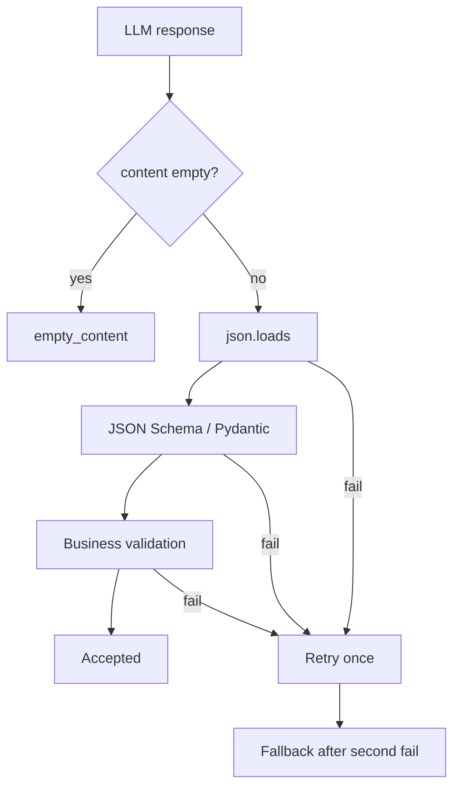
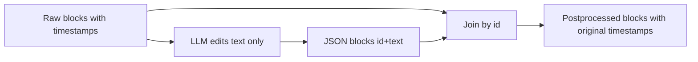

# Structured Output в host application: JSON Schema, reasoning OFF, validation, retry и fallback 🧩

## Назначение документа 🎯

Structured Output нужен host application для задач, где модель должна вернуть не свободный текст, а машинно-проверяемый результат: массив блоков с ID, исправленным текстом, переводом, метками, краткими summary или структурой таймкодов. Главная задача документа — отделить обещание JSON Schema от фактической надёжности результата.

> [!NOTE]
> JSON Schema гарантирует форму лучше, чем prompt-инструкция, но не гарантирует бизнес-смысл. Валидный JSON может содержать пустой текст, дубли ID или потерянные блоки.

## Базовый endpoint 🧱

LM Studio поддерживает structured output через OpenAI-compatible endpoint:

```http
POST /v1/chat/completions
```

Payload содержит `response_format`:

```json
{
  "model": "google/gemma-4-12b",
  "messages": [
    {"role": "system", "content": "Return valid JSON only."},
    {"role": "user", "content": "Process blocks..."}
  ],
  "temperature": 0,
  "max_tokens": 2048,
  "response_format": {
    "type": "json_schema",
    "json_schema": {
      "name": "blocks_response",
      "strict": true,
      "schema": {
        "type": "object",
        "properties": {
          "blocks": {
            "type": "array",
            "items": {
              "type": "object",
              "properties": {
                "id": {"type": "integer"},
                "text": {"type": "string", "minLength": 1}
              },
              "required": ["id", "text"],
              "additionalProperties": false
            }
          }
        },
        "required": ["blocks"],
        "additionalProperties": false
      }
    }
  }
}
```

## Pipeline валидации ✅



## Классы ошибок 🧯

| Класс | Пример | Что делать |
|-------|--------|------------|
| `api_error` | HTTP 400 / model error | классифицировать, не всегда retry |
| `empty_content` | `choices[0].message.content == ""` | проверить reasoning_content, retry/fallback |
| `json_decode_error` | обрезанный JSON | retry с увеличенным max_tokens |
| `schema_error` | нет required поля | retry |
| `business_error` | ID потерян, текст пустой | retry, затем fallback |
| `finish_length` | `finish_reason == length` | считать результат недостоверным |
| `reasoning_leak` | `<think>` в content | retry с reasoning off / model blocklist |
| `loop_detected` | повторяющиеся фразы | stop + retry/fallback |

## Business validation для JSON Blocks 🧠

```python
def validate_blocks_contract(input_ids: list[int], blocks: list[dict]) -> None:
    returned_ids = [b["id"] for b in blocks]

    if returned_ids != input_ids:
        raise BusinessValidationError("ids_not_exact")

    if len(set(returned_ids)) != len(returned_ids):
        raise BusinessValidationError("duplicate_ids")

    for block in blocks:
        if not block["text"].strip():
            raise BusinessValidationError("empty_text")

        if looks_like_reasoning(block["text"]):
            raise BusinessValidationError("reasoning_leak")
```

## Почему `ids_exact` лучше, чем просто множество ID ⚖️

| Проверка | Что ловит | Что пропускает |
|----------|-----------|----------------|
| `set(returned_ids) == set(input_ids)` | пропущенные/лишние ID | перестановку |
| `len(blocks) == len(input)` | потерю количества | дубли ID |
| `returned_ids == input_ids` | порядок, пропуски, дубли | почти ничего |

Для таймлайн-критичной постобработки порядок блоков должен совпадать. Если host application допускает восстановление порядка по ID, это должно быть отдельной политикой, а не молчаливым поведением.

## Reasoning и structured output ⚠️

Reasoning-модели могут создавать edge cases:

- полезный JSON попадает в `reasoning_content`, а `content` пустой;
- `<think>` попадает в `content` перед JSON;
- reasoning-токены раздувают контекст и ломают prefix cache;
- режим `reasoning=off` доступен не для всех моделей;
- OpenAI-compatible endpoint может иначе обрабатывать reasoning, чем native `/api/v1/chat`.

Проверка capabilities:

```text
GET /api/v1/models
→ capabilities.reasoning.allowed_options
→ если "off" доступен, использовать для non-structured native modes
→ для structured mode всё равно проверять content/reasoning leak
```

## Модельная политика 🧪

| Семейство | Риск | Политика |
|-----------|------|----------|
| Gemma 4 | возможны repetition loops в grammar/JSON режимах | loop detector + max_tokens + retry |
| Qwen 3.5 | reasoning/content split edge cases | не production default для JSON до harness |
| Qwen 3.6 | сильная модель, но thinking default | только после reasoning-off тестов |
| Qwen3-VL | хорош для vision, structured output отдельно проверять | vision JSON harness |
| Ministral reasoning | reasoning может мешать JSON | separate profile |

## Retry strategy 🔁

```text
Attempt 1:
- temperature=0
- max_tokens рассчитан по размеру blocks
- JSON Schema strict

If fail:
Attempt 2:
- тот же prompt
- + краткая repair-инструкция в system/developer message
- возможно max_tokens +25%

If fail again:
- fallback to raw blocks / plain text mode
- записать structured_error metadata
```

> [!WARNING]
> Retry не должен бесконечно гонять локальную модель. Для batch-пайплайна лучше один retry и понятный fallback, чем зависший GPU на 40 минут.

## JSON Blocks Mode и zero-drift 🕒

Главная идея JSON Blocks Mode: модель не генерирует таймкоды. Она получает массив `{id, text}` и возвращает тот же массив с исправленным `text`. Таймкоды остаются у исходных блоков и соединяются по `id`.



## Итог 🧷

Structured output должен рассматриваться как мощный механизм ограничения формы, но не как гарантия качества. Production-контракт host application состоит из четырёх уровней: API success, JSON parse, schema validation и business validation. Только после всех четырёх уровней ответ считается пригодным для записи в БД и использования в таймлайне.

## Источники и точки проверки 🔗

- LM Studio REST API overview: https://lmstudio.ai/docs/developer/rest
- LM Studio model download API: https://lmstudio.ai/docs/developer/rest/download
- LM Studio download status API: https://lmstudio.ai/docs/developer/rest/download-status
- LM Studio model load API: https://lmstudio.ai/docs/developer/rest/load
- LM Studio model list API: https://lmstudio.ai/docs/developer/rest/list
- LM Studio native chat API: https://lmstudio.ai/docs/developer/rest/chat
- LM Studio stateful chats: https://lmstudio.ai/docs/developer/rest/stateful-chats
- LM Studio structured output: https://lmstudio.ai/docs/developer/openai-compat/structured-output
- LM Studio parallel requests: https://lmstudio.ai/docs/app/advanced/parallel-requests
- LM Studio 0.4.0 blog: https://lmstudio.ai/blog/0.4.0
- LM Studio API changelog: https://lmstudio.ai/docs/developer/api-changelog
- LM Studio Open Responses blog: https://lmstudio.ai/blog/openresponses
- LM Studio bug tracker, Responses re-prefill: https://github.com/lmstudio-ai/lmstudio-bug-tracker/issues/2074
- llama.cpp prefix cache discussion: https://github.com/ggml-org/llama.cpp/discussions/15530
