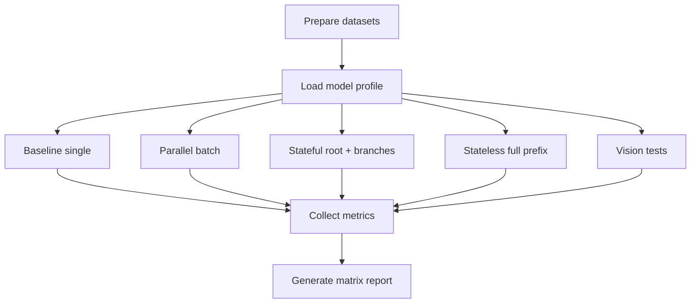

# План экспериментов LM Studio: cache, parallel, context, structured output и vision 🧪

## Назначение документа 🎯

Документ описывает исследовательскую программу для проверки LM Studio как managed backend host application. Цель — не подтвердить гипотезу, а собрать измеримую матрицу: какие модели быстрее, какие стабильнее держат JSON, как влияет parallel, что происходит при увеличении контекста, работает ли общий lecture-context cache, насколько vision влияет на latency и память.

Целевая CUDA-конфигурация: NVIDIA RTX 5060 Ti 16GB. Все результаты должны сохраняться в машинно-читаемом формате и сводиться в таблицы.

> [!NOTE]
> Эксперимент должен измерять не только скорость генерации, но и стоимость prefill: TTFT, prompt processing, queue wait, cache hit proxy и structured-output pass rate.

## Гипотезы 🧠

| ID | Гипотеза | Критерий подтверждения |
|----|----------|------------------------|
| H1 | `parallel=2` ускоряет batch postprocessing без деградации JSON | total batch time ниже baseline, JSON pass ≥ 98% |
| H2 | `parallel=4` полезен только для небольших контекстов | при 32k context latency/VRAM ухудшается |
| H3 | Stateful root context снижает TTFT branch-запросов | branch TTFT ≤ 30% от root TTFT |
| H4 | Stateless full-prefix может получить prefix-cache reuse | повторный request TTFT снижается |
| H5 | Compact lecture memory лучше full transcript для chunk postprocessing | качество достаточно, latency ниже |
| H6 | Gemma 4 12B QAT — sweet spot на 16GB | лучший speed/quality баланс |
| H7 | Vision + parallel требует отдельной политики | vision parallel=4 вызывает сильную деградацию |
| H8 | Qwen reasoning-модели чаще ломают structured output | reasoning leak/error rate выше Gemma |

## Dataset 📚

| Dataset | Размер | Назначение |
|---------|--------|------------|
| `lecture_25k_tokens` | ~25k tokens | основной сценарий кэширования |
| `lecture_chunks_4` | 4 части по 5–7k tokens | parallel postprocessing |
| `blocks_json_small` | 20 блоков | быстрый JSON baseline |
| `blocks_json_medium` | 100 блоков | structured output нагрузка |
| `blocks_json_long` | 250 блоков | max_tokens/length stress |
| `vision_screenshots` | 20 скриншотов | OCR/UI recognition |
| `vision_photos` | 10 фото | multimodal robustness |
| `mixed_batch` | text + vision + JSON | scheduler stress |

## Модели-кандидаты 🤖

| Семейство | Модели |
|-----------|--------|
| Gemma | Gemma 4 E2B, E4B, 12B QAT, 26B A4B QAT, 31B QAT |
| Qwen | Qwen3.5 9B, Qwen3.6 35B A3B, Qwen3-VL 4B/8B |
| Ministral | Ministral 3 3B, Ministral 3 14B Reasoning |

## Режимы тестирования ⚙️

| Режим | Endpoint | Контекст | Цель |
|-------|----------|----------|------|
| `baseline_single` | `/v1/chat/completions` | chunk only | чистый baseline |
| `json_schema_single` | `/v1/chat/completions` | chunk + schema | JSON pass rate |
| `json_schema_parallel` | `/v1/chat/completions` | 4 chunks | parallel quality |
| `stateful_root` | `/api/v1/chat` | full lecture root | root context creation |
| `stateful_branches` | `/api/v1/chat` | previous_response_id | branch reuse |
| `stateless_full_prefix` | `/v1/chat/completions` | full transcript each time | prefix cache comparison |
| `compact_memory` | `/v1/chat/completions` | 1–3k memory + chunk | practical production mode |
| `vision_single` | `/api/v1/chat` or compat | image + prompt | vision baseline |
| `vision_parallel` | same | images batch | vision parallel stress |

## Матрица context × parallel 📊

| Context | Parallel | App concurrency | Purpose |
|---------|----------|-----------------|---------|
| 8k | 1 | 1 | baseline |
| 8k | 2 | 2 | low-risk parallel |
| 8k | 4 | 4 | decode throughput |
| 16k | 1 | 1 | medium context baseline |
| 16k | 2 | 2 | practical target |
| 16k | 4 | 4 | stress |
| 32k | 1 | 1 | lecture memory baseline |
| 32k | 2 | 2 | long-context parallel |
| 32k | 4 | 4 | stress / likely unsafe |
| 64k | 1 | 1 | long context probe |
| 64k | 2 | 2 | extreme probe |

## Метрики ⏱️

| Категория | Метрики |
|-----------|---------|
| Timing | TTFT, total latency, prompt processing duration, queue wait |
| Generation | output tokens, tokens/sec, finish reason |
| Cache | cached tokens if available, repeated prefix delta, branch TTFT ratio |
| Memory | VRAM before/peak/after, RAM before/peak/after |
| Stability | API errors, timeout, OOM, unload events |
| JSON | parse pass, schema pass, business pass, retry count |
| Quality | summary score, chunk preservation, hallucination flags |
| Vision | OCR completeness, image latency, failure rate |

## Mermaid-план эксперимента 🧭

## Acceptance criteria ✅

| Область | Критерий |
|---------|----------|
| JSON production model | `business_pass_rate ≥ 98%`, no reasoning leak |
| Parallel production mode | batch time улучшен ≥ 20%, no OOM, JSON pass не падает |
| Stateful cache mode | branch TTFT/prompt processing ≤ 30% от root |
| Vision production mode | failure rate ≤ 2%, latency acceptable |
| Long context mode | нет length/OOM ошибок на 32k context |

## Правила повторяемости 🔁

1. Температура фиксируется: `temperature=0` для structured tests.
2. Модель и quant фиксируются в результатах.
3. Load config записывается после `echo_load_config`.
4. Каждый тест повторяется минимум 3 раза.
5. Первый run помечается как warmup.
6. Системные процессы и параллельная нагрузка фиксируются.
7. Датасет версионируется hash-ами, тексты не пишутся в публичные логи.

## Итог 🧷

План экспериментов должен превратить обсуждение LM Studio cache/parallelism из догадок в таблицы. Для host application важно не только выбрать «самую умную» модель, а найти режим, который стабильно работает на реальном железе, не ломает JSON, не перегревает VRAM и даёт предсказуемое время обработки длинных лекций.

## Источники и точки проверки 🔗

- LM Studio REST API overview: https://lmstudio.ai/docs/developer/rest
- LM Studio model download API: https://lmstudio.ai/docs/developer/rest/download
- LM Studio download status API: https://lmstudio.ai/docs/developer/rest/download-status
- LM Studio model load API: https://lmstudio.ai/docs/developer/rest/load
- LM Studio model list API: https://lmstudio.ai/docs/developer/rest/list
- LM Studio native chat API: https://lmstudio.ai/docs/developer/rest/chat
- LM Studio stateful chats: https://lmstudio.ai/docs/developer/rest/stateful-chats
- LM Studio structured output: https://lmstudio.ai/docs/developer/openai-compat/structured-output
- LM Studio parallel requests: https://lmstudio.ai/docs/app/advanced/parallel-requests
- LM Studio 0.4.0 blog: https://lmstudio.ai/blog/0.4.0
- LM Studio API changelog: https://lmstudio.ai/docs/developer/api-changelog
- LM Studio Open Responses blog: https://lmstudio.ai/blog/openresponses
- LM Studio bug tracker, Responses re-prefill: https://github.com/lmstudio-ai/lmstudio-bug-tracker/issues/2074
- llama.cpp prefix cache discussion: https://github.com/ggml-org/llama.cpp/discussions/15530
