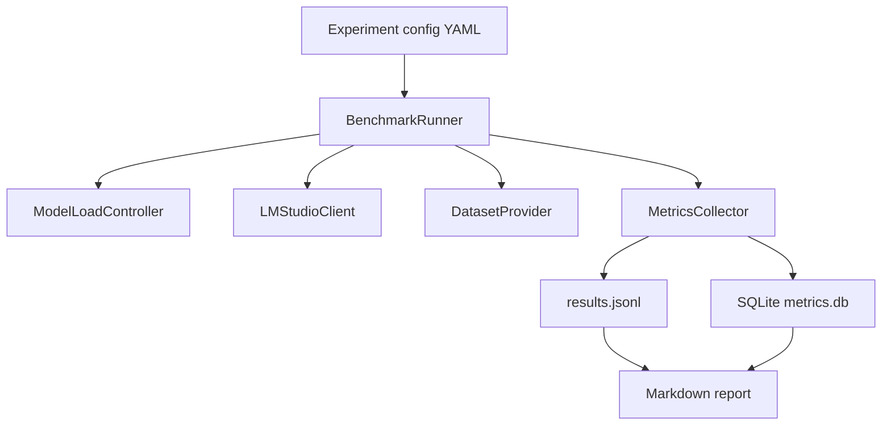

# Benchmark Harness для LM Studio: техническая спецификация тестового стенда 🛠️

## Назначение документа 🎯

Benchmark Harness — это инструмент, который автоматически запускает серии запросов к LM Studio, меняет модели, контекст, parallel, endpoint, режим кэша и structured output, собирает метрики и формирует отчёты. Его задача — сделать измерения воспроизводимыми. Ручной тест «вроде стало быстрее» не подходит для выбора production-профиля host application.

## Компоненты harness 🧱



## CLI-интерфейс 💻

```bash
python tools/lmstudio_benchmark.py run experiments/gemma12b_parallel.yaml
```

```bash
python tools/lmstudio_benchmark.py summarize results/run_2026_07_01_120000
```

```bash
python tools/lmstudio_benchmark.py compare results/run_a results/run_b --metric ttft_seconds
```

## Формат experiment config ⚙️

```yaml
experiment_id: gemma12b_cache_parallel_5060ti
hardware_profile: rtx_5060ti_16gb
lmstudio_base_url: http://127.0.0.1:1234
models:
  - key: gemma4_12b_qat
    load:
      context_length: [8192, 16384, 32768]
      parallel: [1, 2, 4]
      flash_attention: true
      offload_kv_cache_to_gpu: true
      eval_batch_size: 512
modes:
  - json_schema_single
  - json_schema_parallel
  - stateful_root_branches
  - stateless_full_prefix
datasets:
  - lecture_25k_tokens
  - blocks_json_medium
repeats: 3
warmup_runs: 1
timeouts:
  request_seconds: 300
  load_seconds: 600
privacy:
  store_prompt_text: false
  store_prompt_hash: true
```

## Основные классы 🧩

| Класс | Ответственность |
|-------|-----------------|
| `BenchmarkRunner` | оркестрация эксперимента |
| `ModelLoadController` | download/load/unload и проверка config |
| `LMStudioClient` | HTTP/SSE клиент |
| `DatasetProvider` | загрузка датасетов и hash-метаданных |
| `RequestScenario` | описание одного запроса |
| `ParallelScenarioRunner` | параллельный запуск N requests |
| `StreamingEventRecorder` | сбор SSE-событий |
| `MetricsCollector` | агрегация timing/token/memory/JSON метрик |
| `ReportGenerator` | Markdown/CSV/HTML отчёты |

## Сбор streaming events 📡

Harness должен уметь работать в streaming-режиме, потому что именно там видны важные события:

- model load start/progress/end;
- prompt processing start/progress/end;
- first token timestamp;
- output token stream;
- final stats.

```python
async for event in client.stream_chat(payload):
    recorder.record(event)
    if event.type == 'message.delta' and not first_token_seen:
        metrics.ttft_seconds = now() - request_started
        first_token_seen = True
```

## Сбор системных метрик 🎮

Для CUDA-профиля используется `nvidia-smi`:

```bash
nvidia-smi --query-gpu=timestamp,memory.used,memory.total,utilization.gpu,power.draw --format=csv
```

В Windows лучше запускать polling отдельным процессом/потоком с интервалом 500–1000 мс. Метрики синхронизируются по timestamp.

## Privacy-safe dataset handling 🕵️

| Данные | Хранить по умолчанию? | Комментарий |
|--------|-----------------------|-------------|
| Полный prompt | нет | только при debug-флаге |
| Hash prompt | да | SHA-256 |
| Размер prompt | да | tokens/chars |
| Текст ответа | опционально | для quality scoring нужен локальный режим |
| Ошибки API | да | без user text |
| Пути файлов | нет | только dataset_id/hash |

## Сценарии выполнения 🔁

### Sequential baseline

```text
for request in requests:
    run request
    collect metrics
```

### Parallel batch

```text
start N requests at the same time
measure queue wait, TTFT, total latency per request
aggregate batch wall time
```

### Stateful branches

```text
root = run full transcript request
branch_requests = build previous_response_id requests
run branches parallel
compare branch TTFT vs root TTFT
```

### Prefix cache probe

```text
run full_prefix_request A
run full_prefix_request B with same prefix
compare prompt processing duration
```

## Ошибки harness 🧯

| Ошибка | Поведение |
|--------|-----------|
| Model load timeout | mark model/profile failed, skip dependent tests |
| Request timeout | record timeout, continue next repeat |
| JSON validation fail | record structured metrics, not harness fail |
| OOM / model unloaded | stop profile, lower parallel/context in next profile |
| LM Studio unavailable | abort run with environment error |
| Dataset missing | abort before model load |

## Структура результатов 📁

```text
results/
  run_2026_07_01_120000/
    experiment.yaml
    environment.json
    load_configs.jsonl
    requests.jsonl
    metrics.jsonl
    gpu_samples.csv
    structured_errors.jsonl
    report.md
    summary.csv
```

## Markdown report 📝

Отчёт должен включать:

1. параметры окружения;
2. таблицу моделей и load configs;
3. сводку по режимам;
4. лучшие/худшие профили;
5. JSON pass rate;
6. TTFT/prompt-processing graphs;
7. VRAM peak table;
8. рекомендации.

## Итог 🧷

Benchmark Harness должен быть не разовым скриптом, а исследовательским инструментом. Он фиксирует условия эксперимента, собирает метрики, сохраняет воспроизводимые результаты и позволяет сравнивать модели по фактам. Для host application это основа выбора default-профилей, а не постфактум-оправдание выбранной модели.

## Источники и точки проверки 🔗

- LM Studio REST API overview: https://lmstudio.ai/docs/developer/rest
- LM Studio model download API: https://lmstudio.ai/docs/developer/rest/download
- LM Studio download status API: https://lmstudio.ai/docs/developer/rest/download-status
- LM Studio model load API: https://lmstudio.ai/docs/developer/rest/load
- LM Studio model list API: https://lmstudio.ai/docs/developer/rest/list
- LM Studio native chat API: https://lmstudio.ai/docs/developer/rest/chat
- LM Studio stateful chats: https://lmstudio.ai/docs/developer/rest/stateful-chats
- LM Studio structured output: https://lmstudio.ai/docs/developer/openai-compat/structured-output
- LM Studio parallel requests: https://lmstudio.ai/docs/app/advanced/parallel-requests
- LM Studio 0.4.0 blog: https://lmstudio.ai/blog/0.4.0
- LM Studio API changelog: https://lmstudio.ai/docs/developer/api-changelog
- LM Studio Open Responses blog: https://lmstudio.ai/blog/openresponses
- LM Studio bug tracker, Responses re-prefill: https://github.com/lmstudio-ai/lmstudio-bug-tracker/issues/2074
- llama.cpp prefix cache discussion: https://github.com/ggml-org/llama.cpp/discussions/15530
