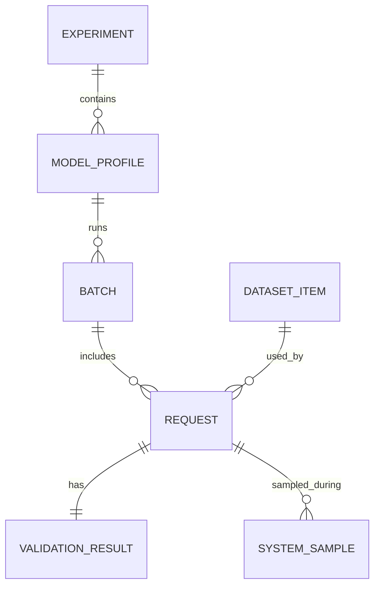

# Metrics Schema: какие данные собирать и как сравнивать результаты 📊

## Назначение документа 🎯

Документ фиксирует структуру метрик для экспериментов LM Studio в host application. Без единой схемы результаты быстро превращаются в несравнимый набор логов. Metrics Schema должна позволять сравнивать модели, контекст, parallel, endpoint, кэш, structured output и vision-нагрузку в одной таблице.

## Основные сущности 🧩

| Entity | Описание |
|--------|----------|
| `experiment` | полный запуск benchmark-набора |
| `model_profile` | модель + backend + quant + load config |
| `request` | один LLM-запрос |
| `batch` | группа параллельных запросов |
| `dataset_item` | входной материал или image |
| `validation_result` | parse/schema/business validation |
| `system_sample` | VRAM/RAM/GPU sample |

## JSONL-запись request metrics 🧱

```json
{
  "schema_version": "1.0",
  "experiment_id": "gemma12b_cache_parallel_5060ti",
  "run_id": "2026_07_01_120000",
  "request_id": "req_000123",
  "batch_id": "batch_000031",
  "model_key": "gemma4_12b_qat",
  "backend": "gguf",
  "quantization": "Q4_0",
  "endpoint": "/v1/chat/completions",
  "mode": "json_schema_parallel",
  "dataset_id": "blocks_json_medium",
  "load_config": {
    "context_length": 16384,
    "parallel": 2,
    "flash_attention": true,
    "eval_batch_size": 512,
    "offload_kv_cache_to_gpu": true
  },
  "runtime": {
    "app_concurrency": 2,
    "attempt": 1,
    "temperature": 0,
    "max_tokens": 2048
  },
  "timing": {
    "queue_wait_seconds": 0.0,
    "time_to_first_token_seconds": 2.14,
    "prompt_processing_seconds": 1.87,
    "generation_seconds": 5.32,
    "total_latency_seconds": 7.61
  },
  "tokens": {
    "input_tokens": 3120,
    "cached_tokens": null,
    "output_tokens": 890,
    "tokens_per_second": 167.2
  },
  "structured": {
    "json_parse_pass": true,
    "schema_pass": true,
    "business_pass": true,
    "retry_count": 0,
    "finish_reason": "stop",
    "reasoning_leak": false,
    "empty_content": false
  },
  "system": {
    "vram_before_mb": 9120,
    "vram_peak_mb": 12440,
    "vram_after_mb": 12100,
    "gpu_util_peak_percent": 92
  },
  "error": null
}
```

## Timing metrics ⏱️

| Поле | Значение |
|------|----------|
| `queue_wait_seconds` | ожидание в очереди приложения или LM Studio |
| `prompt_processing_seconds` | время prefill/prompt processing, если доступно через events |
| `time_to_first_token_seconds` | TTFT, главный показатель cache/prefill |
| `generation_seconds` | decode/generation время |
| `total_latency_seconds` | wall-clock от отправки до завершения |
| `model_load_seconds` | время загрузки модели, если запрос инициировал load |

## Token/cache metrics 🔢

| Поле | Назначение |
|------|------------|
| `input_tokens` | размер входа по API/model stats |
| `cached_tokens` | сколько токенов было переиспользовано, если endpoint отдаёт |
| `cache_ratio` | `cached_tokens / input_tokens` |
| `output_tokens` | длина ответа |
| `tokens_per_second` | скорость decode |
| `tokens_total` | input + output |

Если endpoint не отдаёт `cached_tokens`, benchmark должен использовать косвенные метрики:

```text
cache_proxy = baseline_prompt_processing_seconds / repeated_prompt_processing_seconds
```

## Structured-output metrics ✅

| Метрика | Описание |
|---------|----------|
| `json_parse_pass` | `json.loads` прошёл |
| `schema_pass` | JSON Schema/Pydantic прошёл |
| `business_pass` | IDs, дубли, empty text, order OK |
| `ids_exact_pass` | returned ids == input ids |
| `non_empty_text_pass` | все text непустые |
| `no_duplicate_ids` | нет дублей |
| `reasoning_leak` | найден `<think>` или reasoning markup |
| `empty_content` | content пустой |
| `finish_reason` | stop/length/error |
| `retry_count` | число retry |

## Quality metrics 🧠

Quality scoring должен быть отделён от технических метрик. Пример:

| Метрика | Метод |
|---------|-------|
| `summary_coverage_score` | checklist по ключевым темам |
| `timeline_hit_score` | совпадение тем с expected timecodes |
| `block_preservation_score` | смысл блока сохранён |
| `hallucination_score` | обнаружены добавленные факты |
| `style_score` | читаемость и пунктуация |
| `ocr_completeness_score` | vision-текст найден |

## System metrics 🎮

| Метрика | Primary source | Fallback / semantics |
|---------|----------------|----------------------|
| Per-device VRAM used/free/total | NVML | `nvidia-smi` device-only |
| Per-process GPU memory | NVML process query | `null` when attribution is unavailable |
| GPU and memory utilization | NVML | `nvidia-smi` device-only |
| Power draw | NVML | `nvidia-smi` device-only |
| MIG identity/state | NVML | explicit unsupported/unavailable state |
| RAM used | `psutil` | `null` when unavailable |
| Process memory | `psutil.Process` | only when safely attributable |
| CPU utilization | `psutil` | `null` when unavailable |

Every GPU sample carries one evidence level: `nvml_process_attributed`, `nvml_device_only`, `nvidia_smi_device_only`, or `unavailable`. Device-only evidence must never be promoted to a process-attributed claim. Device and process identifiers in publication-safe artifacts are hashed or omitted.

Phase-aware summaries retain samples for clean baseline, load, loaded idle, request dispatch, prefill, first token, decode, concurrent peak, batch completion, post-batch idle, unload, and after-unload global zero. A derived phase records its derivation method and confidence; coarse polling is not exact prefill/decode evidence. The configured and actual sample intervals, sampler failure count, phase-order validity, and telemetry validity are part of the summary.

## Versioned memory recommendation catalog

The reusable catalog schema is `model-memory-recommendation-catalog.v1`. Each row is keyed by exact artifact/revision/checksum, quantization, context, runtime parallelism, application concurrency, workload, placement requirement, and KV placement. Display-name-only matching is invalid.

The catalog keeps the measured peak, fixed loaded cost, context/concurrency overhead, safety reserve, and recommended memory separate. These values are observations and derived envelopes; they do not authorize linear scaling from P1 to P2 or P4.

Consumers must validate the exact `schema_revision` and complete row shape with the validator from their pinned managed-contract package. Unknown revisions, extra or missing fields, duplicate identities, invalid digests, and unsorted rows fail closed. Status handling is explicit: `approved` may be considered only for an exact local match; `manual_only` requires an explicit decision; `rejected` and `insufficient_evidence` are not eligible for automatic selection.

The v1 row does not serialize runtime identity, runner/schema revisions, hardware identity, or proof that repeats were independent load/unload cycles. Its evidence digest does not prove those omitted facts. A standalone consumer must bind the row to separately reviewed immutable owner evidence containing them; without that binding, even a serialized `approved` row is not eligible for automatic selection.

See [GPU telemetry, recommendations, and package boundary](12_gpu_telemetry_recommendations_and_package_boundary.md) for full usage and non-claim rules.

## Aggregations 📈

| Aggregation | Формула |
|-------------|---------|
| `p50_ttft` | median TTFT |
| `p95_ttft` | 95 percentile TTFT |
| `batch_wall_time` | max finished_at - min started_at |
| `json_pass_rate` | business_pass / total |
| `retry_rate` | requests with retry / total |
| `oom_rate` | OOM errors / total |
| `speedup_parallel_2` | baseline_batch_time / parallel_2_batch_time |
| `cache_effectiveness` | root_prompt_time / branch_prompt_time |

## Mermaid-схема данных 🗺️



## Минимальный CSV summary 📋

| model | context | parallel | mode | p50_ttft | p95_ttft | tok_s | json_pass | vram_peak | errors |
|-------|---------|----------|------|----------|----------|-------|-----------|-----------|--------|
| gemma4_12b | 16k | 2 | json_parallel | 2.1 | 3.8 | 165 | 99% | 12.4GB | 0 |

## Инварианты схемы ✅

1. Каждая запись имеет `schema_version`.
2. Все времена в секундах, все memory values в MB.
3. Missing metric обозначается `null`, а не `0`.
4. Ошибка запроса не удаляет timing/system данные.
5. Тексты prompt/response не пишутся по умолчанию.
6. Dataset идентифицируется hash-ом.
7. Load config сохраняется фактический, а не только запрошенный.
8. Device-only telemetry не считается process-attributed evidence.
9. Recommendation catalog revision проверяется до чтения строк.
10. Measured peak и safety reserve не объединяются в одно недоказуемое число.

## Итог 🧷

Единая схема метрик позволяет сравнивать режимы host application не по ощущениям, а по фактам. Она должна фиксировать не только итоговую скорость, но и структуру времени: сколько ушло на очередь, prefill, первый токен, decode и validation. Именно такая детализация покажет, где реально работает кэш, где полезен parallel, а где модель просто красиво делает вид, что оптимизирована.

## Источники и точки проверки 🔗

- LM Studio REST API overview: https://lmstudio.ai/docs/developer/rest
- LM Studio model download API: https://lmstudio.ai/docs/developer/rest/download
- LM Studio download status API: https://lmstudio.ai/docs/developer/rest/download-status
- LM Studio model load API: https://lmstudio.ai/docs/developer/rest/load
- LM Studio model list API: https://lmstudio.ai/docs/developer/rest/list
- LM Studio native chat API: https://lmstudio.ai/docs/developer/rest/chat
- LM Studio stateful chats: https://lmstudio.ai/docs/developer/rest/stateful-chats
- LM Studio structured output: https://lmstudio.ai/docs/developer/openai-compat/structured-output
- LM Studio parallel requests: https://lmstudio.ai/docs/app/advanced/parallel-requests
- LM Studio 0.4.0 blog: https://lmstudio.ai/blog/0.4.0
- LM Studio API changelog: https://lmstudio.ai/docs/developer/api-changelog
- LM Studio Open Responses blog: https://lmstudio.ai/blog/openresponses
- LM Studio bug tracker, Responses re-prefill: https://github.com/lmstudio-ai/lmstudio-bug-tracker/issues/2074
- llama.cpp prefix cache discussion: https://github.com/ggml-org/llama.cpp/discussions/15530
