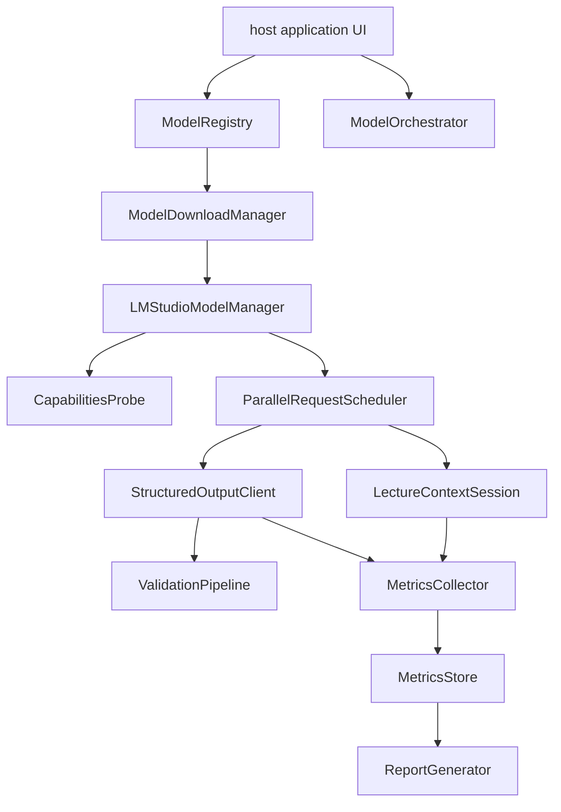
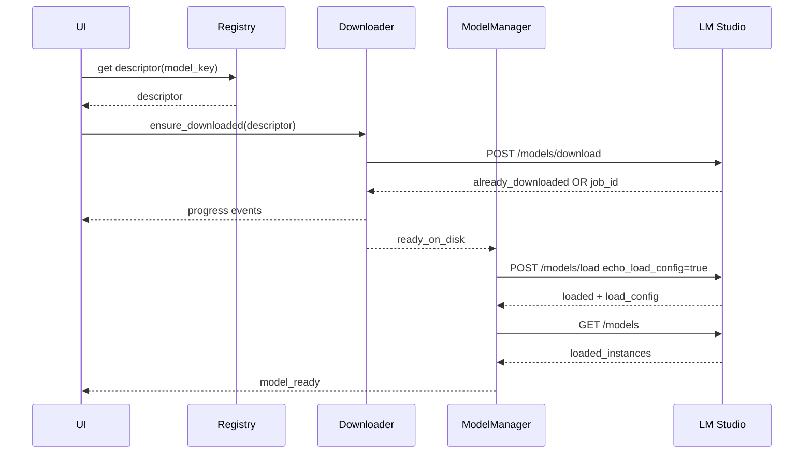
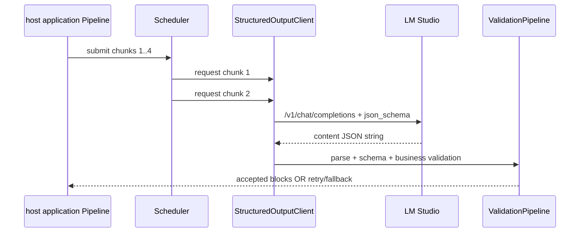
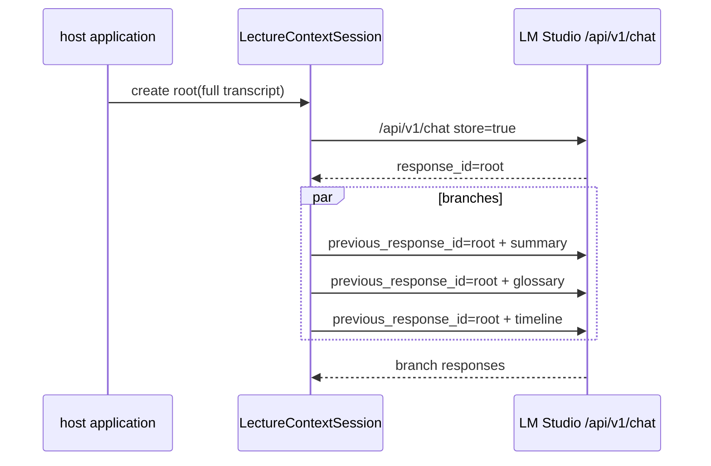

# LM Studio Managed Backend для host application: итоговая архитектура подсистемы 🏗️

## Назначение документа 🎯

Документ собирает предыдущие материалы в общую архитектуру. LM Studio рассматривается не как ручной GUI-инструмент, а как управляемый backend: host application знает модели, скачивает их, загружает в память с проверенным config, планирует параллельные запросы, измеряет кэш, получает structured output и сохраняет метрики.

## Высокоуровневая схема 🗺️



## Компоненты 🧩

| Компонент | Ответственность |
|-----------|-----------------|
| `ModelRegistry` | модели, источники, capabilities, load profiles |
| `ModelDownloadManager` | download jobs, progress, already_downloaded |
| `LMStudioModelManager` | load/unload, echo_load_config, instance tracking |
| `CapabilitiesProbe` | `/api/v1/models`, reasoning/vision/tools/json flags |
| `ModelOrchestrator` | выбор модели под purpose, LRU/swap policy |
| `ParallelRequestScheduler` | app-level concurrency, очереди, backpressure |
| `LectureContextSession` | root context, previous_response_id, stateful branches |
| `StructuredOutputClient` | `/v1/chat/completions`, JSON Schema |
| `ValidationPipeline` | parse/schema/business validation |
| `BenchmarkHarness` | эксперименты и регрессии |
| `MetricsStore` | JSONL/SQLite результаты |

## Поток “скачать и загрузить модель” 📥



## Поток structured JSON postprocessing 🧩



## Поток global lecture context 🌳



## Purpose-based model routing 🎛️

| Purpose | Preferred endpoint | Requirements |
|---------|--------------------|--------------|
| `postprocess_blocks` | `/v1/chat/completions` | JSON Schema, validation, low temperature |
| `lecture_summary` | `/api/v1/chat` | long context, stateful optional |
| `timeline_extraction` | `/api/v1/chat` or structured compat | timecode schema if needed |
| `vision_ocr` | `/api/v1/chat` | vision capability, image resize |
| `benchmark` | all | streaming metrics, reproducible config |

## Configuration model ⚙️

```json
{
  "lmstudio_backend": {
    "base_url": "http://127.0.0.1:1234",
    "model_key": "gemma4_12b_qat",
    "load_profile": "balanced_5060ti",
    "download_missing_models": true,
    "parallel_policy": {
      "load_parallel": 2,
      "max_app_concurrent_requests": 2
    },
    "global_context": {
      "enabled": false,
      "mode": "compact_memory",
      "endpoint": "/api/v1/chat"
    },
    "structured_output": {
      "enabled": true,
      "retry_count": 1,
      "business_validation": true
    }
  }
}
```

## Runtime safety 🛡️

| Риск | Защита |
|------|--------|
| модель не скачана | DownloadManager ensure_downloaded |
| модель загружена не с тем config | echo_load_config verification |
| слишком много parallel | Scheduler app-level cap |
| reasoning ломает JSON | capabilities probe + validation |
| cache не работает | benchmark gate |
| VRAM pressure | load profiles + telemetry |
| vision перегружает text pipeline | purpose queues |
| API поменялся | schema version + feature probing |

## Integration с host application слоями 🧱

| host application слой | Компоненты |
|---------|------------|
| Domain | model descriptors, capabilities, metrics DTO |
| Application | orchestrator, scheduler, benchmark service |
| Infrastructure | LM Studio REST client, downloader, model manager |
| UI | model picker, progress panel, benchmark panel |
| Storage | model registry cache, metrics store |

## Neutral package boundary

Reusable lifecycle, identity, telemetry, and recommendation contracts belong to the managed library. Transport execution, cancellation, persistence, user-facing policy, benchmark orchestration, datasets, report generation, and raw evidence remain consumer- or LabKit-owned.

The proposed extraction is a dedicated `lmstudio-managed` distribution exposing the `lmstudio_managed` import package. Its base wheel should contain only the dependency-light contract kernel; LabKit tools and optional runtime integrations must not be imported by the base package. Consumers pin an exact pre-release package version and independently declare the catalog schema revisions they accept.

This is a proposed packaging boundary, not a claim that the distribution has been published. The concrete wheel contents, migration sequence, compatibility gates, and pinned-consumer upgrade procedure are defined in [GPU telemetry, recommendations, and package boundary](12_gpu_telemetry_recommendations_and_package_boundary.md).

## Roadmap реализации 🗺️

| Phase | Результат |
|-------|-----------|
| 1 | ModelRegistry + статическая таблица моделей |
| 2 | DownloadManager + progress UI |
| 3 | ModelManager load/unload + config verification |
| 4 | StructuredOutputClient + validation pipeline |
| 5 | Parallel scheduler для chunk postprocessing |
| 6 | Benchmark harness + metrics store |
| 7 | LectureContextSession experimental mode |
| 8 | Production presets по результатам тестов |

## Итог 🧷

LM Studio Managed Backend должен быть проектирован как отдельная подсистема. Его успех определяется не тем, что модель ответила один раз, а тем, что host application может предсказуемо скачать модель, загрузить её с нужным профилем, отправить контролируемую серию запросов, измерить результат и безопасно обработать ошибки. Такой backend превращает локальные модели в управляемую инфраструктуру, а не в ручной экспериментальный чат.

## Источники и точки проверки 🔗

- LM Studio REST API overview: https://lmstudio.ai/docs/developer/rest
- LM Studio model download API: https://lmstudio.ai/docs/developer/rest/download
- LM Studio download status API: https://lmstudio.ai/docs/developer/rest/download-status
- LM Studio model load API: https://lmstudio.ai/docs/developer/rest/load
- LM Studio model list API: https://lmstudio.ai/docs/developer/rest/list
- LM Studio native chat API: https://lmstudio.ai/docs/developer/rest/chat
- LM Studio stateful chats: https://lmstudio.ai/docs/developer/rest/stateful-chats
- LM Studio structured output: https://lmstudio.ai/docs/developer/openai-compat/structured-output
- LM Studio parallel requests: https://lmstudio.ai/docs/app/advanced/parallel-requests
- LM Studio 0.4.0 blog: https://lmstudio.ai/blog/0.4.0
- LM Studio API changelog: https://lmstudio.ai/docs/developer/api-changelog
- LM Studio Open Responses blog: https://lmstudio.ai/blog/openresponses
- LM Studio bug tracker, Responses re-prefill: https://github.com/lmstudio-ai/lmstudio-bug-tracker/issues/2074
- llama.cpp prefix cache discussion: https://github.com/ggml-org/llama.cpp/discussions/15530
