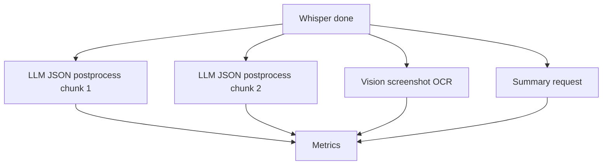

# Расширенная тестовая матрица для RTX 5060 Ti 16GB: скорость, JSON, parallel, context, cache и vision 🧪🎮

## Назначение документа 🎯

Этот документ описывает отдельную тестовую программу под CUDA-видеокарту RTX 5060 Ti 16GB. Цель — собрать большую матрицу по качеству, скорости, стабильности JSON, эффективности кэширования, влиянию параллелизма, росту контекста и vision-нагрузке. Документ предназначен для практического эксперимента, после которого можно выбрать production-профили host application.

> [!NOTE]
> Тестовая матрица должна отвечать на вопрос: какая модель и какой режим дают лучший результат на конкретном железе, а не вообще в вакууме.

## Аппаратный профиль 🖥️

| Параметр | Значение |
|----------|----------|
| GPU | NVIDIA RTX 5060 Ti |
| VRAM | 16 GB |
| Backend | LM Studio GGUF / llama.cpp CUDA |
| Основные модели | Gemma 4 12B QAT, Gemma 4 26B A4B QAT, Qwen3-VL 8B, Qwen3.6 35B A3B, Ministral 14B |
| Основные задачи | postprocessing, structured JSON, summary, timeline, vision OCR |

## Группы экспериментов 🧭

| Группа | Что проверяется |
|--------|-----------------|
| A | Базовая скорость моделей |
| B | JSON Schema и business validation |
| C | Parallel 1/2/4 |
| D | Context 8k/16k/32k/64k |
| E | Prompt cache и stateful root context |
| F | Vision input и resize |
| G | Mixed workload: text + vision + JSON |
| H | Stability: long run, OOM, retry, unload |

## A. Базовая скорость моделей ⏱️

| Тест | Context | Parallel | Dataset | Метрики |
|------|---------|----------|---------|---------|
| A1 | 8k | 1 | short text | TTFT, tok/s, latency |
| A2 | 16k | 1 | medium chunk | TTFT, tok/s, latency |
| A3 | 32k | 1 | lecture segment | prompt processing, TTFT |

Повторить для каждой модели минимум 3 раза. Первый запуск помечается как warmup.

## B. Structured JSON quality 🧩

| Тест | Dataset | Требование |
|------|---------|------------|
| B1 | 20 blocks | parse/schema/business pass |
| B2 | 100 blocks | no missing IDs, no empty text |
| B3 | 250 blocks | finish_reason != length |
| B4 | translated blocks | IDs preserved despite text length changes |
| B5 | noisy transcript | no hallucinated blocks |
| B6 | retry test | после искусственной ошибки fallback работает |

Метрики:

```text
json_parse_pass_rate
schema_pass_rate
business_pass_rate
ids_exact_pass_rate
empty_text_count
duplicate_id_count
reasoning_leak_count
retry_rate
fallback_rate
```

## C. Parallel matrix ⚙️

| Test | Context | Load parallel | App concurrency | Dataset |
|------|---------|---------------|-----------------|---------|
| C1 | 8k | 1 | 1 | 4 chunks |
| C2 | 8k | 2 | 2 | 4 chunks |
| C3 | 8k | 4 | 4 | 4 chunks |
| C4 | 16k | 1 | 1 | 4 chunks |
| C5 | 16k | 2 | 2 | 4 chunks |
| C6 | 16k | 4 | 4 | 4 chunks |
| C7 | 32k | 1 | 1 | 4 chunks |
| C8 | 32k | 2 | 2 | 4 chunks |
| C9 | 32k | 4 | 4 | 4 chunks |

Критерий:

```text
speedup = sequential_batch_wall_time / parallel_batch_wall_time
```

Режим принимается, если:

- speedup ≥ 1.2;
- no OOM;
- JSON business pass не падает ниже baseline более чем на 1–2%;
- VRAM peak остаётся в безопасной зоне.

## D. Context growth 🧠

| Test | Context | Dataset | Цель |
|------|---------|---------|------|
| D1 | 8k | chunk only | baseline |
| D2 | 16k | chunk + context | practical |
| D3 | 32k | lecture memory | target long context |
| D4 | 64k | full lecture partial | stress |
| D5 | 128k | only if stable | extreme probe |

Метрики:

- prompt_processing_seconds;
- TTFT;
- VRAM peak;
- errors;
- quality delta.

## E. Prompt cache / lecture context 📦

### E1. Stateful root context

```text
Root: full lecture 25k tokens
Branches:
- summary
- timeline
- glossary
- postprocess chunk 1
- postprocess chunk 2
- postprocess chunk 3
- postprocess chunk 4
```

Измерить:

| Метрика | Значение |
|---------|----------|
| root prompt processing | baseline cost |
| branch prompt processing | reuse indicator |
| branch TTFT | user-visible speed |
| branch total latency | practical speed |
| quality | usefulness |

### E2. Stateless full prefix

Каждый запрос содержит один и тот же 25k prefix. Измеряется, срабатывает ли prefix cache косвенно через снижение TTFT/prompt processing.

### E3. Compact memory

Сначала создаётся lecture memory на 1–3k токенов. Затем чанки обрабатываются с compact memory. Сравнивается качество и latency против full context.

## F. Vision matrix 🖼️

| Test | Input | Resize | Parallel | Метрики |
|------|-------|--------|----------|---------|
| F1 | screenshot text | 1024px | 1 | OCR completeness, latency |
| F2 | screenshot UI | 1024px | 1 | UI structure quality |
| F3 | photo | 1024px | 1 | description quality |
| F4 | screenshot text | 512px | 1 | degradation |
| F5 | screenshot text | original | 1 | latency/VRAM |
| F6 | 4 images | 1024px | 2 | parallel vision |
| F7 | 4 images | 1024px | 4 | stress vision |

Vision scoring:

```text
ocr_text_found_percent
ui_elements_found_count
hallucinated_elements_count
latency_seconds
vram_peak_mb
failure_rate
```

## G. Mixed workload 🧪



Проверяется, не ломает ли vision-поток postprocessing, и не должна ли система иметь отдельный scheduler для vision.

## H. Stability long run 🔁

| Тест | Длительность | Что проверяется |
|------|--------------|-----------------|
| H1 | 30 мин | повторные JSON-запросы |
| H2 | 1 час | смешанный workload |
| H3 | 1000 blocks | memory leak / degradation |
| H4 | unload/load cycles 20× | lifecycle robustness |
| H5 | failed JSON injection | retry/fallback correctness |

## Итоговая матрица решений 🏁

| Решение | Условие принятия |
|---------|------------------|
| Default model | лучший баланс JSON pass + latency + VRAM |
| Default parallel | speedup есть, стабильность не падает |
| Max context | 32k стабилен, 64k только если есть явный выигрыш |
| Vision policy | отдельный low-parallel scheduler, если F6/F7 деградируют |
| Stateful cache | включать только если E1 branch TTFT сильно ниже baseline |
| Compact memory | включать, если качество близко к full context, latency ниже |

## Формат итогового отчёта 📊

```markdown
# Benchmark Report: RTX 5060 Ti 16GB

## Лучшие профили
| model | context | parallel | mode | TTFT | tok/s | JSON pass | VRAM peak |

## Cache experiments
| mode | root prefill | branch TTFT | branch prompt processing | verdict |

## Vision experiments
| model | resize | latency | OCR score | failure rate |

## Recommendations
- Default structured model: ...
- Default context: ...
- Default parallel: ...
- Experimental global context: on/off
```

## Итог 🧷

Расширенная матрица должна дать практический ответ: какие модели действительно подходят для host application на RTX 5060 Ti 16GB. Она проверяет не только «модель отвечает», но и полный production-набор: скорость, TTFT, prefill, кэш, parallel, JSON-валидность, reasoning leaks, vision-качество, VRAM и устойчивость на длинных сериях.

## Источники и точки проверки 🔗

- LM Studio REST API overview: https://lmstudio.ai/docs/developer/rest
- LM Studio model download API: https://lmstudio.ai/docs/developer/rest/download
- LM Studio download status API: https://lmstudio.ai/docs/developer/rest/download-status
- LM Studio model load API: https://lmstudio.ai/docs/developer/rest/load
- LM Studio model list API: https://lmstudio.ai/docs/developer/rest/list
- LM Studio native chat API: https://lmstudio.ai/docs/developer/rest/chat
- LM Studio stateful chats: https://lmstudio.ai/docs/developer/rest/stateful-chats
- LM Studio structured output: https://lmstudio.ai/docs/developer/openai-compat/structured-output
- LM Studio parallel requests: https://lmstudio.ai/docs/app/advanced/parallel-requests
- LM Studio 0.4.0 blog: https://lmstudio.ai/blog/0.4.0
- LM Studio API changelog: https://lmstudio.ai/docs/developer/api-changelog
- LM Studio Open Responses blog: https://lmstudio.ai/blog/openresponses
- LM Studio bug tracker, Responses re-prefill: https://github.com/lmstudio-ai/lmstudio-bug-tracker/issues/2074
- llama.cpp prefix cache discussion: https://github.com/ggml-org/llama.cpp/discussions/15530
