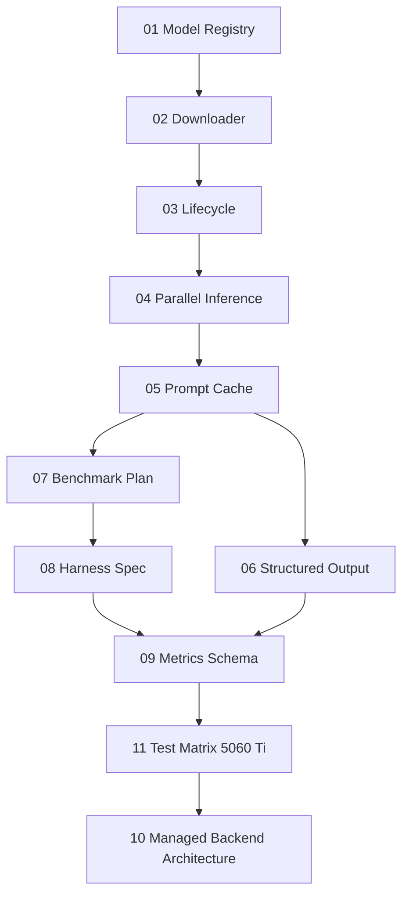

# LM Studio Managed Backend для host application — пакет документов 📚

Этот пакет описывает проектирование управляемого локального backend на базе LM Studio 0.4.x для host application: реестр моделей, загрузчик, lifecycle в памяти, параллельные запросы, кэширование большого контекста лекции, structured output, benchmark-матрицу и архитектурную сборку.

> [!NOTE]
> Документы написаны как статьи от третьего лица. Они не завязаны на личные данные и могут использоваться как техническая база для разработки, исследований и задач AI-агентов.

## Состав пакета 🗂️

| № | Файл | Назначение |
|---:|------|------------|
| 01 | `01_model_registry_ids_and_sources.md` | Реестр моделей, идентификаторы, GGUF/MLX, official/community уровни |
| 02 | `02_model_downloader_progress_and_errors.md` | Скачивание моделей через LM Studio API, прогресс и ошибки |
| 03 | `03_model_lifecycle_load_unload_context_kv.md` | Load/unload, context length, KV cache, Flash Attention, MoE experts |
| 04 | `04_parallel_inference_single_model.md` | Параллельные запросы к одной модели, continuous batching, Unified KV Cache |
| 05 | `05_prompt_cache_stateful_context_and_reuse.md` | Большой контекст лекции, stateful chats, prefix/KV cache, previous_response_id |
| 06 | `06_structured_output_json_schema_validation.md` | JSON Schema, structured output, reasoning leaks, validation/retry/fallback |
| 07 | `07_lmstudio_cache_parallel_benchmark_plan.md` | План экспериментов по cache/parallel/context/structured output |
| 08 | `08_benchmark_harness_technical_spec.md` | Техническая спецификация benchmark harness |
| 09 | `09_metrics_schema_and_result_format.md` | Схема метрик, JSONL/SQLite формат результатов |
| 10 | `10_lmstudio_managed_backend_architecture.md` | Итоговая архитектура подсистемы LM Studio Managed Backend |
| 11 | `11_test_matrix_5060ti_16gb_cuda.md` | Расширенная тестовая матрица под RTX 5060 Ti 16GB, включая vision |

## Рекомендуемый порядок чтения 🧭

> [!TIP]
> Практическая работа обычно начинается с документов 07, 08, 09 и 11: они превращают гипотезы о кэше, параллелизме и JSON-стабильности в измеряемые эксперименты.
