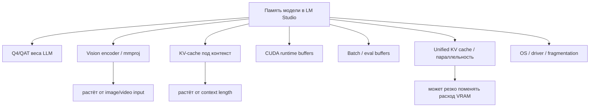
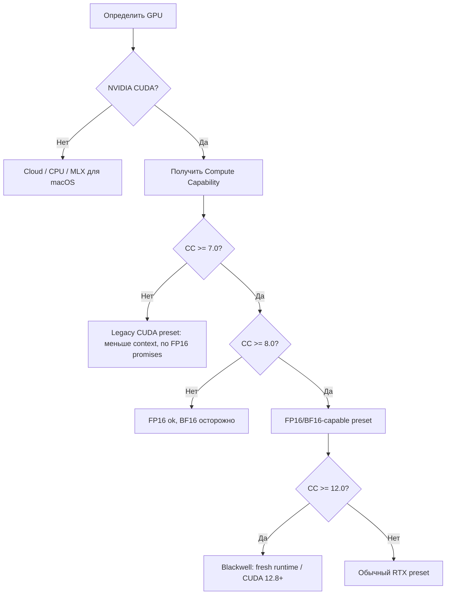
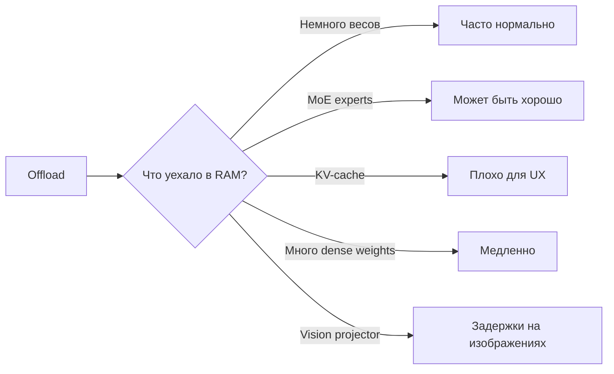
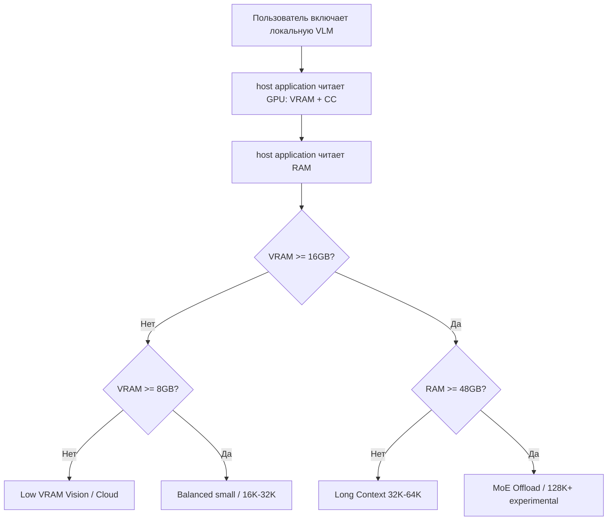

# Модели для host application и требования к железу CUDA/NVIDIA

> **Тип:** КАНВАС-статья  
> **Формат:** Markdown / Obsidian-ready  
> **Дата:** 1 июля 2026  
> **Фокус:** LM Studio, CUDA/NVIDIA, Q4/QAT, vision-модели, длинный контекст, частичный offload в ОЗУ  
> **Семейства:** Qwen, Gemma, Ministral/Mistral  

---

## 1. Аннотация 🧭

В статье рассматривается выбор локальных мультимодальных моделей для host application: модели должны уметь работать с текстом, изображениями и потенциально кадрами видео, а также обрабатывать длинные контексты, возникающие при постобработке транскрипций, документов, скриншотов и видеофрагментов.

Главная задача статьи — не подобрать модель под одну конкретную машину, а построить **матрицу совместимости для пользователей host application**: от старых карт уровня GTX 1060 до RTX 4090/5090 и профессиональных GPU. Поэтому анализ разделяет:

1. **VRAM** — сколько видеопамяти требуется для весов модели, vision-компонентов, KV-cache и runtime-overhead.
2. **RAM** — насколько терпим частичный offload в ОЗУ.
3. **CUDA/FP16-поддержку** — не всякая NVIDIA-карта с CUDA одинаково хорошо подходит для FP16/long-context workloads.
4. **Контекстные окна** — 8K, 16K, 32K, 64K, 128K, а для отдельных MoE/offload-friendly случаев также 192K+.
5. **Практическую скорость** — официальные данные, оценки и community-бенчмарки, когда они есть.

> [!summary] Главный вывод  
> Для массового host application не нужна одна «лучшая модель». Нужна система пресетов: **Low VRAM**, **Balanced Vision**, **Long Context**, **High-End MoE**, **Experimental Offload**. Иначе пользователь с GTX 1060 случайно полезет в 35B MoE, а пользователь с RTX 5090 будет сидеть на маленькой 4B-модели, как на спорткаре в первой передаче.

---

## 2. Почему задача сложнее, чем “сколько весит GGUF” 🧠

У локальной VLM/LLM-модели в LM Studio память складывается из нескольких частей:



Q4 уменьшает **веса модели**, но не отменяет KV-cache. В длинном контексте именно KV-cache может стать главным потребителем VRAM, особенно у dense full-attention моделей. При этом новые модели вроде **Qwen3.5-9B**, **Qwen3.6-35B-A3B** и **Gemma 4 26B-A4B** используют гибридные/скользящие/MoE-архитектуры, поэтому ведут себя иначе, чем обычная dense-модель.

> [!warning] Важная оговорка  
> Все VRAM-таблицы в статье — инженерные диапазоны, а не обещание до мегабайта. LM Studio, llama.cpp, драйвер NVIDIA, Flash Attention, KV-cache quantization, batch size, Unified KV Cache и конкретный GGUF-файл могут сдвинуть результат на 1–4 GB.

---

## 3. Термины и правила чтения таблиц 📚

| Термин | Значение для host application |
|---|---|
| **Q4 / Q4_K_M / Q4_0** | 4-битные веса модели. Снижает размер весов, но не обязательно KV-cache. |
| **QAT** | Quantization-Aware Training. Модель обучалась/дообучалась с учётом будущей квантизации, поэтому Q4-качество обычно лучше, чем у наивно сконвертированного Q4. |
| **KV-cache** | Память attention-контекста. Растёт с длиной контекста и количеством активных attention-слоёв. |
| **mmproj / vision encoder** | Компонент, который превращает изображение/видео в токены/эмбеддинги, понятные LLM. |
| **Offload в RAM** | Часть весов/слоёв уходит в системную память. Может быть нормально для MoE-экспертов, но плохо, если туда уезжает KV-cache. |
| **FP16-capable GPU** | NVIDIA GPU, где FP16-путь нормален. Для CTranslate2 это CC >= 7.0. |
| **Legacy CUDA** | Старые GTX/Pascal/Maxwell. CUDA есть, но FP16/BF16 режимы могут быть плохими или недоступными. |
| **Recommended** | Ожидается нормальная работа без шаманства. |
| **Experimental** | Может работать, но зависит от backend, RAM, offload и настроек. |
| **Slow/offload** | Запустится, но UX может быть заметно хуже. |

---

## 4. CUDA/NVIDIA: FP16 и поколения GPU ⚙️

Для host application важно не только количество VRAM, но и поколение GPU. GTX 1080 Ti с 11 GB VRAM и RTX 3060 12 GB — это не один и тот же класс для FP16/LLM-runtime.

### 4.1. Compute Capability и практическая политика

| Класс | Примеры | Compute Capability | Политика host application |
|---|---|---:|---|
| **Очень старые NVIDIA** | GT 730, GTX 7xx/9xx, часть Maxwell | <= 5.x / 3.x | Не рекомендовать локальные VLM через LM Studio как основной сценарий. |
| **Pascal legacy** | GTX 1050/1060/1070/1080/1080 Ti | 6.1 | CUDA есть, но FP16 не считать нормальным путём. Рекомендовать INT8/малый контекст/облако. |
| **Turing RTX** | RTX 2060–2080 Ti, GTX 1650 Ti CC 7.5 | 7.5 | FP16 доступен, нормальный базовый RTX-класс. |
| **Ampere** | RTX 3050–3090 | 8.6 | FP16/BF16-поддержка лучше, хороший массовый класс. |
| **Ada** | RTX 4050–4090 | 8.9 | Хороший класс для 8B/12B/14B/части MoE. |
| **Blackwell** | RTX 5050–5090 | 12.0 | Нужны свежие runtime/CUDA. Не хардкодить старые compute paths. |

NVIDIA официально публикует таблицы Compute Capability для актуальных и legacy GPU. RTX 50xx/Blackwell указан как CC 12.0, RTX 40xx/Ada — 8.9, Ampere RTX 30xx — 8.6, Pascal GTX 10xx — 6.1. CTranslate2 показывает, что `float16` поддерживается на NVIDIA GPU с CC >= 7.0, `bfloat16` — с CC >= 8.0, а `int8` поддерживает CC 6.1 и >= 7.0.

### 4.2. Что это значит для host application



> [!tip] Практическая политика  
> Для host application старые карты не надо блокировать жёстко. Но интерфейс должен честно писать: “Legacy CUDA: модель может запускаться, но длинный контекст и vision будут медленнее; рекомендуется меньший контекст или cloud-provider”.

---

## 5. LM Studio: какие настройки реально влияют на память 🧰

LM Studio позволяет управлять контекстом, GPU-offload, Flash Attention, memory mapping, KV-cache quantization, keep-in-memory и MoE-числом экспертов. В документации LM Studio отдельно отмечает, что KV-cache quantization снижает память, но может влиять на качество, а для V-cache quantization нужен Flash Attention.

| Настройка LM Studio | Влияние на host application |
|---|---|
| **Context Length** | Главный рычаг KV-cache. 128K может быть в разы тяжелее 32K. |
| **GPU Offload** | Определяет, какая часть модели живёт в VRAM. |
| **Flash Attention** | Часто нужен для более экономичного long-context, а также для KV quant. |
| **K/V Cache Quantization** | Q8/Q4 cache снижает VRAM, но может ломать качество у некоторых моделей. |
| **keepModelInMemory** | Ускоряет повторный доступ, но увеличивает RAM footprint. |
| **tryMmap** | Помогает старту и mmap-загрузке; если RAM мало, может привести к paging/дисковому тормозу. |
| **Max Concurrent Predictions** | Для локального host application почти всегда 1, иначе KV-cache множится. |
| **Unified KV Cache** | Может быть полезно, но для vision-пайплайнов иногда требует осторожности. |

> [!warning] KV-cache quantization  
> В host application нельзя универсально советовать “включить KV Q4”. Для некоторых моделей Q8 — безопасный компромисс, Q4 — experimental. Если модель начинает повторяться, loop’иться или деградировать на длинном ответе, сначала откатывается KV-cache на F16/Q8.

---

## 6. Общее правило offload в ОЗУ 🧺

host application должен различать **хороший offload** и **плохой offload**.

| Ситуация | Статус |
|---|---|
| Не хватает VRAM до 1–2 GB | ✅ Обычно нормально. |
| Не хватает VRAM до 2–4 GB | ⚠️ Терпимо, особенно для MoE/гибридных моделей. |
| Не хватает VRAM 4–8 GB | 🐢 Работает, но скорость может гулять. |
| В RAM ушло >25–35% весов | 🐢 Скорее “запустилось”, чем “комфортно”. |
| KV-cache уехал в RAM | ❌ Плохой интерактивный режим. |
| Vision/mmproj уехал в RAM | ⚠️ Возможны задержки на изображениях/кадрах. |
| MoE expert weights уехали в RAM | ✅/⚠️ Иногда нормально, если активных экспертов мало и runtime умеет эффективно offload. |



---

## 7. Глобальная матрица VRAM-классов 🎮

| VRAM | Типичные карты | Общий сценарий host application |
|---:|---|---|
| **4 GB** | GTX 1650 4GB, старые ноуты | Локальные VLM почти не рекомендовать. Whisper/малые LLM/cloud. |
| **6 GB** | GTX 1060 6GB, RTX 2060 6GB | 3B–4B, 8K–16K, aggressive resize изображений. |
| **8 GB** | RTX 3060 8GB, RTX 4060 8GB | 3B–4B комфортно; 8B/9B только малый контекст/offload. |
| **12 GB** | RTX 3060 12GB, RTX 4070 12GB | 8B/9B/12B 16K–32K. |
| **16 GB** | 4060 Ti 16GB, 4070 Ti Super, 5080 16GB | 8B/9B/12B 32K–64K; MoE 26B/35B с offload. |
| **24 GB** | RTX 3090/4090 | 14B/26B/35B 32K–128K в зависимости от модели. |
| **32 GB** | RTX 5090, pro-карты | High-end MoE, 128K+, больше headroom. |
| **48 GB+** | A6000/RTX PRO | 35B/26B long-context комфортно, эксперименты 192K/256K. |

---

## 8. Qwen: проверенные данные и матрицы 🐉

### 8.1. Проверенные исходные данные Qwen

| Модель | Vision | Архитектура | Контекст | Q4 / GGUF / min memory |
|---|---:|---|---:|---|
| **qwen/qwen3.6-35b-a3b** | ✅ | MoE + hybrid attention, 35B total / 3B active | 262K | LM Studio min system memory 20 GB; GGUF Q4_K_M около 22.3 GB. |
| **qwen/qwen3.5-9b** | ✅ | Hybrid dense, 9B | 262K | LM Studio min 7 GB; GGUF Q4_K_M около 5.7 GB. |
| **qwen/qwen3-vl-4b** | ✅ | Dense VL, 4.44B | 256K | LM Studio min 3 GB; Q4_K_M около 2.5 GB + mmproj. |
| **qwen/qwen3-vl-8b** | ✅ | Dense VL, 8.77B | 256K | LM Studio min 6 GB; Q4_K_M около 5.0 GB + mmproj. |

### 8.2. Архитектурная поправка Qwen

У Qwen есть две разные группы:

1. **Qwen3-VL-4B/8B** — dense vision-language модели. Длинный контекст быстро раздувает KV-cache.
2. **Qwen3.5-9B и Qwen3.6-35B-A3B** — гибридные модели с Gated DeltaNet / Gated Attention pattern. Там KV-cache длинного контекста дешевле, чем у обычной dense full-attention модели.

> [!important] Вывод  
> Qwen3.5-9B может быть лучше для длинного контекста, чем кажется по размеру. Qwen3-VL-4B может быть легче по весам, но тяжелее на 128K из-за KV-cache.

### 8.3. Qwen: оценка VRAM для FP16-capable RTX

| Модель Q4 + Vision | 8K | 16K | 32K | 64K | 128K |
|---|---:|---:|---:|---:|---:|
| **Qwen3-VL-4B** | ~5.5–6 GB | ~6.5–7.5 GB | ~9–10 GB | ~13.5–15 GB | ~22–24 GB |
| **Qwen3-VL-8B** | ~8.5–9 GB | ~9.5–10.5 GB | ~12–13.5 GB | ~16.5–18 GB | ~25–27 GB |
| **Qwen3.5-9B** | ~8–8.5 GB | ~8.3–9 GB | ~9–10 GB | ~10–11.5 GB | ~12–14 GB |
| **Qwen3.6-35B-A3B** | ~24–25 GB | ~24.5–25.5 GB | ~25–26 GB | ~26–27.5 GB | ~28–31 GB |

### 8.4. Qwen: матрица по VRAM-классам

| VRAM | Qwen3-VL-4B | Qwen3-VL-8B | Qwen3.5-9B | Qwen3.6-35B-A3B |
|---:|---|---|---|---|
| **6 GB** | ⚠️ 8K, 16K experimental | ❌/🐢 | ❌/🐢 | ❌ |
| **8 GB** | ✅ 8K–16K, ⚠️ 32K | ⚠️ 8K | ⚠️ 8K–16K | ❌ |
| **12 GB** | ✅ 32K | ✅ 16K, ⚠️ 32K | ✅ 16K–32K, ⚠️ 64K | ❌/🐢 |
| **16 GB** | ✅ 64K, ⚠️ 128K KV-Q | ✅ 32K, ⚠️ 64K | ✅ 32K–64K, ⚠️ 128K | 🐢 offload/IQ4/Q3 |
| **24 GB** | ✅ 128K | ✅ 64K, ⚠️ 128K | ✅ 128K | ⚠️ 8K–32K |
| **32 GB** | ✅ 128K | ✅ 128K | ✅ 128K | ✅ 32K–64K, ⚠️ 128K |

### 8.5. Qwen: legacy/no-FP16 поправка

| Модель | Legacy CUDA рекомендация |
|---|---|
| **Qwen3-VL-4B** | 8K–16K; 32K как experimental. |
| **Qwen3-VL-8B** | 8K–16K только при 8–12GB+ VRAM. |
| **Qwen3.5-9B** | 8K–16K; 32K только при достаточной RAM/VRAM. |
| **Qwen3.6-35B-A3B** | Не рекомендовать как обычный GPU-сценарий; только advanced offload. |

### 8.6. Qwen: данные по скорости из сети

| Модель | Железо / режим | Скорость | Надёжность данных | Комментарий |
|---|---|---:|---|---|
| **Qwen3.6-35B-A3B** | Reddit: LM Studio, 12GB VRAM | 120+ tok/s | Низкая/средняя, community screenshot/thread | Вероятно сильная зависимость от кванта/настроек/активных параметров. Не считать гарантией. |
| **Qwen3.6-35B-A3B** | Исследовательский custom engine, Tesla C2075 6GB + CPU decode | до 8.6 tok/s | Исследовательская работа, не LM Studio | Доказывает offload-потенциал hybrid MoE, но не готовый consumer UX. |
| **Qwen3.5-9B** | Community reports на 8GB VRAM | без точной стабильной цифры | Низкая | Важнее сам факт запуска 9B-class на 8GB с квантами. |
| **Qwen3-VL-4B/8B** | llama.cpp/LM Studio GGUF | точных стабильных публичных цифр мало | Средняя/низкая | Для host application лучше собирать собственную телеметрию. |

> [!note] Рекомендация  
> Для Qwen host application должен хранить не только “минимальную память”, но и режим: **dense VL** или **hybrid/MoE**. Это влияет на длинный контекст сильнее, чем само число параметров.

---

## 9. Gemma: проверенные данные и матрицы 💎

### 9.1. Проверенные исходные данные Gemma

| Модель | Vision | Audio/Video | Контекст | Q4/QAT память |
|---|---:|---:|---:|---|
| **Gemma 3 4B QAT** | ✅ | ❌ | 128K | Q4_K_M около 2.5 GB; image normalization до 896×896. |
| **Gemma 4 E2B QAT** | ✅ | ✅ audio | 128K | Google указывает Q4_0 memory около 2.9 GB; LM Studio card около 4.2 GB. |
| **Gemma 4 E4B QAT** | ✅ | ✅ audio | 128K | Google Q4_0 memory около 4.5 GB; LM Studio card около 5.9 GB. |
| **Gemma 4 12B QAT** | ✅ | ✅ audio/video | 256K | Google Q4_0 memory около 6.7 GB; LM Studio card около 7.4 GB. |
| **Gemma 4 26B-A4B QAT** | ✅ | image/video | 256K | Google Q4_0 memory около 14.4 GB; LM Studio min system memory 16 GB. |

Google AI for Developers указывает approximate memory requirements для Gemma 4: E2B Q4_0 — 2.9 GB, E4B Q4_0 — 4.5 GB, 12B Q4_0 — 6.7 GB, 26B-A4B Q4_0 — 14.4 GB. LM Studio для Gemma 4 26B-A4B QAT указывает Minimum system memory 16 GB и capabilities Vision Input / tool use / reasoning.

### 9.2. Gemma: архитектурная поправка

| Модель | Особенность |
|---|---|
| **Gemma 3 4B** | Старый проверенный vision-baseline, умеренный KV-cache. |
| **Gemma 4 E2B/E4B** | Очень дешёвый KV-cache благодаря attention layout; хороши для слабого железа. |
| **Gemma 4 12B** | Сильная balanced-модель, но 128K становится заметно дороже. |
| **Gemma 4 26B-A4B** | MoE: 26B total / около 4B active. Память весов большая, но offload MoE-экспертов может быть терпимым. |

### 9.3. Gemma: оценка VRAM для FP16-capable RTX

Это консервативный near-GPU режим, где модель в основном живёт на GPU.

| Модель Q4/QAT + Vision | 8K | 16K | 32K | 64K | 128K |
|---|---:|---:|---:|---:|---:|
| **Gemma 3 4B QAT** | ~4.5–5.2 GB | ~4.8–5.6 GB | ~5.3–6.3 GB | ~6.3–7.5 GB | ~8–9.5 GB |
| **Gemma 4 E2B QAT** | ~5–5.8 GB | ~5.1–6 GB | ~5.3–6.2 GB | ~5.6–6.7 GB | ~6.2–7.5 GB |
| **Gemma 4 E4B QAT** | ~7–8 GB | ~7.2–8.4 GB | ~7.6–9 GB | ~8.2–10 GB | ~9.2–11.5 GB |
| **Gemma 4 12B QAT** | ~9–10.5 GB | ~10–11.5 GB | ~11–13.5 GB | ~13.5–16.5 GB | ~18–22 GB |
| **Gemma 4 26B-A4B QAT** | ~18–20 GB | ~19–21 GB | ~20–22.5 GB | ~22–25 GB | ~26–31 GB |

### 9.4. Gemma 4 26B-A4B: отдельный offload-friendly режим

Gemma 4 26B-A4B нельзя оценивать как обычную dense 26B. В community-данных есть несколько важных наблюдений:

| Источник / режим | Железо | Контекст / настройки | Скорость | Вывод |
|---|---|---|---:|---|
| Пользовательский кейс из обсуждения host application | 16GB-class GPU + RAM offload | 192K context | ~35 tok/s | Такой режим реален и не должен считаться невозможным. |
| LocalLLaMA thread | 5060 Ti 16GB | IQ3_S, 80K context, q8_0 KV | ~20–25 tok/s | 16GB VRAM может быть достаточно при правильном кванте/offload. |
| Level1Techs thread | RTX A5500 Laptop ~15GB VRAM | Q4 + CPU expert offload | ~35–42 tok/s | Скорость порядка 35 tok/s подтверждается похожим железом. |
| HF discussion / llama.cpp | 5070 Ti 16GB + быстрый RAM/PCIe | 128K+ context, CPU-MoE | до ~50 TPS anecdotal | Advanced режим зависит от backend и RAM. |

> [!important] Исправленный вывод  
> Gemma 4 26B-A4B QAT для host application не следует маркировать как “только 24GB+”. Правильнее: **16GB+ with intelligent offload**. Для массового пресета — 64K/128K, для advanced — 192K/256K при достаточной RAM и хорошем runtime.

### 9.5. Gemma: матрица по VRAM-классам

| VRAM | Gemma 3 4B | Gemma 4 E2B | Gemma 4 E4B | Gemma 4 12B | Gemma 4 26B-A4B |
|---:|---|---|---|---|---|
| **6 GB** | ✅ 8K–16K | ✅ 8K–32K | ⚠️ 8K–16K offload | ❌/🐢 | ❌ |
| **8 GB** | ✅ 32K, ⚠️ 64K | ✅ 64K, ⚠️ 128K | ✅ 16K–32K, ⚠️ 64K | ⚠️ 8K offload | ❌ |
| **12 GB** | ✅ 64K–128K | ✅ 128K | ✅ 64K–128K | ✅ 16K–32K, ⚠️ 64K | ⚠️ strong offload |
| **16 GB** | ✅ 128K | ✅ 128K | ✅ 128K | ✅ 32K–64K, ⚠️ 128K | ✅/⚠️ 64K–192K with offload |
| **24 GB** | ✅ | ✅ | ✅ | ✅ 128K | ✅ 128K, ⚠️ 192K/256K |
| **32 GB** | ✅ | ✅ | ✅ | ✅ 128K | ✅ 128K–256K |

### 9.6. Gemma: legacy/no-FP16 поправка

| Модель | Legacy CUDA рекомендация |
|---|---|
| **Gemma 3 4B** | ✅ 8K–16K, 32K experimental. |
| **Gemma 4 E2B** | ✅ лучший слабый Gemma-кандидат. |
| **Gemma 4 E4B** | ⚠️ 8K–16K; 32K если VRAM 8–12 GB. |
| **Gemma 4 12B** | ⚠️ 12GB+ и 8K–16K. |
| **Gemma 4 26B-A4B** | Не recommended, но advanced offload possible. |

### 9.7. Gemma: скорости из сети и чата

| Модель | Железо / режим | Скорость | Надёжность |
|---|---|---:|---|
| **Gemma 4 E4B** | Reddit/Gemma4: RTX 4070 12GB | ~90 tok/s | Community anecdotal |
| **Gemma 4 26B-A4B** | Обсуждение host application: 16GB-class + RAM offload, 192K | ~35 tok/s | Реальный пользовательский кейс |
| **Gemma 4 26B-A4B** | Level1Techs: RTX A5500 Laptop ~15GB | ~35–42 tok/s | Community benchmark |
| **Gemma 4 26B-A4B** | TowardsAI: RTX 4090, Q4 | ~42 tok/s | Авторский тест/статья |
| **Gemma 4 26B-A4B** | HF/community: 5070 Ti 16GB, CPU-MoE | ~50 TPS anecdotal | Низкая/средняя |

---

## 10. Ministral / Mistral: отдельный блок 🌬️

> [!note] Статус блока  
> В чате подробно уточнялись Qwen и Gemma. Ministral/Mistral включён в статью, потому что исходный список моделей содержал `ministral-3-3b` и `ministral-3-14b-reasoning`. Этот блок стоит считать хорошей предварительной матрицей, но при финальном релизном решении его желательно валидировать отдельной сессией, как это было сделано с Qwen/Gemma.

### 10.1. Проверенные исходные данные Ministral

| Модель | Vision | Архитектура | Контекст | Q4/память |
|---|---:|---|---:|---|
| **Ministral 3 3B Instruct 2512** | ✅ | 3.4B Language Model + 0.4B Vision Encoder | 256K | GGUF Q4_K_M, edge/local model; FP8 fits in 8GB VRAM, less if further quantized. |
| **Ministral 3 14B Reasoning 2512** | ✅ | 13.5B Language Model + 0.4B Vision Encoder | 256K | 14B-class multimodal, Q4 expected around 8–9 GB model weight class. |

Mistral объявила Ministral 3 как семейство 3B/8B/14B моделей, все с image understanding capabilities и Apache 2.0. Hugging Face cards для 3B/14B указывают 0.4B vision encoder и vision/system prompt/function calling/JSON capabilities.

### 10.2. Ministral: оценка VRAM для FP16-capable RTX

| Модель Q4 + Vision | 8K | 16K | 32K | 64K | 128K |
|---|---:|---:|---:|---:|---:|
| **Ministral 3 3B** | ~3.8–4.5 GB | ~4.5–5.2 GB | ~5.7–6.8 GB | ~8–9.5 GB | ~12.5–15 GB |
| **Ministral 3 14B Reasoning** | ~11–12.5 GB | ~12.5–14 GB | ~15–17 GB | ~20.5–23 GB | ~31–35 GB |

### 10.3. Ministral: матрица по VRAM-классам

| VRAM | Ministral 3 3B | Ministral 3 14B Reasoning |
|---:|---|---|
| **6 GB** | ✅ 8K–16K | ❌ |
| **8 GB** | ✅ 16K–32K | ❌/🐢 |
| **12 GB** | ✅ 32K–64K | ⚠️ 8K–16K |
| **16 GB** | ✅ 64K–128K | ✅ 16K–32K, ⚠️ 64K |
| **24 GB** | ✅ 128K | ✅ 64K, ⚠️ 128K |
| **32 GB** | ✅ 128K | ✅ 128K |

### 10.4. Роль Ministral в host application

| Модель | Роль |
|---|---|
| **Ministral 3 3B** | Лучший лёгкий Mistral-кандидат для 6–8GB VRAM, особенно если нужен Apache 2.0 и мультимодальность. |
| **Ministral 3 14B Reasoning** | Reasoning + vision для 16GB+ VRAM; интересен как high-quality local модель, но 128K требует 24–32GB. |

---

## 11. Единая матрица моделей по VRAM-классам 🧩

| VRAM | Рекомендуемые модели | Experimental / offload | Не рекомендовать |
|---:|---|---|---|
| **6 GB** | Ministral 3 3B, Gemma 4 E2B, Gemma 3 4B, Qwen3-VL-4B 8K | Qwen3-VL-4B 16K, Gemma E4B 8K | 8B/9B/12B/14B/26B/35B |
| **8 GB** | Gemma E2B/E4B, Qwen3-VL-4B, Ministral 3B | Qwen3-VL-8B 8K, Qwen3.5-9B 8K, Gemma 12B 8K offload | Qwen 35B, Gemma 26B, Ministral 14B long context |
| **12 GB** | Qwen3-VL-8B, Qwen3.5-9B, Gemma 12B, Gemma E4B | Ministral 14B 8K–16K, Gemma 26B strong offload | Qwen3.6 35B normal mode |
| **16 GB** | Qwen3.5-9B, Qwen3-VL-8B, Gemma 12B, Ministral 14B | Gemma 26B-A4B 64K–192K offload, Qwen3.6 35B offload | 128K dense VL без KV quant/headroom |
| **24 GB** | Qwen3.5 128K, Gemma 12B 128K, Ministral 14B 64K, Gemma 26B 128K | Qwen3.6 35B 16K–32K, Qwen3-VL-8B 128K | 35B 128K full comfort |
| **32 GB** | Qwen3.6 35B, Gemma 26B, Ministral 14B 128K, Qwen3.5 128K | 192K/256K advanced | Почти нет из списка, кроме extreme context with concurrency |

---

## 12. Единая матрица по контексту 8K–128K 📊

| Модель | 8K | 16K | 32K | 64K | 128K | 192K+ |
|---|---|---|---|---|---|---|
| **Qwen3-VL-4B** | 6GB+ | 8GB | 12GB | 16GB | 24GB | 32GB+ experimental |
| **Qwen3-VL-8B** | 8GB | 12GB | 12–16GB | 16–24GB | 24–32GB | 32GB+ experimental |
| **Qwen3.5-9B** | 8GB | 8–12GB | 12GB | 16GB | 24GB | 32GB+ experimental |
| **Qwen3.6-35B-A3B** | 24GB/offload | 24GB/offload | 24–32GB | 32GB | 32–48GB | 48GB+ |
| **Gemma 3 4B** | 6GB | 6GB | 8GB | 8–12GB | 12GB | не основной сценарий |
| **Gemma 4 E2B** | 6GB | 6GB | 6–8GB | 8GB | 8–12GB | не основной сценарий |
| **Gemma 4 E4B** | 8GB | 8GB | 8–12GB | 12GB | 12–16GB | не основной сценарий |
| **Gemma 4 12B** | 12GB | 12GB | 12–16GB | 16GB | 24GB | 32GB+ |
| **Gemma 4 26B-A4B** | 16GB offload | 16GB offload | 16–24GB | 16–24GB | 16GB advanced / 24GB recommended | 16GB advanced / 32GB comfortable |
| **Ministral 3 3B** | 6GB | 6GB | 8GB | 12GB | 16GB | 24GB+ |
| **Ministral 3 14B** | 12–16GB | 16GB | 16GB | 24GB | 32GB | 48GB+ |

---

## 13. Рекомендованные host application-пресеты 🛠️

### 13.1. Preset table

| Preset | Модели | Контекст | Класс железа | Статус |
|---|---|---:|---|---|
| **Low VRAM Vision** | Ministral 3 3B, Gemma 4 E2B, Qwen3-VL-4B | 8K–16K | 6–8GB VRAM | ✅ массовый low-end |
| **Balanced Vision** | Qwen3-VL-8B, Gemma 4 E4B, Qwen3.5-9B | 16K–32K | 8–12GB VRAM | ✅ основной средний класс |
| **Long Context Local** | Qwen3.5-9B, Gemma 4 12B | 32K–64K | 12–16GB VRAM | ✅ сильный локальный режим |
| **High-End Reasoning/Vision** | Gemma 4 26B-A4B, Qwen3.6-35B, Ministral 14B | 32K–128K | 16–32GB VRAM + RAM | ⚠️/✅ зависит от offload |
| **Experimental 192K** | Gemma 4 26B-A4B | 192K | 16GB+ VRAM + быстрая RAM | ⚠️ advanced |
| **Cloud Fallback** | OpenRouter/Polza/etc. | любое | 4–6GB / legacy GPU | ☁️ recommended fallback |

### 13.2. Preset logic



---

## 14. Как host application должен показывать совместимость в UI 🖥️

| Статус | Значение | UI-текст |
|---|---|---|
| ✅ **Рекомендуется** | модель и контекст должны работать без сюрпризов | “Подходит для этой системы” |
| ⚠️ **Экспериментально** | вероятно запустится, но зависит от offload/backend | “Может работать, но возможны задержки” |
| 🐢 **Медленно** | значительная часть уйдёт в RAM/CPU | “Запустится, но скорость может быть низкой” |
| ❌ **Не рекомендовано** | слишком высокий шанс OOM/плохого UX | “Лучше выбрать меньшую модель” |
| ☁️ **Лучше облако** | локально нецелесообразно | “Рекомендуется облачный LLM-провайдер” |

### 14.1. Пример автоклассификации

```python
@dataclass
class HardwareProfile:
    gpu_name: str
    vram_gb: float
    ram_gb: float
    cuda_compute_capability: tuple[int, int] | None

    @property
    def fp16_ok(self) -> bool:
        return self.cuda_compute_capability is not None and self.cuda_compute_capability >= (7, 0)

    @property
    def bf16_ok(self) -> bool:
        return self.cuda_compute_capability is not None and self.cuda_compute_capability >= (8, 0)

    @property
    def blackwell(self) -> bool:
        return self.cuda_compute_capability is not None and self.cuda_compute_capability >= (12, 0)
```

```python
@dataclass
class ModelPreset:
    model_id: str
    model_family: str
    min_vram_recommended: dict[int, float]  # context -> GB
    min_ram_for_offload: float
    offload_friendly: bool
    legacy_cuda_allowed: bool
```

```python
def classify_model_for_hardware(model: ModelPreset, hw: HardwareProfile, context: int) -> str:
    required = model.min_vram_recommended[context]
    headroom = hw.vram_gb - required

    if hw.cuda_compute_capability is None:
        return "cloud_recommended"

    if not hw.fp16_ok and not model.legacy_cuda_allowed:
        return "not_recommended"

    if headroom >= 2:
        return "recommended"

    if headroom >= -3 and model.offload_friendly and hw.ram_gb >= model.min_ram_for_offload:
        return "offload_ok"

    if headroom >= -6 and hw.ram_gb >= model.min_ram_for_offload * 1.5:
        return "slow"

    return "not_recommended"
```

---

## 15. Vision-пайплайн: resize изображений и кадров 🖼️

Для host application важно не отправлять в локальную VLM огромные изображения без подготовки. Внутренние бенчмарки host application по vision-пайплайну уже показывали, что resize до 1024 px часто даёт хорошую экономику токенов/памяти без критичной потери качества.

| Тип входа | Рекомендация |
|---|---|
| Скриншот интерфейса | resize до 1024 px по длинной стороне |
| Код/IDE/мелкий текст | 1024–1536 px, если OCR деградирует |
| Фотография | 1024 px, fallback 512 для low VRAM |
| Кадры видео | sampling + resize 512–1024 px |
| Много кадров | обязательно лимитировать число кадров и контекст |

> [!warning] Vision tokens  
> Vision-входи не “бесплатные”. Они занимают место в контексте и могут увеличивать KV-cache. Для host application особенно опасен сценарий: длинная транскрипция + много кадров + 128K context + локальная VLM на 8GB VRAM.

---

## 16. Рейтинг моделей для host application по ролям 🏁

### 16.1. Лучшие low-end модели

| Место | Модель | Почему |
|---:|---|---|
| 1 | **Gemma 4 E2B QAT** | Очень лёгкий Gemma 4, хороший контекст, vision/audio. |
| 2 | **Ministral 3 3B** | Edge-oriented, Apache 2.0, vision, 256K. |
| 3 | **Qwen3-VL-4B** | Сильный Qwen vision, но 64K/128K дороже по KV. |
| 4 | **Gemma 3 4B** | Старый стабильный baseline. |

### 16.2. Лучшие balanced модели

| Место | Модель | Почему |
|---:|---|---|
| 1 | **Qwen3.5-9B** | Отличный text+vision+long-context баланс. |
| 2 | **Qwen3-VL-8B** | Сильный vision, но KV на long-context тяжелее. |
| 3 | **Gemma 4 E4B QAT** | Очень хороша для 8–12GB и высокой скорости. |
| 4 | **Gemma 4 12B QAT** | Сильная модель для 16GB+ и 32K–64K. |

### 16.3. Лучшие high-end / MoE модели

| Место | Модель | Почему |
|---:|---|---|
| 1 | **Gemma 4 26B-A4B QAT** | Наиболее интересный MoE для host application: 16GB+ with intelligent offload, 192K possible. |
| 2 | **Qwen3.6-35B-A3B** | Сильная hybrid/MoE модель; лучше для high-end/offload/agentic coding. |
| 3 | **Ministral 3 14B Reasoning** | Reasoning + vision, 16GB+ practical, 24GB+ comfortable. |

---

## 17. Практические рекомендации для релиза host application 📦

### 17.1. Не показывать пользователю “сырую” таблицу моделей

Вместо списка из 11 моделей лучше показывать пресеты:

```text
Лёгкая локальная vision-модель
Сбалансированная локальная vision-модель
Длинный контекст
Мощная MoE-модель с offload
Экспериментальный 128K/192K режим
```

### 17.2. Встроить авто-предупреждения

| Условие | Предупреждение |
|---|---|
| GTX 10xx / CC 6.1 | “Legacy CUDA: длинный контекст может быть медленным.” |
| VRAM < estimate | “Потребуется offload в ОЗУ.” |
| RAM < model file + запас | “Вероятен disk paging и сильное замедление.” |
| 128K на dense VL | “KV-cache может занять много VRAM.” |
| Gemma 26B на 16GB | “Advanced offload mode: возможно, но зависит от RAM/PCIe/backend.” |
| Blackwell | “Требуются свежие CUDA/runtime; старые сборки могут не поддерживать sm_120.” |

### 17.3. Собственная телеметрия host application

Для точности host application стоит собирать добровольную локальную диагностику без пользовательского контента:

| Поле | Логировать? | Приватность |
|---|---:|---|
| GPU name | ✅ | безопасно |
| VRAM total/free | ✅ | безопасно |
| RAM total/free | ✅ | безопасно |
| Model ID | ✅ | безопасно |
| Context length | ✅ | безопасно |
| KV quant | ✅ | безопасно |
| Tokens/sec | ✅ | безопасно |
| Prompt text | ❌ | нельзя |
| File path / names | ❌ | нельзя |
| Screenshots/images | ❌ | нельзя |

---

## 18. Итоговая рекомендация модели по умолчанию 🧷

| Сценарий host application | Модель по умолчанию | Альтернатива |
|---|---|---|
| 6–8GB VRAM | Gemma 4 E2B / Qwen3-VL-4B / Ministral 3B | Cloud fallback |
| 8–12GB VRAM | Gemma 4 E4B / Qwen3.5-9B 8K–16K | Qwen3-VL-8B |
| 12–16GB VRAM | Qwen3.5-9B / Gemma 4 12B | Ministral 14B |
| 16GB VRAM + 48GB RAM | Gemma 4 26B-A4B advanced offload | Qwen3.5-9B stable |
| 24GB VRAM | Gemma 4 26B-A4B / Qwen3.6-35B | Qwen3.5-9B 128K |
| 32GB+ VRAM | Gemma 26B / Qwen 35B / Ministral 14B 128K | 192K/256K advanced |

> [!summary] Финальный тезис  
> Для host application наиболее практичная линейка выглядит так: **Gemma 4 E2B/E4B для массового low/mid**, **Qwen3.5-9B для сильного text+vision+long-context**, **Gemma 4 26B-A4B для advanced/offload/high-end**, **Qwen3-VL-4B/8B для чистого Qwen vision**, **Ministral 3 3B/14B как Mistral-линейка с Apache 2.0 и хорошей edge-логикой**.

---

## 19. Источники 🔗

### LM Studio

1. LM Studio — `LLMLoadModelConfig`: context, mmap, cache quantization, MoE expert options.  
   https://lmstudio.ai/docs/typescript/api-reference/llm-load-model-config
2. LM Studio — Qwen3.6-35B-A3B model card.  
   https://lmstudio.ai/models/qwen/qwen3.6-35b-a3b
3. LM Studio — Qwen3.5-9B model card.  
   https://lmstudio.ai/models/qwen/qwen3.5-9b
4. LM Studio — Qwen3-VL-4B model card.  
   https://lmstudio.ai/models/qwen/qwen3-vl-4b
5. LM Studio — Qwen3-VL-8B model card.  
   https://lmstudio.ai/models/qwen/qwen3-vl-8b
6. LM Studio — Gemma 4 family card.  
   https://lmstudio.ai/models/gemma-4
7. LM Studio — Gemma 4 26B-A4B QAT model card.  
   https://lmstudio.ai/models/google/gemma-4-26b-a4b-qat
8. LM Studio — Ministral 3 family card.  
   https://lmstudio.ai/models/ministral

### Official / model cards

9. NVIDIA CUDA GPU Compute Capability.  
   https://developer.nvidia.com/cuda/gpus
10. NVIDIA Legacy CUDA GPU Compute Capability.  
   https://developer.nvidia.com/cuda/gpus/legacy
11. CTranslate2 quantization / supported compute types.  
   https://opennmt.net/CTranslate2/quantization.html
12. PyTorch forum note: Blackwell GPUs require CUDA 12.8+ builds.  
   https://discuss.pytorch.org/t/is-there-a-pytorch-build-that-supports-nvidia-rtx-5090-compute-capability-12-0-sm-120/223536
13. Qwen3-VL Technical Report.  
   https://arxiv.org/abs/2511.21631
14. Qwen/Qwen3-VL-4B-Instruct-GGUF.  
   https://huggingface.co/Qwen/Qwen3-VL-4B-Instruct-GGUF
15. Qwen/Qwen3-VL-8B-Instruct-GGUF.  
   https://huggingface.co/Qwen/Qwen3-VL-8B-Instruct-GGUF
16. Unsloth/Qwen3.5-9B-GGUF.  
   https://huggingface.co/unsloth/Qwen3.5-9B-GGUF
17. Unsloth/Qwen3.6-35B-A3B-GGUF.  
   https://huggingface.co/unsloth/Qwen3.6-35B-A3B-GGUF
18. Google AI for Developers — Gemma 4 model overview and memory requirements.  
   https://ai.google.dev/gemma/docs/core
19. Google blog — Gemma 4 QAT.  
   https://blog.google/innovation-and-ai/technology/developers-tools/quantization-aware-training-gemma-4/
20. Mistral — Introducing Mistral 3.  
   https://mistral.ai/news/mistral-3/
21. Mistral AI — Ministral 3 collection.  
   https://huggingface.co/collections/mistralai/ministral-3
22. Ministral 3 3B Instruct GGUF.  
   https://huggingface.co/mistralai/Ministral-3-3B-Instruct-2512-GGUF
23. Ministral 3 14B Reasoning GGUF.  
   https://huggingface.co/mistralai/Ministral-3-14B-Reasoning-2512-GGUF

### Community / anecdotal benchmarks

24. Reddit — Gemma 4 for 16GB VRAM.  
   https://www.reddit.com/r/LocalLLaMA/comments/1scw979/gemma_4_for_16_gb_vram/
25. Level1Techs — Gemma 4 26B-A4B on ~15GB VRAM with CPU expert offload.  
   https://forum.level1techs.com/t/a-story-of-30b-for-coding-in-16gb-mobile-vram/248766
26. Reddit — Qwen 35B on 12GB VRAM in LM Studio at 120+ tok/s.  
   https://www.reddit.com/r/LocalLLM/comments/1tprvk4/qwen_35b_running_on_12gb_of_vram_in_lm_studio_at/
27. GitHub issue — Gemma4 26B-A4B CPU expert offload performance discussion.  
   https://github.com/ikawrakow/ik_llama.cpp/issues/1765

---

## 20. Что ещё стоит проверить отдельно 🧪

Для финальной host application-таблицы перед релизом стоит провести собственный benchmark:

| Тест | Зачем |
|---|---|
| Qwen3.5-9B Q4 на 8/12/16GB VRAM | Проверить реальную скорость long-context и vision. |
| Qwen3-VL-4B/8B на 64K/128K | Проверить KV pressure и стабильность KV quant. |
| Gemma 4 E2B/E4B на старых GTX | Проверить legacy CUDA UX. |
| Gemma 4 26B-A4B на 16GB + 32/48/64GB RAM | Формализовать offload-friendly режим. |
| Ministral 3 3B/14B на 8/16GB | Закрыть Mistral-блок не только теорией. |
| Vision resize 512/1024/1536 | Настроить качество OCR/скриншотов. |
| KV Q8 vs Q4 vs F16 | Поймать модели, которые деградируют на KV Q4. |
| LM Studio Unified KV Cache ON/OFF | Проверить влияние на vision-модели. |

> [!todo] Рекомендуемый следующий документ  
> Отдельный benchmark-протокол host application: модели, железо, контексты, картинки, кадры видео, prompts, JSON structured output, скорость prefill/decode, VRAM peak, RAM peak и стабильность ответа.

---

**Конец статьи.**
