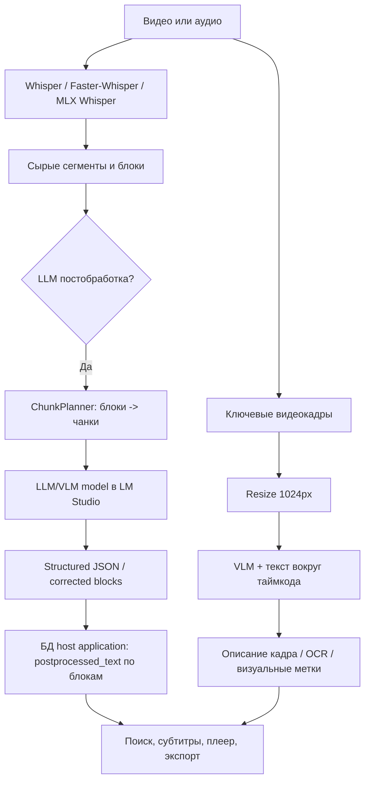
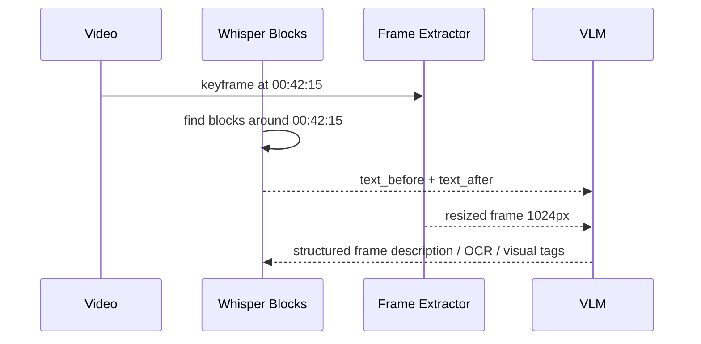
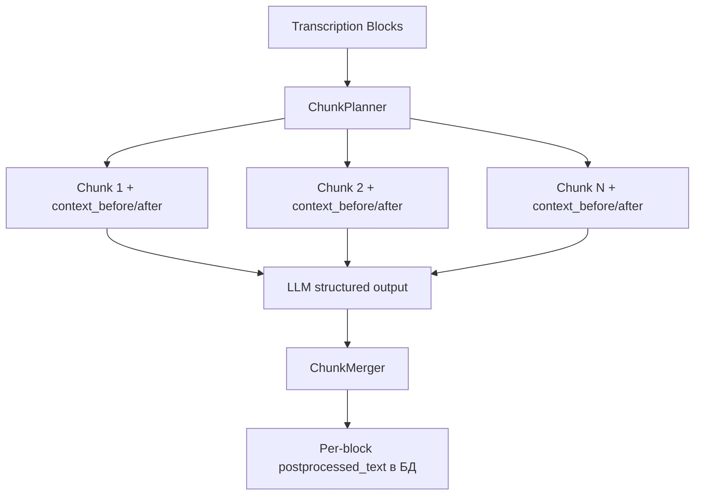
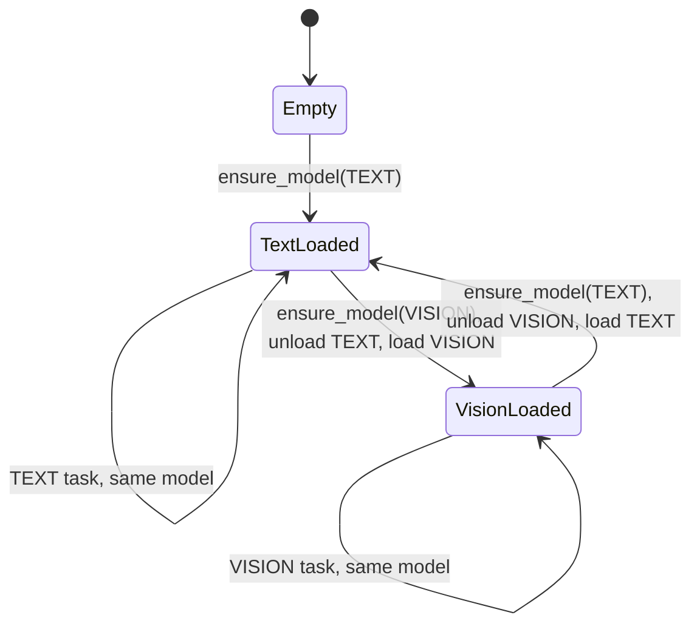
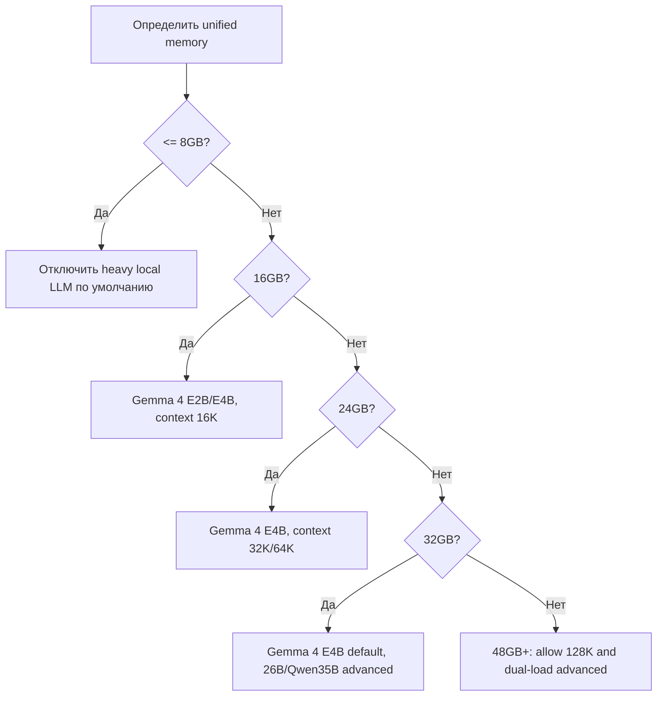

# Модели для host application на macOS MLX Q4: требования к железу, память, контекст и скорость

> [!INFO]  
> **Тип документа:** canvas-статья / инженерная заметка  
> **Контекст:** host application, локальная LLM/VLM-постобработка, macOS, Apple Silicon, LM Studio, MLX, Q4  
> **Дата среза:** 1 июля 2026  
> **Фокус:** не чат-агент, а host application-пайплайн: длинная транскрипция, обработка по чанкам, structured output, анализ видеокадров с текстовым окружением.

---

## 1. Зачем host application нужны локальные LLM/VLM-модели 🧠

host application использует локальные модели не как «универсального агента», а как **контентный процессор**. Это принципиально меняет критерии выбора модели.

Модель нужна для трёх типов задач:

1. **Постобработка длинной транскрипции**  
   Модель получает исходные Whisper-блоки или чанки и возвращает исправленный текст, перевод, структурированный JSON или другие производные слои.

2. **Обработка по чанкам с глобальным пониманием контекста**  
   В длинных лекциях, подкастах и видео модель не должна «забывать», что было раньше. Но весь текст нельзя бездумно держать в 128K/256K контексте на каждом запросе: это дорого по prefill и памяти.

3. **Анализ кадров видео**  
   host application может брать кадр из видео, добавлять текстовое окружение вокруг таймкода и просить VLM описать сцену, интерфейс, код, слайд, график или визуальный контекст.

> [!IMPORTANT]  
> Для host application важнее не «модель приятно болтает», а связка: **стабильный JSON + длинный контекст + дешёвый KV-cache + нормальная скорость prefill + vision-вход**.

---

## 2. Как host application-пайплайн отличается от обычного чата ⚙️

Обычный чат часто нагружает в основном **decode**: модель генерирует ответ на относительно небольшой prompt.

host application нагружает сразу две стадии:

| Стадия | Что происходит | Почему важно |
|---|---|---|
| **Prefill / prompt processing** | Модель «проглатывает» длинный текст, блоки, JSON, кадры, системный prompt | На длинных транскрипциях это может быть главной задержкой |
| **Decode / generation** | Модель генерирует исправленный текст, JSON, описание кадра | Важна скорость токенов/сек и качество structured output |
| **KV-cache** | В памяти хранится контекст запроса | Главный пожиратель памяти на 64K/128K |
| **Vision encoder / image embedding** | Кадр превращается в visual tokens | Может требовать отдельный временный буфер и ломаться при больших изображениях |
| **Model swap** | LM Studio выгружает одну модель и грузит другую | Критично, если text и vision модели разные |



---

## 3. Базовая формула памяти 🧮

Память host application-профиля на Mac считается не только по размеру Q4-файла.

```text
Практическая память ≈ веса модели Q4
                    + KV-cache выбранного контекста
                    + vision/image buffer
                    + runtime overhead LM Studio/MLX
                    + запас под macOS и host application
```

### 3.1. KV-cache

Упрощённая формула для dense attention:

```text
KV bytes ≈ layers × kv_heads × head_dim × 2(K+V) × bytes_per_value × context_tokens
```

Для FP16/BF16 KV-cache:

```text
bytes_per_value = 2
```

Для гибридных архитектур важно считать не все слои, а **global/full-attention слои**. Именно поэтому Gemma 4 и Qwen3.5/Qwen3.6 могут быть намного дешевле по long-context, чем обычные dense VLM.

> [!WARNING]  
> Q4 обычно относится к **весам модели**. KV-cache может оставаться FP16/BF16, если runtime не использует отдельную квантизацию KV. Поэтому «Q4 модель» не означает «128K контекст почти бесплатен».

---

## 4. Источники и статус данных 🔎

| Источник | Что взято |
|---|---|
| LM Studio Hub | Минимальная память, наличие MLX/GGUF, vision/tool/reasoning flags, контекст |
| LM Studio Docs / Changelog | Load-time параметры, `contextLength`, MLX-engine changes, parallel predictions |
| MLX Docs | Unified memory model Apple Silicon |
| Mac LLM Bench | `pp512`, `tg128`, peak RSS на M1/M2 Max/M5 |
| Google AI / Gemma docs | Q4_0 memory requirements Gemma 4 |
| host application внутренний Vision-сезон | host application pipeline: resize → VLM → structured output → storage; выводы по 1024px resize |
| HF / model config cards | Архитектурные параметры, если доступны |
| Community / bug tracker notes | Ограничения LM Studio vision, KV cache pooling, image embedding OOM |

> [!NOTE]  
> Скорости из Mac LLM Bench не всегда измерены именно на MLX. В таблицах ниже runtime указан явно: **MLX** или **GGUF/Metal**. GGUF/Metal-скорости используются как практический ориентир для LM Studio на Apple Silicon, но не должны смешиваться с MLX как одно и то же.

---

## 5. Классы железа Apple Silicon для host application 🍏

| Класс Mac | Unified memory | Реалистичный host application-профиль |
|---|---:|---|
| **Mac 8 GB** | 8 GB | Только лёгкие модели и короткие контексты. Для host application LLM-постобработки скорее нецелевой класс |
| **Mac 16 GB** | 16 GB | Gemma 4 E2B/E4B, Qwen3.5 9B осторожно, Qwen3-VL 4B для vision |
| **Mac 24 GB** | 24 GB | Хороший уровень для Gemma 4 E4B 64K/128K и Qwen3.5 9B 64K/128K |
| **Mac 32 GB** | 32 GB | Нижняя граница для Gemma 4 26B-A4B и Qwen3.6 35B-A3B |
| **Mac 48 GB** | 48 GB | Комфортный уровень для quality-mode, 128K, image + text, меньше swap-боли |
| **Mac 64 GB+** | 64 GB+ | Экспериментальный dual-load, большие контексты, тяжёлые очереди |

> [!TIP]  
> Для host application лучше проектировать **одна локальная модель — один активный запрос**. Параллельность локальной LLM/VLM-постобработки быстро превращает unified memory в тыкву. Красивую, алюминиевую, но тыкву.

---

## 6. Таблица моделей: статус MLX/GGUF и базовые требования 📦

### 6.1. Qwen

| Модель | Формат в LM Studio | Vision | Контекст | LM Studio min memory | Комментарий для host application |
|---|---|---:|---:|---:|---|
| `qwen/qwen3.6-35b-a3b` | MLX 4bit | ✅ | 262K | 21 GB | Большой MoE/Hybrid, хороший long-context brain, но нужен 32GB+ Mac |
| `qwen/qwen3.5-9b` | MLX 4bit | ✅ | 262K | ~7 GB | Хороший баланс text+vision, но на 16GB лучше не прыгать сразу в 128K |
| `qwen/qwen3-vl-4b` | MLX 4bit | ✅ | 256K | 3 GB | Лёгкий vision-кандидат, но KV на длинном контексте дорогой |
| `qwen/qwen3-vl-8b` | MLX 4bit | ✅ | 256K | 6 GB | Более качественный VLM, 24–32GB+ желательно |

### 6.2. Gemma

| Модель | Формат в LM Studio | Vision | Контекст | LM Studio / official memory | Комментарий для host application |
|---|---|---:|---:|---:|---|
| `google/gemma-3-4b` | MLX QAT 4bit + GGUF | ✅ | 128K | 2–3 GB | Лёгкий baseline, но Gemma 4 E4B перспективнее |
| `google/gemma-4-e2b` | MLX/GGUF QAT | ✅ | 128K | 4.2 GB / Q4_0 ~2.9 GB | Быстрый light-профиль, frame analyzer |
| `google/gemma-4-e4b` | MLX/GGUF QAT | ✅ | 128K | 5.9 GB / Q4_0 ~4.5 GB | Главный balanced-кандидат для host application |
| `google/gemma-4-12b-qat` | GGUF подтверждён, MLX не всегда очевиден | ✅ | 256K | 7.4 GB / Q4_0 ~6.7 GB | Возможный mid-quality, но статус MLX надо проверять по конкретному build |
| `google/gemma-4-26b-a4b-qat` | MLX/GGUF QAT | ✅ | 256K | 15.6 GB / Q4_0 ~14.4 GB | Quality-mode для 32GB+ Mac |

### 6.3. Mistral / Ministral

| Модель | Формат в LM Studio | Vision | Контекст | LM Studio min memory | Комментарий для host application |
|---|---|---:|---:|---:|---|
| `mistralai/ministral-3-3b` | GGUF | ✅ | 256K | 2 GB | В LM Studio не подтверждён как MLX. Быстрый, но long-context KV дорогой |
| `mistralai/ministral-3-14b-reasoning` | GGUF | ✅ | 256K | 10 GB | Хороший output, но 128K KV-cache тяжёлый |

---

## 7. KV-cache по контекстным окнам 🧮

### 7.1. Qwen: расчёт KV-cache

| Модель | KV / token, оценка | 8K | 16K | 32K | 64K | 128K |
|---|---:|---:|---:|---:|---:|---:|
| Qwen3.6-35B-A3B | ~20 KB | 0.15 GB | 0.31 GB | 0.61 GB | 1.22 GB | 2.44 GB |
| Qwen3.5-9B | ~32 KB | 0.24 GB | 0.49 GB | 0.98 GB | 1.95 GB | 3.91 GB |
| Qwen3-VL-4B | ~144 KB | 1.10 GB | 2.20 GB | 4.39 GB | 8.79 GB | 17.58 GB |
| Qwen3-VL-8B | ~144 KB | 1.10 GB | 2.20 GB | 4.39 GB | 8.79 GB | 17.58 GB |

**Вывод:** Qwen3.6-35B-A3B большой по весам, но контекст относительно дешёвый. Qwen3-VL 4B/8B маленькие по весам, но длинный контекст очень дорогой.

### 7.2. Gemma / Mistral: расчёт KV-cache

| Модель | KV / token, оценка | 8K | 16K | 32K | 64K | 128K |
|---|---:|---:|---:|---:|---:|---:|
| Gemma 3 4B | ~20 KB | 0.15 GB | 0.31 GB | 0.61 GB | 1.22 GB | 2.44 GB |
| Gemma 4 E2B | ~7 KB | 0.05 GB | 0.11 GB | 0.21 GB | 0.43 GB | 0.85 GB |
| Gemma 4 E4B | ~14 KB | 0.11 GB | 0.21 GB | 0.43 GB | 0.85 GB | 1.71 GB |
| Gemma 4 12B QAT | ~16 KB | 0.12 GB | 0.24 GB | 0.49 GB | 0.98 GB | 1.95 GB |
| Gemma 4 26B-A4B QAT | ~20 KB | 0.15 GB | 0.31 GB | 0.61 GB | 1.22 GB | 2.44 GB |
| Ministral 3 3B | ~104 KB | 0.79 GB | 1.59 GB | 3.17 GB | 6.35 GB | 12.70 GB |
| Ministral 3 14B Reasoning | ~160 KB | 1.22 GB | 2.44 GB | 4.88 GB | 9.77 GB | 19.53 GB |

**Вывод:** Gemma 4 выгодна для host application именно из-за гибридного attention. Mistral/Ministral при 128K становятся тяжёлыми не из-за весов, а из-за KV-cache.

---

## 8. Практическая память host application по контекстам 💾

### 8.1. Qwen: практическая память

Это оценка для LM Studio + MLX Q4 + один активный запрос + служебный запас. Реальное потребление зависит от runtime, версии LM Studio, image size, параллельности и состояния памяти.

| Модель | 8K | 16K | 32K | 64K | 128K |
|---|---:|---:|---:|---:|---:|
| Qwen3.6-35B-A3B Q4 MLX | ~24 GB | ~24 GB | ~25 GB | ~25 GB | ~26–27 GB |
| Qwen3.5-9B Q4 MLX | ~10 GB | ~11 GB | ~11 GB | ~12 GB | ~14 GB |
| Qwen3-VL-4B Q4 MLX | ~7 GB | ~8 GB | ~10–11 GB | ~15 GB | ~24 GB |
| Qwen3-VL-8B Q4 MLX | ~10 GB | ~11 GB | ~13–14 GB | ~18 GB | ~27 GB |

### 8.2. Gemma / Mistral: практическая память

| Модель | 8K | 16K | 32K | 64K | 128K |
|---|---:|---:|---:|---:|---:|
| Gemma 3 4B Q4 MLX | ~6 GB | ~6 GB | ~6–7 GB | ~7 GB | ~8 GB |
| Gemma 4 E2B Q4 MLX | ~6 GB | ~6 GB | ~6–7 GB | ~7 GB | ~7–8 GB |
| Gemma 4 E4B Q4 MLX | ~8–9 GB | ~9 GB | ~9 GB | ~9–10 GB | ~10–11 GB |
| Gemma 4 12B QAT | ~11–12 GB | ~12 GB | ~12–13 GB | ~13–15 GB | ~16–20 GB |
| Gemma 4 26B-A4B QAT | ~20 GB | ~20–21 GB | ~21 GB | ~22–24 GB | ~24–28 GB |
| Ministral 3 3B Q4 GGUF | ~6 GB | ~7 GB | ~9 GB | ~12–14 GB | ~18–22 GB |
| Ministral 3 14B Reasoning Q4 GGUF | ~14–15 GB | ~16 GB | ~18–20 GB | ~24–28 GB | ~34–40 GB |

> [!WARNING]  
> На Mac 16GB модель, которая «по таблице помещается в 14GB», может быть плохим UX: macOS, host application, LM Studio, браузер, кэш и медиаплеер тоже хотят кушать. Без ложной скромности — иногда они едят как маленький дата-центр.

---

## 9. Скорости генерации и prefill: чип + память + модель ⚡

### 9.1. Как читать таблицы скорости

| Поле | Значение |
|---|---|
| `pp512` | Prompt processing / prefill speed на 512 input tokens, tokens/sec |
| `tg128` | Generation speed на 128 generated tokens, tokens/sec |
| `Memory` | Peak RSS в GB в конкретном benchmark |
| `Runtime` | MLX или GGUF/Metal |

Для host application важны оба числа:

```text
Время чанка ≈ input_tokens / pp512 + output_tokens / tg128
```

Если чанк содержит 10 000 input tokens и модель имеет `pp512 = 400 tok/s`, только prefill может занять около 25 секунд. Если модель генерирует 1000 output tokens при `tg128 = 20 tok/s`, decode займёт ещё около 50 секунд.

---

## 10. Qwen: скорости на Mac 🧪

### 10.1. M5 10 CPU / 10 GPU / 32GB

| Модель | Runtime | pp512 | tg128 | Memory |
|---|---|---:|---:|---:|
| Qwen3.5-35B-A3B-4bit | MLX | 618.8 | 58.8 | 20.12 GB |
| Qwen3.6-35B-A3B-4bit | MLX | 277.7 | 20.3 | 20.13 GB |
| Qwen3.5-9B-MLX-4bit | MLX | 402.8 | 21.5 | 5.74 GB |
| Qwen3.5-4B-4bit | MLX | 1074.2 | 48.7 | 3.16 GB |
| Qwen3-8B-4bit | MLX | 405.0 | 24.0 | 5.12 GB |
| Qwen 3.5 9B | GGUF | 229.6 | 13.2 | 5.48 GB |
| Qwen 3.6 35B-A3B | GGUF | 274.9 | 16.7 | 20.14 GB |

### 10.2. M2 Max 12 CPU / 30 GPU / 32GB

| Модель | Runtime | pp512 | tg128 | Memory |
|---|---|---:|---:|---:|
| Qwen3-Coder-30B-A3B-Instruct-4bit | MLX | 441.3 | 78.0 | 17.77 GB |
| Qwen3-8B-4bit | MLX | 290.4 | 48.1 | 5.29 GB |
| Qwen 3 30B-A3B MoE | GGUF | 735.4 | 66.0 | 17.47 GB |
| Qwen 3.5 35B-A3B MoE | GGUF | 726.3 | 45.4 | 20.72 GB |
| Qwen 3.5 9B | GGUF | 402.9 | 30.2 | 5.48 GB |

### 10.3. M1 8 CPU / 7 GPU / 16GB

| Модель | Runtime | pp512 | tg128 | Memory |
|---|---|---:|---:|---:|
| Qwen3.5-4B-4bit | MLX | 128.7 | 23.2 | 3.16 GB |
| Qwen3-8B-4bit | MLX | 67.8 | 12.5 | 5.12 GB |
| Qwen 3.5 9B | GGUF | 86.8 | 8.3 | 5.48 GB |

### 10.4. Что это значит для host application

| Модель | Вывод |
|---|---|
| Qwen3.6-35B-A3B | На M5 base генерация 20 tok/s, prefill 278 tok/s. Подходит для quality long-context, но не для ощущения «молниеносно» |
| Qwen3.5-9B | Хороший компромисс, особенно на 24GB+ Mac. На M1 16GB уже медленно |
| Qwen3-VL-4B/8B | Прямого Mac LLM Bench по этим VL-моделям нет; считать по памяти отдельно, тестировать на реальных кадрах |
| Qwen3.5-4B | Быстрый reference для лёгкого vision/text, но не всякий 4B одинаково хорош в JSON и кадрах |

---

## 11. Gemma: скорости на Mac 💎

### 11.1. M5 10 CPU / 10 GPU / 32GB

| Модель | Runtime | pp512 | tg128 | Memory |
|---|---|---:|---:|---:|
| gemma-3-4b-it-4bit | MLX | 1325.3 | 53.3 | 3.15 GB |
| gemma-3-12b-it-4bit | MLX | 254.7 | 12.5 | 7.82 GB |
| gemma-3-27b-it-4bit | MLX | 113.3 | 5.5 | 16.72 GB |
| Gemma 4 E2B | GGUF | 628.3 | 29.2 | 3.39 GB |
| Gemma 4 E4B | GGUF | 716.0 | 36.7 | 5.22 GB |
| Gemma 4 26B-A4B MoE | GGUF | 300.8 | 16.2 | 16.09 GB |
| Gemma 4 31B | GGUF | 94.1 | 5.5 | 18.64 GB |

### 11.2. M2 Max 12 CPU / 30 GPU / 32GB

| Модель | Runtime | pp512 | tg128 | Memory |
|---|---|---:|---:|---:|
| Gemma 3 4B | GGUF | 915.8 | 65.0 | 2.45 GB |
| Gemma 4 E2B | GGUF | 1628.8 | 88.9 | 3.39 GB |
| Gemma 4 E4B | GGUF | 737.4 | 50.2 | 5.21 GB |
| Gemma 4 26B-A4B MoE | GGUF | 745.9 | 51.6 | 16.08 GB |
| Gemma 3 12B | GGUF | 276.2 | 23.3 | 6.99 GB |
| Gemma 3 27B | GGUF | 118.1 | 10.2 | 15.63 GB |
| Gemma 4 31B | GGUF | 100.0 | 8.4 | 18.64 GB |

### 11.3. M1 8 CPU / 7 GPU / 16GB

| Модель | Runtime | pp512 | tg128 | Memory |
|---|---|---:|---:|---:|
| Gemma 4 E2B | GGUF | 374.9 | 27.4 | 3.39 GB |
| Gemma 3 4B | GGUF | 235.3 | 21.3 | 2.45 GB |
| Gemma 4 E4B | GGUF | 183.2 | 15.9 | 5.21 GB |
| Gemma 3 12B | GGUF | 57.2 | 6.7 | 6.99 GB |

### 11.4. Что это значит для host application

| Модель | Вывод |
|---|---|
| Gemma 4 E2B | Отличный light-профиль, особенно для frame analysis |
| Gemma 4 E4B | Лучший balanced-профиль: дешёвый KV, адекватная скорость, vision |
| Gemma 4 26B-A4B | На M2 Max 32GB внезапно очень хорош: почти как E4B по скорости decode, но требует 16GB+ только на веса |
| Gemma 4 12B QAT | Может быть интересным mid-profile, но MLX-доступность надо проверять по конкретному пакету |
| Gemma 3 4B | Хороший fallback, но Gemma 4 E4B архитектурно вкуснее для host application |

---

## 12. Mistral / Ministral: скорости и ограничения 🌊

### 12.1. M5 10 CPU / 10 GPU / 32GB

| Модель | Runtime | pp512 | tg128 | Memory |
|---|---|---:|---:|---:|
| Mistral-7B-Instruct-v0.3-4bit | MLX | 391.0 | 22.9 | 4.62 GB |
| Mistral-Nemo-Instruct-2407-4bit | MLX | 262.6 | 13.4 | 7.35 GB |
| Mistral-Small-3.1-Text-24B-Instruct-2503-4bit | MLX | 131.9 | 6.9 | 13.80 GB |
| Mistral 7B Instruct v0.3 | GGUF | 182.9 | 11.5 | 4.16 GB |
| Mistral Nemo 12B | GGUF | 108.3 | 6.9 | 7.11 GB |
| Mistral Small 3.1 24B | GGUF | 54.3 | 3.6 | 13.50 GB |

### 12.2. M2 Max 12 CPU / 30 GPU / 32GB

| Модель | Runtime | pp512 | tg128 | Memory |
|---|---|---:|---:|---:|
| Mistral 7B Instruct v0.3 | GGUF | 438.1 | 39.8 | 4.16 GB |
| Mistral Nemo 12B | GGUF | 279.2 | 24.7 | 7.10 GB |
| Mistral Small 3.1 24B | GGUF | 138.2 | 12.4 | 13.49 GB |

### 12.3. Ministral 3: прямые данные

| Модель | Статус |
|---|---|
| Ministral 3 3B | В LM Studio подтверждён как GGUF, не как MLX. Прямого Mac LLM Bench по этой модели не найдено |
| Ministral 3 14B Reasoning | В LM Studio подтверждён как GGUF, не как MLX. HF GGUF llama-bench даёт ориентир `tg128 ~41–48 tok/s`, но без чипа/памяти |

### 12.4. Что это значит для host application

Ministral 3 может быть быстрым и удобным для отдельных multimodal задач, но как основной Mac MLX-профиль для host application он менее предсказуем, чем Gemma 4:

- в LM Studio он не подтверждён как MLX;
- 256K context есть, но KV-cache у dense Mistral/Ministral заметно тяжелее;
- 128K на 14B Reasoning может съесть память быстрее, чем кажется по «14B Q4».

---

## 13. Vision: кадры видео, resize и image tokens 🖼️

### 13.1. Почему кадры нельзя слать как есть

Внутренний benchmark host application показал, что у Qwen VL image tokens резко зависят от разрешения.

| Разрешение | Avg prompt tokens | Avg time | Fail rate |
|---|---:|---:|---:|
| Original | ~1665–1667 | 7.7–9.2 сек | 62.5% |
| 1536px | ~909–911 | 5.8–7.5 сек | 25% |
| 1024px | ~635–637 | 5.5–7.3 сек | 12.5% |
| 512px | ~214–216 | 5.2–7.2 сек | 0% |

> [!TIP]  
> Для host application разумный default — **resize кадра до 1024px по длинной стороне**. При ошибке LM Studio — fallback до 512px. Для OCR мелкого кода 512px может деградировать, поэтому это именно fallback, не основной путь.

### 13.2. Контекст вокруг кадра

Для видеокадра модель должна получать не всю транскрипцию, а **текстовое окно вокруг таймкода**.

| Размер окна | Когда подходит |
|---|---|
| ±15 секунд | Быстрые визуальные сцены, интерфейсные действия |
| ±30 секунд | Слайды, объяснение графика, код на экране |
| ±60 секунд | Лекции, длинные рассуждения, демонстрация приложения |
| ±2–5 минут | Только для сложных случаев; может быть дорого по prefill |



---

## 14. Рекомендованные host application-профили 🎛️

### 14.1. Профили по железу

| Профиль | Mac | Модель | Context default | Context max | Назначение |
|---|---|---|---:|---:|---|
| **Local Light** | 8–16GB | Gemma 4 E2B Q4 | 8K–16K | 32K | Быстрые кадры, лёгкая классификация, короткий JSON |
| **Local Balanced** | 16–24GB | Gemma 4 E4B Q4 | 16K–32K | 64K/128K | Основная постобработка текста + кадры |
| **Long Text** | 24GB+ | Gemma 4 E4B или Qwen3.5-9B | 32K | 128K | Длинные лекции, обработка больших блоков |
| **Quality Local** | 32GB+ | Gemma 4 26B-A4B | 32K | 64K/128K | Качественная постобработка, сложные тексты |
| **Qwen Big** | 32GB+ | Qwen3.6-35B-A3B | 16K–32K | 64K/128K | Сложный long-context, но скорость ниже |
| **Vision Dedicated** | 16–32GB | Qwen3-VL-4B / 8B | 8K–16K | 32K/64K | OCR, кадры, скриншоты, visual reasoning |

### 14.2. Главный дефолт

> [!SUCCESS]  
> **Главный практический кандидат для host application на Mac:** `Gemma 4 E4B Q4 MLX`.

Причины:

- vision input;
- дешёвый KV-cache;
- 128K context у small-моделей;
- адекватная скорость;
- весовая память умеренная;
- хорошо ложится в host application: текст + кадры + structured output.

### 14.3. Light profile

> [!NOTE]  
> `Gemma 4 E2B Q4 MLX` — хороший режим для слабых Mac и быстрого анализа кадров, но не стоит ожидать от него максимального качества длинной постобработки.

### 14.4. Quality profile

> [!WARNING]  
> `Gemma 4 26B-A4B QAT` — очень интересен для 32GB+ Mac, но он не должен быть дефолтом для массового пользователя. Вес модели сам по себе уже около 15–16GB, а host application всё равно нужен запас.

---

## 15. Политика контекста в host application 🧱

### 15.1. Не надо всегда ставить 128K

128K красиво выглядит в настройках, но для host application это не бесплатная магия. Большой контекст даёт:

- больше prefill time;
- больше KV-cache;
- больше риск OOM;
- больше задержку на каждый чанк, если контекст повторяется.

### 15.2. Рекомендуемые defaults

| Unified memory | Default context | Advanced max |
|---:|---:|---:|
| 8GB | 8K | 16K |
| 16GB | 16K | 32K/64K для лёгких моделей |
| 24GB | 32K | 128K для Gemma 4 E4B / Qwen3.5-9B |
| 32GB | 32K–64K | 128K осторожно |
| 48GB+ | 64K | 128K спокойно |

### 15.3. Контекст для постобработки по блокам

Для host application лучше использовать не «один огромный prompt на всё», а блоковую стратегию:



> [!IMPORTANT]  
> Для zero-drift субтитров модель должна возвращать тот же массив блоков `{id, text}`, а не свободный markdown-конспект. Иначе таймлайн снова превращается в “ну оно примерно там где-то”. А “примерно” — это не архитектура, это шаманский бубен.

---

## 16. Structured output и JSON mode 🧾

Для host application качество модели измеряется не только красотой текста. Нужны проверки:

| Проверка | Что валидируется |
|---|---|
| **JSON parse** | Ответ парсится без `JSONDecodeError` |
| **Schema validation** | Есть нужные поля, типы и массивы |
| **Block identity** | Все исходные `id` вернулись |
| **No amnesia** | Модель не потеряла блок |
| **No hallucinated IDs** | Модель не добавила несуществующий блок |
| **Length sanity** | Текст не пустой и не раздувается в 10 раз |
| **Retry** | При битом JSON модель получает одну попытку исправления |

Рекомендуемая структура ответа:

```json
{
  "blocks": [
    {
      "id": 12,
      "text": "Исправленный или переведённый текст блока."
    }
  ],
  "warnings": []
}
```

---

## 17. ModelOrchestrator и стратегия загрузки моделей 🔁

Если text-модель и vision-модель разные, host application не должен держать их обе на слабом железе.



### 17.1. Рекомендации

| Железо | Стратегия |
|---|---|
| 8–16GB | Sequential swap only |
| 24GB | Sequential swap, LRU retention |
| 32GB | Sequential default, dual-load hidden advanced |
| 48GB+ | Dual-load можно разрешить для text+vision |
| 64GB+ | Dual-load + batch vision можно тестировать |

> [!NOTE]  
> ModelOrchestrator должен быть единственным владельцем lifecycle LM Studio моделей. Иначе один модуль загрузит vision, другой думает, что text ещё загружен, и запрос уедет не туда. Это классика жанра: “работало, пока не добавили вторую модель”.

---

## 18. Сравнение моделей для host application: итоговая таблица 🏁

| Модель | Память | Скорость | Long context | Vision | Structured output риск | Итог |
|---|---:|---:|---:|---:|---:|---|
| Gemma 4 E2B | ⭐⭐⭐⭐⭐ | ⭐⭐⭐⭐ | ⭐⭐⭐⭐ | ✅ | Средний | Light/profile для кадров и слабых Mac |
| Gemma 4 E4B | ⭐⭐⭐⭐ | ⭐⭐⭐⭐ | ⭐⭐⭐⭐⭐ | ✅ | Средний/низкий после тестов | Лучший balanced default |
| Gemma 4 26B-A4B | ⭐⭐ | ⭐⭐⭐⭐ на Max, ⭐⭐ на base | ⭐⭐⭐⭐⭐ | ✅ | Низкий после тестов | Quality-mode 32GB+ |
| Qwen3.5-9B | ⭐⭐⭐ | ⭐⭐⭐ | ⭐⭐⭐⭐ | ✅ | Проверять | Хороший long-text альтернативный профиль |
| Qwen3.6-35B-A3B | ⭐⭐ | ⭐⭐–⭐⭐⭐ | ⭐⭐⭐⭐⭐ | ✅ | Проверять | Heavy long-context quality |
| Qwen3-VL-4B | ⭐⭐⭐⭐ | Нет прямых Mac данных | ⭐⭐ при 128K | ✅✅ | Проверять | Dedicated vision |
| Qwen3-VL-8B | ⭐⭐⭐ | Нет прямых Mac данных | ⭐⭐ при 128K | ✅✅ | Проверять | Better vision, 24GB+ |
| Ministral 3 3B | ⭐⭐⭐⭐ | Нет прямых MLX данных | ⭐⭐ | ✅ | Проверять | Альтернатива через GGUF |
| Ministral 3 14B | ⭐⭐ | ⭐⭐⭐⭐ по GGUF bench | ⭐ | ✅ | Проверять | Не основной Mac MLX путь |

---

## 19. Рекомендуемая матрица для UI настроек host application 🧭

| User-facing preset | Модель | Context | Max output | Vision resize | Local concurrency |
|---|---|---:|---:|---:|---:|
| **Быстро и экономно** | Gemma 4 E2B | 16K | 1024–2048 | 1024px | 1 |
| **Рекомендуется** | Gemma 4 E4B | 32K | 2048–4096 | 1024px | 1 |
| **Длинные лекции** | Gemma 4 E4B / Qwen3.5-9B | 64K | 4096 | 1024px | 1 |
| **Максимальное качество** | Gemma 4 26B-A4B | 32K/64K | 4096 | 1024px | 1 |
| **Vision OCR** | Qwen3-VL-4B | 8K/16K | 1024–2048 | 1024px → 512px fallback | 1 |
| **Vision quality** | Qwen3-VL-8B | 16K/32K | 2048 | 1024px | 1 |

---

## 20. Практические правила для host application 🛠️

### 20.1. Автоподбор модели



### 20.2. Предупреждения в UI

| Условие | Текст предупреждения |
|---|---|
| 128K на Mac <32GB | «Большой контекст может вызвать нехватку unified memory и долгий prefill» |
| Vision model + original image | «Кадр будет уменьшен до 1024px для стабильной локальной обработки» |
| Gemma 4 26B на 24GB | «Модель может загрузиться, но запас памяти мал для длинного контекста» |
| Two local models on <48GB | «Одновременная загрузка text и vision моделей может привести к OOM» |
| Local concurrency > 1 | «Параллельные локальные запросы умножают потребление KV-cache» |

### 20.3. Метрики, которые стоит логировать без утечки данных

| Метрика | Можно логировать? | Пример |
|---|---:|---|
| model_id | ✅ | `model=gemma-4-e4b` |
| context length | ✅ | `ctx=32768` |
| input tokens | ✅ | `input_tokens=10432` |
| output tokens | ✅ | `output_tokens=2190` |
| image resolution after resize | ✅ | `image_max_side=1024` |
| file path | ❌ | не логировать |
| user text / prompt content | ❌ | не логировать |
| raw OCR text | ❌ | не логировать |

---

## 21. Ограничения и что обязательно проверить экспериментально 🧪

### 21.1. Что ещё не закрыто таблицами

| Зона | Почему нужно тестировать |
|---|---|
| Gemma 4 MLX реальные скорости | Mac LLM Bench по Gemma 4 в основном даёт GGUF/Metal, не MLX |
| Qwen3-VL 4B/8B на Mac MLX | Нет прямого speed-бенча chip+memory+model |
| Structured JSON на Gemma 4 | Нужно 50–100 host application-кейсов: исправление, перевод, block JSON |
| Vision + text context | Нужно тестировать кадры с окружением ±30/60/120 сек |
| 128K context | Нужно тестировать не только load, но и prefill + repeated chunks |
| LM Studio MLX engine version | Производительность меняется между версиями движка |

### 21.2. Минимальный тест-пакет для модели

```text
1. 10 коротких transcript blocks -> JSON blocks
2. 100 transcript blocks -> JSON blocks
3. Перевод 30 блоков -> JSON blocks
4. Длинный chunk 16K input -> JSON
5. Кадр интерфейса + ±30 sec context -> JSON
6. Кадр с кодом + OCR -> JSON
7. Кадр с презентацией -> JSON
8. Ошибка JSON -> retry repair
9. Проверка отсутствия потерянных block_id
10. Повторный запрос после model swap TEXT <-> VISION
```

---

## 22. Финальная рекомендация 🧷

Для host application на macOS MLX Q4 модельные профили стоит строить вокруг Gemma 4, а Qwen и Ministral держать как дополнительные ветки.

### 22.1. Рекомендуемая иерархия

1. **Default Mac local:** `Gemma 4 E4B Q4 MLX`  
   Основной баланс: память, long-context, vision, скорость.

2. **Light Mac / fast vision:** `Gemma 4 E2B Q4 MLX`  
   Для слабых машин и быстрых кадров.

3. **Quality Mac:** `Gemma 4 26B-A4B QAT`  
   Для 32GB+ и задач, где качество важнее загрузки.

4. **Long-text alternative:** `Qwen3.5-9B Q4 MLX`  
   Если Gemma даёт хуже JSON/перевод на конкретных host application-кейсах.

5. **Heavy long-context:** `Qwen3.6-35B-A3B Q4 MLX`  
   Для сильных Mac, сложных длинных задач, но не как массовый default.

6. **Dedicated vision:** `Qwen3-VL-4B / 8B Q4 MLX`  
   Для специализированного OCR/кадров, но с осторожным context.

7. **Mistral / Ministral:** GGUF-ветка, не основной MLX-профиль  
   Использовать как альтернативу после отдельных тестов.

> [!SUCCESS]  
> Если host application должен дать пользователю «локальная постобработка работает из коробки на нормальном Mac», самый рациональный стартовый профиль: **Gemma 4 E4B Q4 MLX, context 32K, max output 2048–4096, vision resize 1024px, local concurrency 1**.

---

## 23. Источники 📚

### LM Studio / MLX

1. LM Studio model pages: Gemma 4 family, Qwen3.5/3.6, Qwen3-VL, Ministral 3.
2. LM Studio Python docs: load-time parameters, `contextLength`, inference config, structured response.
3. LM Studio changelog 0.4.13: MLX performance improvements and parallel predictions for vision-capable models.
4. MLX documentation: Apple Silicon unified memory architecture.

### Benchmarks

5. Mac LLM Bench: M1 16GB speed results.
6. Mac LLM Bench: M2 Max 32GB speed results.
7. Mac LLM Bench: M5 32GB speed results.
8. host application internal Vision benchmark: Qwen3.5-4B / Qwen3-VL-4B / Gemini Flash Lite image token economics.

### Gemma / Google

9. Google AI Gemma 4 model overview and Q4_0 inference memory table.
10. Google Gemma 4 QAT announcement.

### host application architecture notes

11. host application Season 7: JSON Blocks Mode, Block-Boundary Chunking, zero-drift postprocessing.
12. host application Season 9: Vision pipeline, ModelOrchestrator, ProviderConfigBase, resize, structured output.

---

## 24. Короткая версия для вставки в roadmap 🧾

```text
Для macOS MLX Q4 основным локальным профилем host application следует считать Gemma 4 E4B:
- 16–24GB Mac: context 16K–32K по умолчанию, 64K advanced;
- 24GB+: 64K/128K возможно, но prefill нужно считать по токенам;
- 32GB+: можно добавить quality-mode Gemma 4 26B-A4B и Qwen3.6-35B-A3B;
- Vision: resize кадров до 1024px, fallback 512px, текстовое окно вокруг кадра ±30–60 секунд;
- Local concurrency: 1;
- Model lifecycle: один ModelOrchestrator, LRU retention, sequential swap TEXT/VISION;
- Structured output: JSON blocks с сохранением id, retry при битом JSON.
```
