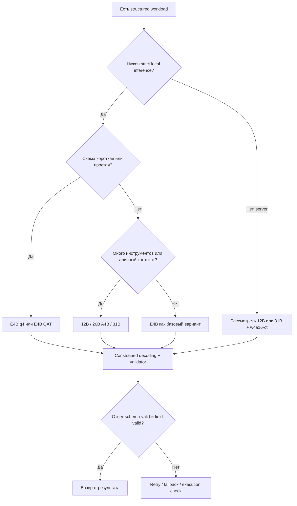

# Аналитический отчёт по Gemma 4 q4 и Gemma 4 QAT для структурированных запросов

## Executive summary 🧭

Gemma 4 в целом выглядит **сильной платформой для структурированных запросов**, потому что у семейства есть нативные системные инструкции, нативный function calling и специальная токенизация для структурированного tool-use/JSON-потока. Но важная оговорка такая: **официальных, прямых, apples-to-apples бенчмарков именно для “Gemma 4 q4 против Gemma 4 QAT” на SQL/JSON/табличных задачах почти нет**. Поэтому выводы приходится строить из трёх слоёв данных: официальной архитектуры и best practices, семейных структурированных бенчмарков без явного указания кванта, и community-тестов для локальных q4-сборок. citeturn5search0turn24view1turn24view0turn38view1

Если разделить маркетинг и железо, получается следующая картина. **QAT — это не “другая архитектура”, а способ дообучить модель так, чтобы 4-битная версия меньше теряла качество**; Google прямо пишет, что QAT-модели должны вести себя почти как их высокоточные базовые версии, при гораздо меньших требованиях к памяти. В официальной линейке QAT есть готовые маршруты под llama.cpp/LM Studio, vLLM/SGLang, mobile и speculative decoding. Для локального запуска это очень практично: E2B и E4B становятся реально “ноутбучными”, 12B уже выглядит как серьёзный local-first компромисс, а 26B A4B и 31B — как варианты для рабочих станций. citeturn38view1turn37view0

По **структурированному JSON** семейство Gemma 4 показывает хорошую, но не “магическую” дисциплину. На SOB-бенчмарке Gemma-4-31B получила **Overall 0.833**, **Value Accuracy 77.8%**, **Faithfulness 84.3%**, **JSON Pass 94.3%** и **Perfect Response 46.1%**. Это означает, что модель нередко возвращает синтаксически корректную структуру, но часть полей всё ещё оказывается неверной. Иными словами: “валидный JSON” у Gemma 4 достигается заметно легче, чем “фактически правильный JSON”. При этом Gemma-4-31B была **лучшей по image structured extraction** в SOB с **67.2% Value Accuracy на изображениях**, что особенно интересно для извлечения из таблиц, сканов и графиков. citeturn35view0

По **SQL** официальная документация Gemma уже предлагает tuning-гайд именно под text-to-SQL, но **официальные SQL-цифры для Gemma 4 q4 и Gemma 4 QAT не опубликованы**. Из доступных прикладных тестов самым полезным выглядит Nick Lothian SQL Benchmark: локальная **Gemma-4-E4B-it-GGUF:Q4_K_M набрала 15/25**, то есть примерно уровень **Qwen3.5-9B-GGUF:Q4_K_M (thinking) — тоже 15/25** в том же бенчмарке. Но сам бенчмарк агентный: там модель не только пишет SQL, но и должна корректно пользоваться SQL-инструментом. Поэтому часть провалов — это не “не умеет SQL”, а “сломала tool calling”. Для production это даже важнее: структурированные пайплайны чаще ломаются не на SELECT, а на glue-коде между моделью и рантаймом. citeturn6view0turn18view0turn21search0

Практический вывод такой: **для строгих структурированных сценариев Gemma 4 стоит брать не как “самопроверяющийся оракул”, а как очень сильный генератор внутри жёсткого контура** — с низкой температурой, constrained decoding, явной схемой, валидацией результата и retry/fallback логикой. Для крупной схемы, длинных колонок, сложных tool-use циклов и больших таблиц у семейства явно безопаснее выглядят **12B / 26B A4B / 31B**, а не E2B / E4B. Если нужен максимально удобный локальный q4-деплой без танцев — официальный **QAT GGUF** выглядит предпочтительнее; если нужен high-throughput server — **w4a16 compressed tensors**. А если кто-то обещает “чистый JSON без валидатора”, стоит держать руку на кошельке и вторую на логах: у structured output галлюцинации очень любят приходить в деловом костюме. citeturn38view1turn24view1turn35view0turn27view0

## Что именно сравнивается 🧩

Сначала важно развести термины. В пользовательской речи “Gemma 4 q4” часто означает **любую 4-битную локальную сборку** — GGUF, MLX, Q4_K_M, IQ4 и так далее. Но в официальной терминологии Google есть отдельная сущность **Gemma 4 QAT**, то есть **Quantization-Aware Training**: модель во время обучения/дообучения уже “привыкает” к будущей 4-битной точности. Поэтому **QAT — это не новый размер модели и не новая архитектура семейства, а способ получить более качественный 4-битный чекпойнт**. Официальный маршрут у Google такой: `-qat-q4_0-gguf` для local/llama.cpp, `-qat-w4a16-ct` для vLLM/SGLang, `-qat-mobile-*` для mobile, а `-qat-q4_0-unquantized` — это half-precision checkpoint, извлечённый из QAT-пайплайна для дальнейшей конвертации или research-задач. citeturn38view1turn37view0

Архитектурно семейство Gemma 4 неоднородно. E2B и E4B — это компактные dense-модели с **Per-Layer Embeddings**, где эффективные параметры меньше полного веса модели; 12B Unified — **encoder-free unified multimodal** вариант; 26B A4B — **Mixture-of-Experts**, где активируется только часть параметров на токен; 31B — классический крупный dense-флагман. Общими для семейства остаются **hybrid attention**, комбинирующий sliding-window и global attention, а также длинный контекст: **128K** у E2B/E4B и **256K** у 12B/26B A4B/31B. Для структурированных задач это не абстракция, а вполне прикладная вещь: длинные DDL-схемы, большие JSON Schema и длинные tool-traces очень быстро съедают маленький контекст. citeturn37view0turn4view3turn38view1

### Официальная матрица вариантов Gemma 4 и Gemma 4 QAT

| Модель | Архитектура | Контекст | Поддержка аудио | Официальная память Q4_0 | Официальные QAT-форматы | Что это означает для структурированных задач | Источник |
|---|---|---:|---|---:|---|---|---|
| Gemma 4 E2B | Dense + PLE, 2.3B effective, 5.1B с embeddings | 128K | Да | 2.9 GB | `q4_0-gguf`, `q4_0-unquantized`, `w4a16-ct`, `mobile-*` | Самый дешёвый вход в локальный structured output; годится для простых JSON и коротких схем, но запас по tool-calling и длинному контексту ограничен | citeturn37view0turn38view1 |
| Gemma 4 E4B | Dense + PLE, 4.5B effective, 8B с embeddings | 128K | Да | 4.5 GB | `q4_0-gguf`, `q4_0-unquantized`, `w4a16-ct`, `mobile-*` | На практике выглядит самым “рабочим” edge-вариантом для локального JSON/простого SQL/tool use | citeturn37view0turn38view1 |
| Gemma 4 12B Unified | Dense, encoder-free multimodal, 11.95B | 256K | Да | 6.7 GB | `q4_0-gguf`, `q4_0-unquantized`, `w4a16-ct` | Лучший компромисс для длинных схем, таблиц, сканов и mixed-modal structured extraction на ноутбуке | citeturn37view0turn38view1 |
| Gemma 4 26B A4B | MoE, 25.2B total / 3.8B active | 256K | Нет | 14.4 GB | `q4_0-gguf`, `q4_0-unquantized` | Хорош для агентных сценариев и throughput, но память ближе к “почти 26B”, а не к “почти 4B”; в структурированных контурах выигрывает, если рантайм корректно работает с MoE | citeturn37view0turn38view1 |
| Gemma 4 31B | Dense, 30.7B | 256K | Нет | 17.5 GB | `q4_0-gguf`, `q4_0-unquantized`, `w4a16-ct` | Самый сильный кандидат для schema-heavy и accuracy-first structured workloads, но и самый дорогой по VRAM/latency | citeturn37view0turn38view1 |

Принципиальная тонкость здесь в том, что **26B A4B действительно активирует только ~3.8B параметров на токен, но в память надо загрузить весь набор весов**, поэтому по VRAM эта модель ближе к крупным моделям, чем по названию может казаться. Это особенно важно для длинного SQL-контекста и длинных tool-traces: “active parameters” экономят вычисление, но не отменяют базовый memory footprint. citeturn4view4turn38view1

Отдельно стоит отметить, что **официальных, сопоставимых структурированных тестов именно для community-форматов `Q4_K_M`, `IQ4_*`, `UD-Q4_K_XL` и их сравнения с официальными QAT-checkpoints Google не публикует**. Поэтому любое сравнение “QAT против обычного q4” вне официальных QAT-форматов — это уже область community-proof, а не vendor-proof. В отчёте ниже такие места отмечены явно. citeturn38view1turn37view0

## Насколько хорошо Gemma 4 держит JSON, SQL и таблицы 🧱

Официально Google позиционирует Gemma 4 как модель семейства с **native structured JSON output**, **native function calling** и **native system prompt support**. Для function calling у Gemma 4 есть специальный набор служебных токенов: `<|tool|>`, `<|tool_call|>`, `<|tool_response|>` и строковый delimiter `<|"|>`. Это означает, что структурированное поведение у модели не только “выпросили промптом”, а частично заложили на уровне формата. Для структурированных запросов это плюс: меньше зависимости от “магических слов” в system prompt и больше шансов, что модель будет воспроизводимо держать схему. citeturn5search0turn24view1turn24view0

Но в практической плоскости есть нюанс: **наличие нативных токенов ещё не гарантирует, что весь стек их правильно понимает**. Часть качества structured output определяется не только самой моделью, но и тем, как runtime вставляет системный prompt, думающие токены, tool responses и constrained decoding. Поэтому ниже важнее не столько слова “поддерживает JSON”, сколько реальные результаты и реальные сбои. citeturn24view1turn24view0turn27view0

### Сводка по доступным данным о структурированных задачах

| Сценарий | Вариант Gemma 4 | Что измерялось | Результат Gemma | Сравнение | Как интерпретировать | Источник |
|---|---|---|---|---|---|---|
| Нативная структурированность | Всё семейство Gemma 4 | Наличие system role, function calling, structured JSON output | Поддерживается нативно; у модели есть отдельные tool-токены и documented JSON/tool lifecycle | Сравнение не требуется | Хорошая база для JSON, SQL-агентов и табличных пайплайнов, если runtime соблюдает шаблон | citeturn5search0turn24view1turn24view0 |
| SOB structured-output benchmark | Gemma-4-31B, **квант не указан** | Overall, Value Accuracy, Faithfulness, JSON Pass, Perfect Response | Overall **0.833**, Value Accuracy **77.8%**, Faithfulness **84.3%**, JSON Pass **94.3%**, Perfect **46.1%** | Qwen3-30B: Overall **0.842**, Value Accuracy **75.3%**, JSON Pass **98.3%**; Nemotron-3-Nano-30B: Overall **0.841**, Value Accuracy **74.7%** | Gemma-4-31B лучше некоторых open-weight конкурентов по смысловой точности полей, но слабее по чистой JSON-pass дисциплине | citeturn35view0 |
| SOB image structured extraction | Gemma-4-31B, **квант не указан** | Value Accuracy по изображениям | **67.2%**, лучший результат среди всех валидных моделей в этой категории | Лидирует над остальными в image modality | Для извлечения из графиков, сканов и табличных картинок семейство выглядит особенно интересно | citeturn35view0 |
| Agentic NL→SQL benchmark | Gemma-4-E4B-it-GGUF:Q4_K_M | 25 вопросов, English→SQL, DuckDB, debug loop, tool calling | **15/25** | Qwen3.5-9B-GGUF:Q4_K_M (thinking) — **15/25**; Nemotron Nano 9B v2 — **14/25** | E4B q4 конкурентоспособна в локальном SQL-классе, но это агентный benchmark: tool-calling ошибки бьют по результату не меньше, чем SQL-ошибки | citeturn18view0turn21search0 |
| Локальный vision→JSON extraction | Gemma 4 E4B Q4_K_M | JSON validity, OCR/ID extraction, latency | **7/7 valid JSON**, Avg tok/s **63.82**, TTFT **0.136s**, корректный Storage ID | Qwen3-VL 8B Q4_K_M: тоже **7/7 valid JSON**, но slower (**54.83 tok/s**, **1.996s** TTFT) и с ложным OCR-позитивом | В узкой structured-vision задаче E4B q4 выглядела и стабильной, и быстрой | citeturn8view3 |
| Локальное извлечение из таблиц/графиков | Gemma 4 12B `UD-Q4_K_XL.gguf` | Строгий JSON→CSV из картинок таблиц и графиков | Простая таблица — **100%**, pie chart — значения совпали до десятых; на плотном line chart модель выдумывала годы до ужесточения промпта; большая вложенная таблица упёрлась в лимит токенов и wall-clock | Сравнения нет | Для табличного/визуального extraction 12B q4 может быть рабочей, но не без внешней сигнализации и manual-review на сложных кейсах | citeturn36view1turn26view0 |

Главное, что видно из этой сводки: **Gemma 4 лучше выглядит там, где задача структурная, но схема явная и канал данных “чистый”** — inventory extraction, простые таблицы, chart-to-JSON, SQL с понятной схемой и ретраями. Проблемы начинаются, когда модель должна одновременно держать схему, длинный контекст, сложный reasoning и внешние инструменты. Тогда ошибки идут не по одному типу: часть — это неверные значения, часть — сорванная схема, часть — ошибка в tool-call lifecycle. citeturn35view0turn18view0turn8view3turn26view0

Отдельно следует подчеркнуть: **прямого опубликованного бенчмарка “Gemma 4 QAT vs Gemma 4 PTQ q4_K_M” на JSON/SQL/таблицах найти не удалось**. Google обещает near-bf16 quality для QAT и публикует QAT routing/memory, но не даёт структурированных task-level дельт именно против community PTQ вариантов. Это тот случай, где правильная фраза — не “хуже/лучше”, а **“не указано/недоступно”**. citeturn38view1turn37view0

## Сохранение схемы, контекста и устойчивость к ошибкам 🧪

Для structured workloads важны не только “знает ли модель SQL/JSON”, но и **умеет ли она не развалиться на длинной истории**. У Gemma 4 здесь есть несколько сильных сторон. Во-первых, у семейства нативно есть **system role**, а Google прямо пишет, что это нужно для более структурированных и контролируемых диалогов. Во-вторых, официальный prompt-formatting документ подробно описывает, как именно нужно передавать tool calls и tool responses, а также отдельно предупреждает: в обычном multi-turn нужно **удалять старые thought-блоки** из истории, но **не удалять их между tool calls внутри одного агентного хода**. Это очень практичный момент: часть “контекстных” багов у агентных пайплайнов — вообще не про интеллект, а про порчу истории сообщений. citeturn24view1turn24view0turn14search5

Контекстный запас у семейства тоже заметно влияет на structured use cases. **E2B и E4B дают 128K**, а **12B / 26B A4B / 31B — 256K**. Для короткого JSON extraction этой разницы почти не видно, но для text-to-SQL с длинными комментариями к схеме, для длинных database schema dumps, для накопленных function traces и особенно для multimodal extraction из объёмных документов разница уже становится прикладной. Поэтому если проблема звучит как “модель начала забывать схему после середины разговора”, это часто не “плохая модель”, а “слишком маленький класс модели для этого контура”. citeturn38view1turn37view0

Google также прямо пишет, что **thinking mode может заметно улучшать function-calling accuracy**, потому что помогает точнее решать, когда вызывать инструмент и какие аргументы ему передавать. Но здесь кроется и инженерная ирония: structured output любит детерминизм, а thinking любит дополнительные токены и runtime-особенности. В результате качество выбора инструмента может вырасти, а стабильность выдачи строгой схемы — наоборот просесть, если рантайм не дружит с thinking-токенами. То есть включать thinking “всегда и везде” для structured pipelines не стоит; его нужно тестировать на конкретном стеке. citeturn24view0turn24view1

Самый показательный публичный пример такого конфликта — issue в Ollama: для `gemma4:26b-a4b-it-q4_K_M` в версии **0.20.0** при `think=false` параметр `format` **игнорировался**, и модель выдавала обычный текст вместо JSON; если `think` не передавать, формат снова работал, но росла латентность. По логу автора репорта это давало примерно **~0.7s** без thinking и **~4s** с thinking, но без гарантии структурного вывода в первом случае. Это не значит, что “Gemma 4 ломает JSON”; это значит, что **runtime-интеграция может ломать JSON даже при хорошей модели**. Для production-разработки это load-bearing факт. citeturn27view0turn27view2

SOB очень хорошо показывает, где проходит граница между “форма соблюдена” и “содержимое правильно”. У Gemma-4-31B **JSON Pass 94.3%**, но **Value Accuracy только 77.8%**, а **Perfect Response 46.1%**. И сам бенчмарк подчёркивает, что structured hallucinations — самый неприятный класс ошибок: ответ остаётся типобезопасным, schema-valid и внешне правдоподобным, поэтому стандартные guardrails его не ловят. Для SQL и табличных extraction-задач это почти идеальное описание “красивой галлюцинации”: колонка есть, JSON валиден, а вот значение тихо придумано. citeturn35view0

Community-тесты дают очень похожую картину. В benchmark-репозитории с E4B модель **галлюцинировала город** при анализе CSV и **придумала несуществующие инструменты** при summarization большого репозитория. В русскоязычном Habr-тесте 12B local q4 на плотном line chart **достроила годы 2027–2043**, которых на оси не было, пока промпт не ужесточили. Смешно ровно до тех пор, пока это не quarterly report. Потом уже не до юмора, а до валидатора. citeturn8view3turn26view0

### Типовые отказы и что они реально означают

| Тип отказа | Как проявляется | Где зафиксировано | Что это значит на практике | Источник |
|---|---|---|---|---|
| Schema-valid, but wrong values | JSON проходит парсинг, но часть leaf-values неверна | SOB | Нужна проверка значений, а не только `json.loads()` | citeturn35view0 |
| Tool-call lifecycle break | Формат или tool call ломаются на уровне рантайма | Ollama issue с `think=false` + `format` | Надо тестировать не только модель, но и конкретный runtime/SDK | citeturn27view0 |
| Structured hallucination в табличной/визуальной задаче | Модель достраивает ось, годы, значения или строки | Habr chart/table extraction | На сложных таблицах нужно делать cross-check и graceful-fail | citeturn26view0turn36view1 |
| Agentic/tool errors вместо semantic SQL errors | Не дошла до правильного SQL из-за tool use/timeout | Nick Lothian SQL Benchmark | Для SQL benchmark результаты надо читать вместе с устройством agent loop | citeturn18view0 |
| Hallucinated tools / wrong data reasoning | Модель уверенно описывает несуществующие сущности | Daniel Rosehill benchmark | Нужен execution grounding, а не вера в “уверенный тон” модели | citeturn8view3 |

## Производительность, латентность и требования к ресурсам ⚙️

По памяти у Gemma 4 всё уже довольно прозрачно: Google публикует примерные цифры для BF16, SFP8, Q4_0 и mobile. Для structured workloads это важнее, чем может показаться: если модель не помещается без CPU offload, латентность в агентном цикле раздувается так, что даже хороший structured output начинает ощущаться как кара небесная. На официальном уровне **Q4_0** выглядит так: **E2B — 2.9 GB**, **E4B — 4.5 GB**, **12B — 6.7 GB**, **26B A4B — 14.4 GB**, **31B — 17.5 GB**. Важно, что это только базовые веса; KV-cache и длинный контекст докидывают память сверху. citeturn38view0turn38view1

### Официальные требования к памяти для загрузки модели

| Модель | BF16 | SFP8 | Q4_0 | Mobile | Mobile text-only | Что это значит practically | Источник |
|---|---:|---:|---:|---:|---:|---|---|
| Gemma 4 E2B | 11.4 GB | 5.7 GB | 2.9 GB | 1.1 GB | 0.84 GB | Реально подходит для edge/mobile и очень слабых локальных машин | citeturn38view0 |
| Gemma 4 E4B | 17.9 GB | 8.9 GB | 4.5 GB | 2.5 GB | 2.2 GB | На практике sweet spot для ноутбуков и лёгких рабочих станций | citeturn38view0 |
| Gemma 4 12B | 26.7 GB | 13.4 GB | 6.7 GB | — | — | Уже вполне ноутбучный “серьёзный” вариант для структурных задач | citeturn38view0 |
| Gemma 4 26B A4B | 57.7 GB | 28.8 GB | 14.4 GB | — | — | Выигрывает по active params, но не по базовой памяти загрузки | citeturn38view0turn38view1 |
| Gemma 4 31B | 69.9 GB | 34.9 GB | 17.5 GB | — | — | Accuracy-first вариант для workstation/server | citeturn38view0 |

Для снижения latency Google отдельно продвигает **MTP drafters**. По официальным материалам, Multi-Token Prediction даёт **до 3x speedup** без потери качества; для **26B A4B** на Apple Silicon при batch size **4–8** Google отдельно упоминает **до ~2.2x** локального ускорения. Для реальных агентных пайплайнов это важно: если structured loop вызывает модель несколько раз на один пользовательский вопрос, ускорение декодирования напрямую меняет комфорт использования. citeturn25view0turn25view1

Два community-набора цифр особенно полезны. На **Apple M3 Max 96 GB** в MLX Swift-реализации все четыре семейства были прогнаны в нескольких квантах; для **4-bit** текстовая генерация составила примерно **97 tok/s у E2B**, **61 tok/s у E4B**, **56 tok/s у 26B-A4B** и **12 tok/s у 31B**. Автор репозитория делает вывод, что в его setup именно **4-bit был sweet spot**, а BF16 давал сильно меньшую скорость без видимой выгоды в выбранном quality-check. Эти цифры нельзя считать официальным стандартом — это конкретная реализация и конкретное железо, — но для local-first планирования они весьма полезны. citeturn22view0

На другом полюсе — старый десктоп 2015 года с **i5-6400, 24 GB RAM и GTX 950 2 GB**, где в Ollama автор получил около **6.7 tok/s на E2B** и **5.0 tok/s на E4B**, а RAM-потребление было примерно **6–7 GB** у E2B и **9–10 GB** у E4B. Для structured output это важно не только из любопытства: если inference уходит в CPU-bound режим, то time-to-first-useful-JSON и cost-per-retry быстро растут. Иначе говоря, на слабой машине модель может быть “умной”, но продуктовой — уже не очень. citeturn29view0

### Практическая логика выбора модели для structured workloads

Эта схема — не официальный decision tree Google, а рабочая инженерная интерпретация официальных memory/formatting рекомендаций и опубликованных локальных тестов. В ней главный смысл такой: **structured workloads почти всегда любят модель классом выше, чем обычный чат**, потому что вы платите не только за “разум”, но и за дисциплину схемы. citeturn38view1turn24view1turn22view0turn29view0

## Бенчмарки, методики тестирования и сравнение с другими моделями 📊

Поскольку прямых официальных structured-task leaderboard’ов именно для Gemma 4 q4/QAT мало, крайне важно правильно выбрать методику оценки. Для такого запроса полезны как минимум шесть классов тестов: JSON-structure benchmarks, value-level structured extraction benchmarks, text-to-SQL benchmarks, robustness benchmarks, local agentic harnesses и прикладные multimodal extraction tests. И да, это тот случай, когда “одного любимого бенча” недостаточно. LLM легко проходит один benchmark и вполне успешно разваливает продовый JSON в пятницу вечером. citeturn30search0turn35view0turn18view0

### Какие бенчмарки здесь действительно полезны

| Бенчмарк / методика | Что меряет | Почему релевантен для Gemma 4 q4 / QAT | Ограничения | Источник |
|---|---|---|---|---|
| JSONSchemaBench | Эффективность и покрытие constrained decoding на 10K real-world JSON schemas | Полезен, если задача — “строгий JSON по схеме” | Больше оценивает decoding/framework, чем конкретно Gemma 4 family | citeturn30search0turn30search3 |
| SOB | Value Accuracy, JSON Pass, Faithfulness, Perfect Response для structured outputs | Хорошо ловит “валидный JSON, но неверные поля” — самый опасный для production класс ошибок | Данные по Gemma 4 есть для 31B, но **квант не указан** | citeturn35view0 |
| Spider | Классический cross-domain text-to-SQL | Хорош как базовая общая оценка SQL-понимания и генерализации по схемам | Менее “грязный” и менее production-like, чем новые enterprise-наборы | citeturn31search0turn31search2 |
| BIRD | Large-scale, more realistic text-to-SQL, с упором на content и efficiency | Ближе к реальным BI/enterprise SQL-задачам | Сам benchmark и его аннотации тоже не идеальны | citeturn30search2turn31search1 |
| Dr.Spider | Robustness text-to-SQL через 17 perturbation sets | Полезен для проверки устойчивости схемы, названий, перефразов и шумов | Не даёт полного ответа о long-context enterprise SQL | citeturn32search1turn32search5 |
| Spider 2.0 | Real-world text-to-SQL workflows, 632 enterprise-like problems | Очень полезен для современного enterprise SQL, где таблиц и колонок много | Тяжёлый benchmark; публикация и экосистема ещё моложе | citeturn31search5turn31search7 |
| Nick Lothian SQL Benchmark | Быстрый agentic NL→SQL benchmark с DuckDB, retries и execution loop | Очень полезен для local q4, потому что тестирует не только SQL, но и tool use в агентной обвязке | Небольшой, авторский, не академический benchmark | citeturn18view0turn21search0 |

Здесь особенно важны две методические оговорки. Первая: **BIRD и Spider 2.0 — сами не безупречны**; в работе CIDR 2026 для BIRD и Spider 2.0-Snow показаны существенные annotation error rates, поэтому leaderboard на этих наборах нельзя читать буквально как “истину в последней инстанции”. Вторая: **короткие local benchmarks вроде Nick Lothian, наоборот, очень полезны для разработки**, потому что они хорошо показывают поведение в реальном tool-use контуре, хоть и слабее как академический стандарт. Иначе говоря: одно измеряет научную общую способность, другое — житейскую предсказуемость. Для продукта нужны оба. citeturn31search1turn18view0

### Сравнение с другими квантованными моделями

| Сценарий | Gemma 4 | Другая модель | Что видно | Precision / quant | Источник |
|---|---|---|---|---|---|
| Local agentic SQL | Gemma-4-E4B-it-GGUF:Q4_K_M — **15/25** | Qwen3.5-9B-GGUF:Q4_K_M (thinking) — **15/25** | По этому benchmark Gemma E4B q4 конкурентоспособна в 9B-классе | Оба q4, local | citeturn21search0turn18view0 |
| Local agentic SQL | Gemma-4-E4B-it-GGUF:Q4_K_M — **15/25** | NVIDIA Nemotron Nano 9B v2 — **14/25** | Gemma E4B q4 немного выше в этом конкретном agentic SQL harness | Квант у Nemotron в snippet не указан | citeturn21search0turn18view0 |
| Structured vision→JSON | Gemma 4 E4B — **7/7 valid JSON**, **63.82 tok/s**, **0.136s TTFT** | Qwen3-VL 8B — **7/7 valid JSON**, **54.83 tok/s**, **1.996s TTFT** | В inventory-processing Gemma была и быстрее, и аккуратнее по structured output | Оба Q4_K_M | citeturn8view3 |
| Family-level structured JSON | Gemma-4-31B — Value Accuracy **77.8%**, JSON Pass **94.3%** | Qwen3-30B — Value Accuracy **75.3%**, JSON Pass **98.3%** | Gemma лучше по смысловой точности полей, Qwen лучше по чистой schema-pass дисциплине | **Не указано** | citeturn35view0 |
| Family-level structured JSON | Gemma-4-31B — Value Accuracy **77.8%** | Nemotron-3-Nano-30B — **74.7%**; Schematron-8B — **73.1%** | Gemma выглядит сильнее части open-weight конкурентов по field correctness | **Не указано** | citeturn35view0 |
| QAT vs обычный PTQ q4_K_M на JSON/SQL/таблицах | **Не указано / недоступно** | **Не указано / недоступно** | Прямых официальных apples-to-apples structured-task сравнений не найдено | — | citeturn38view1turn37view0 |

Если свести этот блок к одному трезвому выводу, то он такой: **Gemma 4 в q4-сборках уже находится в рабочем классе для structured tasks, но не доминирует безусловно**. В локальном SQL-классе E4B выглядит достойно, в image-structured extraction 31B-семейство выглядит очень хорошо, а в “чистой дисциплине JSON schema pass” некоторые конкуренты могут быть жёстче. Поэтому сравнение “лучшая модель” здесь почти всегда нужно заменять на “лучшая модель под конкретную структуру отказов”: кому-то важнее field correctness, кому-то schema pass, кому-то TTFT, кому-то объём VRAM. citeturn35view0turn8view3turn21search0

## Рекомендации по настройке, дообучению и промптингу 🛠️

Если задача — **локальный production-like structured pipeline**, то базовая рекомендация выглядит так: **использовать официальный QAT-маршрут там, где он есть**, а не случайный “какой-то q4” из экосистемы, если нужен предсказуемый baseline. Для llama.cpp / LM Studio логичный вариант — `-qat-q4_0-gguf`; для vLLM/SGLang server-serving — `-qat-w4a16-ct`; для мобильных сценариев — `-qat-mobile-*`. Это не магическое заклинание на успех, но это хотя бы переводит систему в режим “поддерживаемого и документированного стека”. citeturn38view1turn37view0

Для **JSON и табличного extraction** лучшие практики сходятся очень чётко. Нужны: **явная схема**, **низкая температура**, **внешняя валидация**, **retry/fallback**, а не надежда на “сама себя проверит”. В русскоязычном Habr-кейсе с Gemma 4 12B local автор добился заметно лучшей дисциплины, когда снизил `temperature` до **0.1**, явно просил **только валидный JSON**, добавил поля наподобие `n_labels_seen` и `value_source`, а также сделал **graceful-fail** вместо “угадай недостающий хвост”. Это очень хорошая практическая иллюстрация того, как structured output нужно “обвязывать”, а не просто “просить”. citeturn26view0turn36view1

Для **function calling** лучше держаться официального формата чата и tool-response истории. Google прямо пишет, что для хорошего результата в ходе агентного цикла нужно добавлять `tool_calls` и `tool_responses` в историю в точной структуре, которую ожидает chat template. Кроме того, thoughts в обычном multi-turn нужно чистить, но **не чистить между function calls внутри одного хода**. У structured pipelines здесь типично происходит одна и та же комедия ошибок: промпт хороший, модель хорошая, а developer случайно испортил message history. И пошло-поехало. citeturn24view0turn24view1

Для **SQL** официальная рекомендация со стороны экосистемы Gemma — идти через **fine-tuning / QLoRA**, если доменная схема, синтаксис или naming conventions нестандартны. В официальном tuning-гайде Google text-to-SQL поставлен как учебный, но вполне прикладной use case: модель получает user query, schema definition и целевой SQL. Это очень правильный сигнал: если база сложная, надеяться на чистый zero-shot хуже, чем один раз вложиться в дообучение на целевом стиле SQL и вашей схеме. Для enterprise tool-use это ещё важнее: Google отдельно объясняет на примере FunctionGemma, что smaller models особенно плохо удерживают “зачем и когда вызывать инструмент”, а fine-tuning полезен для снятия неоднозначности выбора инструмента и работы с нестандартными схемами. citeturn6view0turn6view1

Для **выбора класса модели** рекомендация простая. Если structured workload короткий и бюджетный — начинать с **E4B q4 / E4B QAT**. Если есть длинные схемы, большие таблицы, multimodal extraction, длинные audit-trails или серьёзный SQL/tool-use — сразу смотреть на **12B** как минимально комфортный production-class локальный вариант. Если ставка на accuracy-first и допускается workstation/server — **31B**; если важен throughput при агентной работе — **26B A4B**, но только после проверки конкретного runtime на MoE-совместимость и latency profile. E2B хорош как edge-минимум, но для строгости схемы и сложного SQL у него слишком маленький запас. citeturn38view1turn37view0turn22view0

И, наконец, жёсткая рекомендация по эксплуатации: **в structured production не делать релиз без runtime-specific тестов на thinking on/off, format/schema mode и message history handling**. Публичный Ollama-баг с `think=false` и `format` слишком показателен, чтобы его игнорировать. Модель может быть сильной, а стек вокруг неё — слегка драматичным. В мире structured output самый дорогой баг — это не crash. Самый дорогой баг — это очень вежливая, очень валидная и очень неправильная структура, которая уходит дальше по пайплайну как будто всё в порядке. citeturn27view0turn35view0

### Итоговая практическая рекомендация по выбору

| Приоритет | Рекомендуемый вариант | Почему | Что проверить до продакшена | Источник |
|---|---|---|---|---|
| Минимум VRAM, локальный JSON/tool use | E4B QAT q4_0 GGUF | Самый практичный edge/local баланс | JSON validator, thinking/runtime interaction, tool history format | citeturn38view1turn24view0turn27view0 |
| Ноутбук + сложные таблицы / multimodal extraction | 12B QAT q4_0 GGUF или близкий q4-format | 256K context и заметно лучший запас для schema-heavy задач | Лимит токенов, wall-clock, truncation handling | citeturn38view1turn36view1turn26view0 |
| Агентный server-side structured workflow | 26B A4B или 31B + `w4a16-ct` | Лучше для quality-first или throughput-first служебных пайплайнов | Реальную latency на вашем рантайме, особенно для MoE | citeturn38view1turn25view1turn33view0 |
| Field-correctness важнее schema-pass | 31B family | По доступным данным сильнее по содержательной точности, чем часть конкурентов | Внешний field-level scoring/validation | citeturn35view0 |
| Нужен строгий SQL под вашу схему | Любая Gemma 4, но лучше после QLoRA/SFT | Google сама показывает text-to-SQL как сценарий для дообучения | Spider/BIRD/Dr.Spider + ваш private eval set | citeturn6view0turn31search0turn30search2turn32search1 |

В сухом остатке: **Gemma 4 q4 и Gemma 4 QAT — хорошие рабочие кандидаты для structured запросов, но не “drop-in deterministic engine” сами по себе**. Их сильные стороны — нативный tool-use формат, длинный контекст, хорошая multimodal structured extraction и достойное local-first соотношение качества к ресурсам. Их слабые стороны — отсутствие прямых официальных structured-task сравнений между PTQ q4 и QAT, уязвимость к runtime-интеграционным сбоям и типичная для всех современных LLM пропасть между “валидной структурой” и “фактически верными полями”. Если нужен один короткий вердикт: **Gemma 4 — хорошая основа для строгих structured workflows, но только в паре с жёсткой инженерной обвязкой; QAT — предпочтительный официальный 4-битный маршрут, когда важны память и воспроизводимость, а не исследовательская экзотика**. citeturn38view1turn35view0turn24view1turn27view0