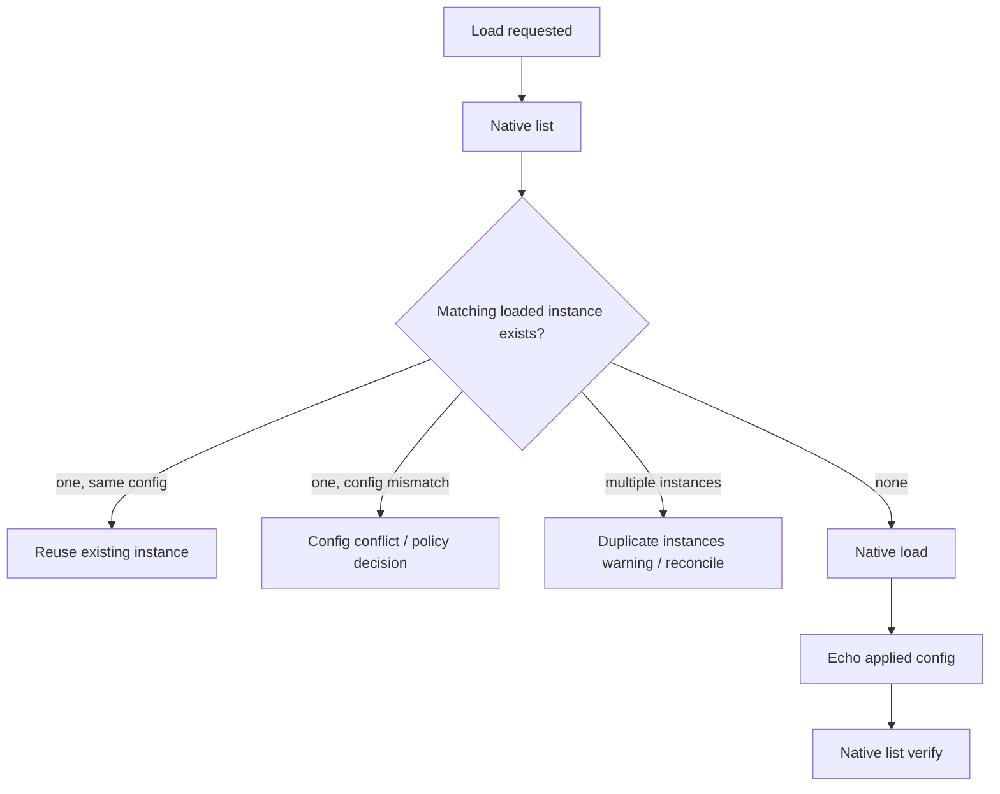
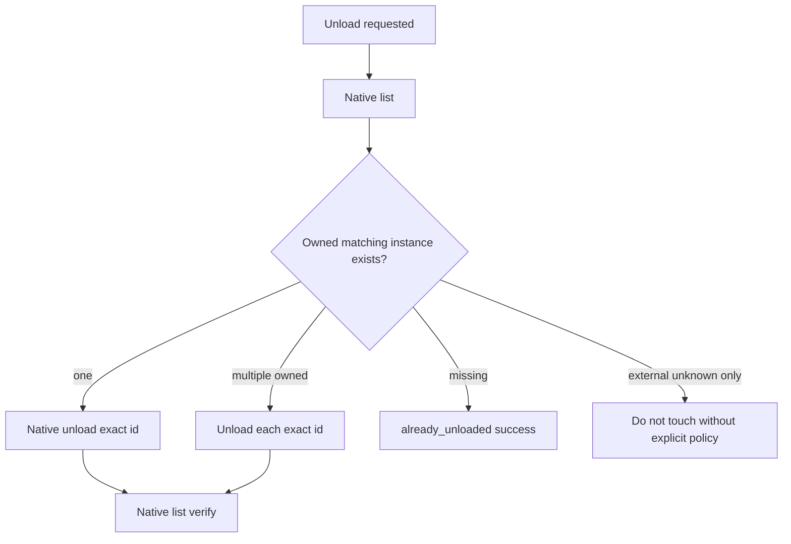
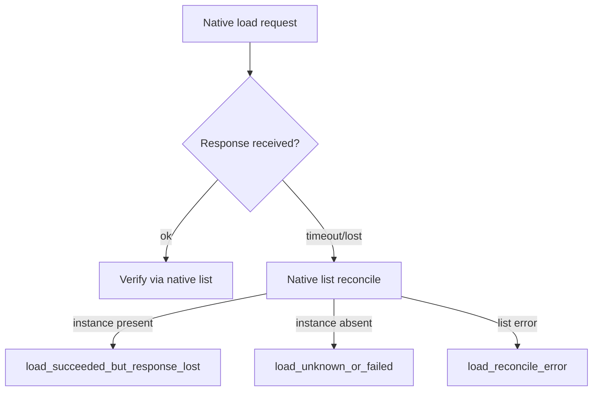
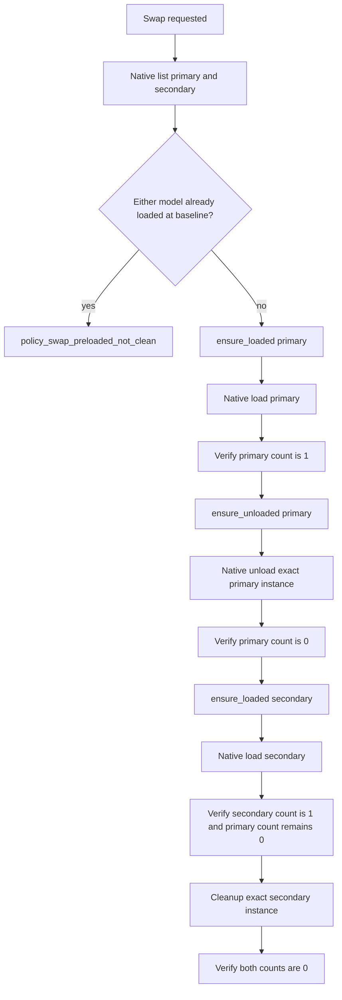

# L4 Lifecycle Invariants Matrix — LM Studio Managed Backend Foundation

## Scope

- Date: 2026-07-03
- Last updated: 2026-07-04
- Branch: `next/modular-backend-lab`
- Evidence level: Lab-only lifecycle evidence, before WVM runtime integration
- Primary native-verified model: `qwen35_4b_q4km` / `qwen3.5-4b`

This matrix consolidates the L4 lifecycle facts gathered so far. It is intended to prevent future backend work from re-deriving scattered evidence from individual experiment notes.

## Lifecycle gates

| Gate | Evidence | Result | Production implication |
| --- | --- | --- | --- |
| Download progress | `acq_live_qwen35_4b_q4km_001` | ✅ completed | Downloader can expose progress and downloaded/total bytes. |
| Native identity | candidate registry M0.4 | ✅ `qwen3.5-4b`, `GGUF`, `Q4_K_M`, `4B`, ready on disk | Registry facts must distinguish source id, compat id and native key. |
| Controlled load echo | L4b `controlled_load_echo` | ✅ `context_length=8192`, `parallel=1` verified | Request config is not enough; applied config must be verified. |
| Exact unload happy path | L4c `unload_happy_path` | ✅ exact instance unload returned to `loaded_instances=0` | Unload must target an exact observed instance id. |
| Already gone | L4g `unload_already_gone` | ✅ already unloaded is a success state | Missing instance should clear transitional/unloading state. |
| External manual unload | L4d `external_unload_reconcile` | ✅ `1 -> 0`, no Lab unload call | Observed native state wins over desired transitional state. |
| Duplicate same-config load | L4e `duplicate_load_behavior` | ✅ duplicate confirmed: `0 -> 1 -> 2`, cleanup to `0` | Native load is not idempotent; list-before-load guard is mandatory. |
| Load timeout reconciliation | L4h `load_timeout_reconcile` | ✅ offline/fake proof | After timeout, always reconcile via native list before declaring failure. |
| Two-model swap | L4f `policy_two_model_swap` | ✅ `qwen3.5-4b -> google/gemma-4-e4b`, primary `0 -> 1 -> 0`, secondary `0 -> 1 -> 0`, final both `0` | Model switch must be policy-staged: verify clean baseline, exact-unload old WVM-owned instance before loading the new one, then exact cleanup. |
| Repeated download already-present | D3 `already_downloaded` | ✅ terminal success | Repeated download classifies already-on-disk as success without polling. |

## Core lifecycle policies

These policies are now backed by Lab evidence and should be treated as the starting contract for `lmstudio_managed`:

```text
no blind load
list-before-load
verify applied load config
observed state wins over desired transitional state
exact instance unload only
no wildcard unload
cleanup only WVM-owned/test-owned exact instances
duplicate instances must block or reconcile before new load
timeout after load must reconcile through native list
two-model swap must verify old model is unloaded before loading the new model
```

## Load decision policy



## Unload decision policy



## Timeout reconciliation policy



## Two-model swap policy



## Key L4e conclusion

```text
Native model load is not safe to call blindly.
Same model + same config can create duplicate loaded instances.
```

For future managed backend work, `ensure_loaded()` must reconcile state before issuing a native load. A blind load call can duplicate instances, waste VRAM and increase the risk of server errors under memory pressure.

## Privacy and artifact policy

The L4 Lab path uses sanitized artifacts:

- endpoint kinds instead of raw endpoint paths;
- hashes instead of raw instance ids;
- token presence booleans instead of token values;
- no provider bodies, prompts, transcripts, local paths, process paths, cwd, cmdline or username/env values.

## Non-goals for the current stage

Do not expand this Lab evidence directly into WVM runtime integration yet:

```text
no WVM runtime fix
no QueueManager/UI changes
no wildcard unload
no cache/stateful experiments
no keepModelInMemory / tryMmap experiments
no vision or embedding work
no app_concurrency=4 expansion
```

## Next recommended slices

1. **M1r/M2r failure triage** for first-pass structured/plain-text failures before any production profile conclusion.
2. **Compact model screening table** after triage, with current baselines and unresolved failure modes separated.
3. **S0 `lmstudio_managed` skeleton** after triage, using the Lab lifecycle vocabulary and failure taxonomy.
4. **Keep cache/stateful, `keepModelInMemory`, `tryMmap`, vision and embeddings deferred** until the lifecycle-backed text model matrix and triage are complete.
